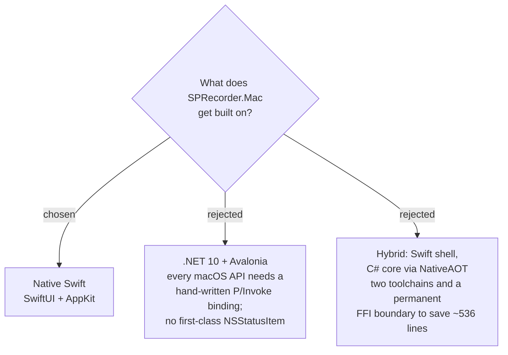

# Native Swift for the macOS port

The Windows app is 4,222 lines of C# on `net10.0-windows` with Windows Forms,
which does not exist on macOS. We build the port as a native Swift app using
SwiftUI and AppKit.

## Why

**Every API the port needs is Swift-or-C first.** The seven research tickets on
the decision map each landed on one: ScreenCaptureKit for the Screen recording
and for system audio, Carbon `RegisterEventHotKey` for the hotkey, AVFoundation
for AAC encoding, `NSWindow` overlays for the Input highlight, and CoreAudio
process objects for call detection. None has a mature .NET binding, and
ScreenCaptureKit is the worst case — a Swift-first framework built on `async`
sequences.

**The reuse prize is small and shrinking.** Only 658 of the 4,222 lines are
platform-independent, against 2,780 that must be rewritten whatever we choose.
Two of those seven "portable" classes are already dead by earlier decisions on
this map: `HotkeyParser` (53 lines) encodes Windows virtual-key codes, which
Carbon does not use, and `Mp3FrameSplitter` (69 lines) parses MP3 frames, which
`sprecorder-mac-0002`-era AAC output does not have. Real reuse is ~536 lines, and
281 of those are `MarkerReviewPage`, an HTML string builder that is near-trivial
in any language.

**Windows is frozen, so reuse buys no future maintenance saving.** Shared code
would be a cost carried permanently for a one-time convenience.

**The menu bar is the app.** SPRecorder has no main window — it is a tray icon
plus dialogs. `NSStatusItem` is the real macOS API for that; Avalonia has no
first-class binding for it, so even the .NET path needs platform code exactly
where the app is most visible.

## What this costs

The 17 xUnit test files are rewritten as XCTest. `MarkerReviewPage`,
`MarkerLog`, `FileNameBuilder`, `CallDetectionStateMachine` and `AppConfigStore`
are translated rather than carried. The C# stays readable as the reference
implementation of intended behaviour, alongside the Windows repo's 22 ADRs.

## Consequences

Unblocks `pure-logic-reuse`, `menu-bar-app-shape`, `logging-and-diagnostics` and
`config-and-file-layout` on the decision map.
