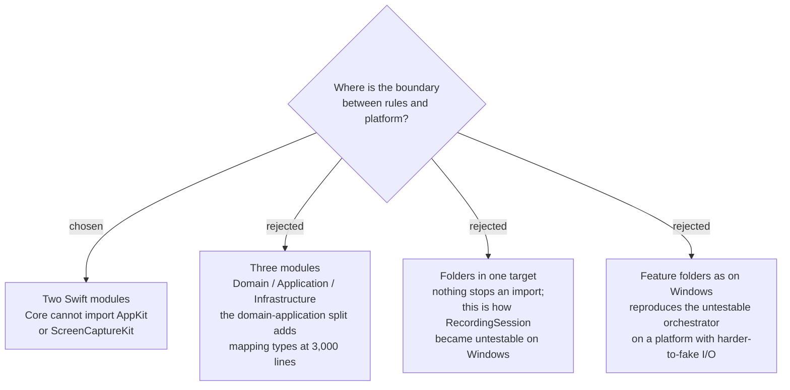

# Two modules: SPRecorderCore and SPRecorderApp



SPRecorder.Mac is built as two Swift modules. `SPRecorderCore` holds the domain
types and the Recording Session orchestrator, and declares everything it needs
from the platform as protocols. `SPRecorderApp` holds the adapters that implement
those protocols, the SwiftUI and AppKit surface, and the entry point. The
dependency runs one way: `SPRecorderApp` imports `SPRecorderCore`, never the
reverse.

## Why

**The Windows app proves the cost of no boundary.** `RecordingSession.cs` is 382
lines and orchestrates the whole app — the System track, the Mic track, the Mixed
file, Markers and the Marker review page. It constructs its own infrastructure
(`new SystemAudioCapture(...)`, `new MicrophoneCapture(...)`, `new
ScreenRecorder()`), so it cannot be tested without real audio hardware. It is the
only significant class with **no test file**, while `FileNameBuilder` (49 lines)
and `IconFactory` (45 lines) both have one. Answering "does a Recording Session
with two Markers produce a Marker review page?" currently requires recording a
real meeting.

**The compiler is the enforcement, not discipline.** A module boundary makes
`import ScreenCaptureKit` inside the Core a build error. A folder convention makes
it a code-review habit, and habits decay.

**Three known swaps are already recorded on this map**, all in infrastructure:
`mixesAudioWithMicrophone` arriving in macOS 27 (`screen-capture-stack`), AAC
replacing MP3 (`audio-encoding-format`), and the CoreAudio process tap as a
fallback to ScreenCaptureKit (`system-audio-capture`).

**Two, not three.** At roughly 3,000 lines a separate Application layer buys
indirection and mapping types rather than clarity, and a strict Application layer
that may not reference SwiftUI types fights `@Observable` view models. Splitting
domain from application later is cheap; introducing a module boundary later is not.

## The worked example: the macOS 27 swap

The Core declares what it wants, in its own terms:

```swift
protocol ScreenCapturing {
    func start(display: DisplayID, audio: AudioRouting) async throws
    func stop() async throws -> URL          // the Self-contained MP4
}
```

The Core asks for a Self-contained MP4 and nothing more. Today's adapter writes
two audio tracks and mixes them itself, because `mixesAudioWithMicrophone` does
not exist below macOS 27. When the deployment target allows it, the adapter sets
that flag and lets the framework mix. **One adapter file changes; the Core and its
tests do not.**

## Consequences

`RecordingSession` becomes testable against fakes for the first time. The Core is
where the ~536 surviving lines from the Windows app land, which is what
`pure-logic-reuse` decides next. Whether the Core ships as its own Swift Package
with its own test target is now the concrete form of a fog line, and
`test-strategy` is unblocked by this decision.
