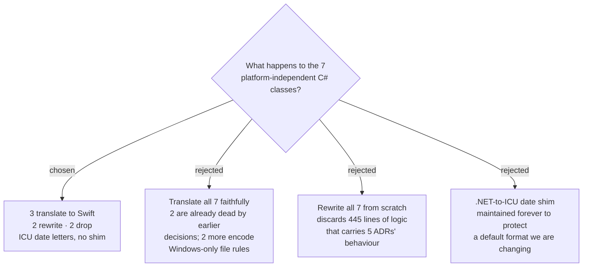

# Translate three pure classes, rewrite two, drop two

`sprecorder-mac-0001` chose Swift and `sprecorder-mac-0002` put the pure logic in
`SPRecorderCore`, so "carry it over as C#" was already off the table. What
remained was per-class: translate, rewrite, or drop.

## The verdicts

| class | LOC | verdict | why |
|---|---|---|---|
| `CallDetectionStateMachine` | 66 | **translate** | its entire surface is `Update(bool inCall, DateTime now)` with on/off debounce — pure logic, and the CoreAudio signal that feeds it is an adapter concern |
| `MarkerLog` | 98 | **translate** | text append plus a finalize step; preserves ADR 0009 (markdown or CSV), 0012 (lazy, kept whole) and 0014 (appended immediately) |
| `MarkerReviewPage` | 281 | **translate** | pure HTML string generation |
| `FileNameBuilder` | 49 | **rewrite** | see below |
| `AppConfigStore` | 42 | **rewrite** | expands `%USERPROFILE%`, and its storage target is still open in `config-and-file-layout` |
| `HotkeyParser` | 53 | **drop** | encodes Windows virtual-key codes; Carbon `RegisterEventHotKey` uses different codes |
| `Mp3FrameSplitter` | 69 | **drop** | parses MP3 frame headers; `audio-encoding-format` chose AAC |

Roughly **445 lines translate, 91 are rewritten, 122 are dropped.**

## Two findings that changed the verdicts

**`MarkerReviewPage` is unaffected by the AAC decision.** It emits
`<video src=...>` and `<audio src=...>` with no `type=` attribute, so the browser
sniffs the container. Switching the Mixed file from `.mp3` to `.m4a` requires no
change to those 281 lines.

**`FileNameBuilder` cannot be translated**, because both halves of it are
Windows-shaped. `Path.GetInvalidFileNameChars()` returns a different set per
platform, and macOS permits characters that break other things — a `:` is shown
as `/` in Finder. Separately, `{timestamp:...}` carries a .NET date format string
and Swift uses ICU.

## Date letters: adopt ICU, no translation shim

`yyyy`, `MM`, `dd`, `HH`, `mm` and `ss` mean the same thing in both dialects, so
realistic patterns are unaffected. Only `tt`→`a`, `fff`→`SSS` and `dddd`→`EEEE`
differ. A translation shim was rejected: the user is changing the default format
anyway, so there is no legacy output to protect, and the shim would be maintained
permanently for three rare tokens.

## Tests

The Windows suite has 17 xUnit files. Tests for the three translated classes and
`SessionNameSanitizer` translate to XCTest in the Core module's test target.
Tests for the dropped classes go with them. Tests covering infrastructure
(`Mp3Mixer`, `Mp3StreamWriter`, `HdrDisplay`, `IconFactory`, `MarkNoteInputForm`,
`HotkeyStatus`, `HotkeyValidation`) do not survive: `HdrDisplay` is deleted by
`hdr-display-detection-macos`, and the rest test Windows infrastructure that
`sprecorder-mac-0002` puts behind protocols. `test-strategy` decides what replaces
them.

## Consequences

Unblocks `test-strategy`. The exact default file name format is deliberately not
decided here — see the `default-file-name-format` ticket.
