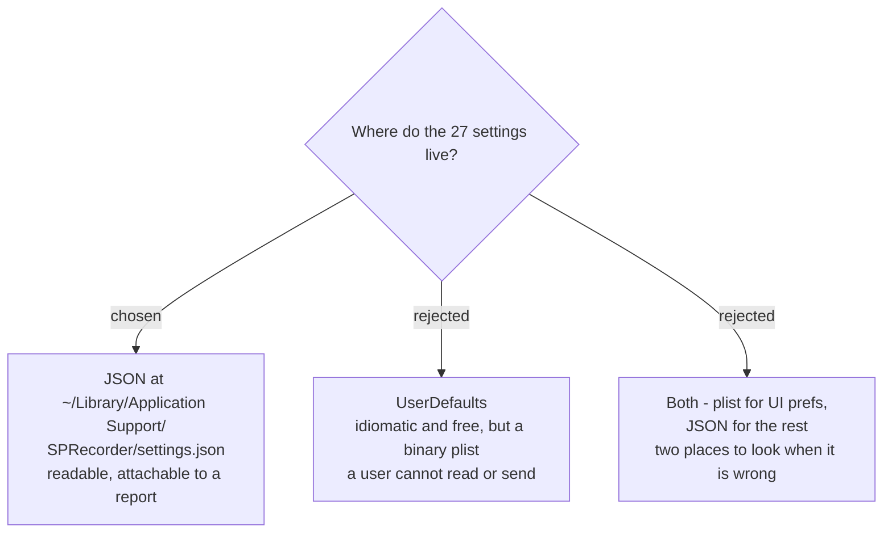

# Settings as a readable JSON file in Application Support

The Windows app reads `appsettings.json` from beside the executable. A signed
macOS app bundle is read-only, so that location is impossible. Settings move to
`~/Library/Application Support/SPRecorder/settings.json`, still as readable JSON.

## Why

**The user can read it and send it.** The destination requires logs good enough to
support a user who reports a problem, and the user intends to build an in-app
report feature that attaches related files. A settings file the user can open,
read and attach serves that directly; a binary plist requires a `defaults`
incantation and cannot be eyeballed.

**It preserves the existing mental model.** The Windows app's settings are JSON
with the same key names, so a support conversation works the same way on both
platforms.

**It keeps `SPRecorderCore` platform-neutral.** Per `sprecorder-mac-0002` the Core
must not import platform frameworks. Reading a JSON file is Foundation-only;
`UserDefaults` would push a storage concern into a place that should only see a
decoded value.

## What carries over, and what does not

The 27 settings are all scalars, so the shape survives. Three do not:

- `OutputDirectory` defaults to `%USERPROFILE%\Documents\SPRecorder` and is passed
  through `ExpandEnvironmentVariables`. Windows environment-variable syntax goes;
  see `sprecorder-mac-0005`.
- `ScreenMonitorDeviceName` holds `\\.\DISPLAYn`. macOS identifies displays by
  `CGDirectDisplayID`, which is **not stable across reboots or reconnection**, so
  the stored value must be a stable display UUID rather than the transient ID.
- `Mp3BitrateKbps` is misnamed once `audio-encoding-format` moves output to AAC.

**The validation in `AppConfig.Load` must survive the rewrite.** It clamps
`SplitTimeMinutes` to 1-1440 and `SplitSizeMb` to 1-10000, snaps `ScreenFrameRate`
to the nearest of 15/25/30, and falls back to a default for out-of-range
`ScreenQuality`, `MarkerLogFormat` and `SplitMode`. A hand-edited settings file is
now the expected support path, so that validation is load-bearing, not decoration.

## Consequences

`AppConfigStore` is rewritten rather than translated, as `sprecorder-mac-0003`
already decided. Atomic save keeps its temp-file-then-replace shape via
`FileManager.replaceItemAt`.
