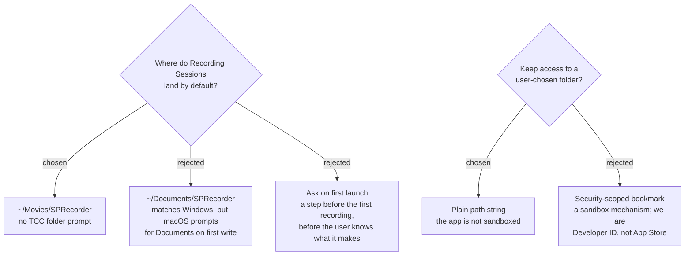

# Recordings default to ~/Movies, and no security-scoped bookmarks

Recording Sessions default to `~/Movies/SPRecorder`. A user-chosen folder is
stored as an ordinary path, with no security-scoped bookmark.

## Why ~/Movies

**It avoids a permission prompt.** Since Catalina, macOS gates Desktop, Documents
and Downloads behind a TCC consent dialog for every app, sandboxed or not.
`~/Movies` is not in that set. The destination asks for the easiest possible
install, and this removes one dialog from the path to a first recording — a
dialog that, if refused, makes the app fail for a reason the user cannot see.

**It is semantically right.** A Recording Session can contain a Screen recording,
which is an MP4. `~/Movies` is where QuickTime saves, so the folder matches what
the app produces.

`~/Documents` was rejected despite matching the Windows default, because matching
Windows is worth less than removing a permission dialog from first use.

> Verify on first build that writing to `~/Movies` raises no TCC prompt on macOS
> 26. The TCC-protected folder set is asserted here from the documented Catalina
> behaviour, not measured on this machine.

## Why no security-scoped bookmarks

Security-scoped bookmarks are an **App Sandbox** mechanism. `install-and-update-channel`
is constrained to Developer ID distribution because the Mac App Store is out of
scope, and a Developer-ID app is not required to sandbox. A non-sandboxed app
keeps access to any path the user's account can reach, so the stored path is
enough. This removes bookmark creation, staleness handling and
`startAccessingSecurityScopedResource` bracketing from the design entirely.

If the app is ever sandboxed, this ADR is superseded, not amended.

## The file extension leaves the pattern

`FileNamePattern` currently ends in `.mp3` while `BuildScreen` overrides it to
`.mp4`, `BuildMarker` to `.md`/`.csv` and `BuildReviewPage` to `.html` — so the
pattern's extension only ever applied to audio, and `audio-encoding-format` has
now made `.mp3` wrong. The extension is therefore derived per track from the
format, and the pattern describes only the name. A user can no longer type an
extension that contradicts the file's actual contents.

The default pattern itself is deliberately **not** decided here; see the
`default-file-name-format` ticket.

---

## Amendment — 2026-09-11, measured

SPRecorder (`com.sprecorder.mac`, ad-hoc signed, macOS 26.6.2) created
`~/Movies/SPRecorder` and a Session folder inside it on its first Recording Session.
A "would like to access files in your Movies folder" box did not appear: tccd logged no
`MoviesFolder` request between 07:29 and 09:00, across 11 Session folders.
Plan 1 first-demo results: `docs/superpowers/plans/2026-09-10-plan-1-first-demo-results.md`.
