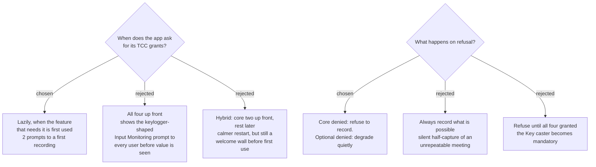

# Permissions are asked lazily, per feature, and refusal blocks only the core

## Which grants are actually required

Earlier decisions on this map removed more of these than the ticket assumed:

| grant | required for | when |
|---|---|---|
| **Microphone** | the Mic track | core |
| **Screen & System Audio Recording** | the System track, via ScreenCaptureKit | core |
| **Screen Recording** (video portion of the same grant) | the Screen recording | optional feature |
| **Input Monitoring** | the Key caster | optional feature |
| ~~Accessibility~~ | **nothing** | never asked |

**Accessibility is never requested.** `global-hotkey-mechanism` chose Carbon
`RegisterEventHotKey`, which needs no permission, so the port avoids the grant
entirely. `NSEvent` and `CGEventTap` would each have dragged it in.

On macOS 26 the Screen Recording panel is *"Screen & System Audio Recording"* and
carries an audio-only sub-toggle, so a user can grant system audio without
granting screen capture — which is exactly the split this ADR relies on.

## Why lazily

`ADR 0004` (Windows) makes the Screen recording an opt-in toggle, off by default,
and `ScreenRecordingEnabled` confirms it. So a new user who presses the hotkey
needs **two** grants, not four, and a user who never enables screen recording
never meets the Input Monitoring prompt — the one that reads as keylogging and is
most likely to end the install.

Asking up front was rejected because it puts the frightening prompt before any
demonstrated value. The hybrid was rejected for the same reason in weaker form.

> **Known cost of this choice.** Granting Screen Recording has historically
> required the app to be restarted before capture works, which is intrusive
> mid-recording. The mitigation is to preflight with
> `CGPreflightScreenCaptureAccess()` when the user *arms* recording rather than at
> the moment they press the hotkey, so any restart happens before a meeting is in
> progress. Verify the restart requirement on macOS 26 at first build.

## Why refusal blocks the core but not the extras

**A meeting happens once.** If system audio is denied and the app records anyway,
the user gets their own voice and none of the other participants — and finds out
after the meeting is over and unrepeatable. So a denied core grant refuses to
start a Recording Session, names the missing grant, and opens the correct System
Settings pane.

A denied **Input Monitoring** only disables the Key caster. The Recording Session
still runs, because losing the on-screen key display costs nothing that cannot be
recreated.

Refusing everything until all four are granted was rejected: it makes the Key
caster mandatory, and `ADR 0003` (Windows) already treats showing every keystroke
as a privacy trade-off a user should be able to decline.

## How a missing grant is shown

This reuses the existing visual language rather than inventing one:

- **`ADR 0017`** — a warning badge composited over the menu-bar icon, independent
  of the idle/recording base state, plus a menu item naming what is missing. A
  missing grant is exactly the ADR 0017 case: a capability that has silently
  failed and that the user must notice without already suspecting it.
- **`ADR 0016`** — at startup, **one consolidated alert** ("2 permissions
  missing"), never one per grant, and treated as a first alert only. The durable
  detail lives on the badge and in Settings.
- **`ADR 0018`** — resolved by the user acting, not by polling. The app re-checks
  when it next needs the capability, not on a timer.

Settings gains a Permissions view listing each grant, its state, and a button that
opens the matching System Settings pane.

## Consequences

Unblocks `signing-and-notarization` and contributes to `install-and-update-channel`.
`menu-bar-app-shape` inherits a requirement: the icon must support a badge overlay
and the menu must be able to name missing grants.

---

## Amendment — 2026-09-10, measured

The restart risk recorded above was **verified and discharged** by
`verify-screen-recording-restart`, on macOS 26.6.2 / arm64:

**No relaunch is required.** A process running since before the grant existed began
capturing 12 seconds after the operator toggled the permission on, with no restart.
The lazy prompting decision stands unchanged, and the mitigation suggested above —
preflighting at arm-time to keep a restart out of a live meeting — is no longer
needed for that reason (it may still be worth doing to keep the dialog out of the
meeting, which is a separate argument).

Two behaviours were found that this ADR must now carry:

**1. `CGPreflightScreenCaptureAccess()` can return `false` while capture succeeds.**
It is cached per process and was observed reporting "not allowed" in the same log
line as a successful `SCShareableContent` call. **Never gate a Recording Session on
preflight alone.** Use it as a cheap hint for the menu-bar badge; treat attempting
the capability and reading the error as authoritative. A gate built on preflight
would refuse to record when recording would have worked.

**2. A `Deny` click can override the System Settings switch.** After the operator
clicked Deny and then enabled the switch, both the running process and a freshly
launched one still read `false`; only `tccutil reset ScreenCapture <bundle-id>`
cleared it. The app must detect "Settings shows granted, capture still fails" and
tell the user how to recover — otherwise the UI convinces them the app is broken.
This is a new requirement on the missing-grant UI described above.

**3. macOS 26 has two separate permission lists**, not one grant with a sub-toggle:
*Screen & System Audio Recording* and *System Audio Recording Only*. The System
track may therefore be able to ride the narrower second grant, which never mentions
the screen. Which API lands an app in which list is not yet established.
