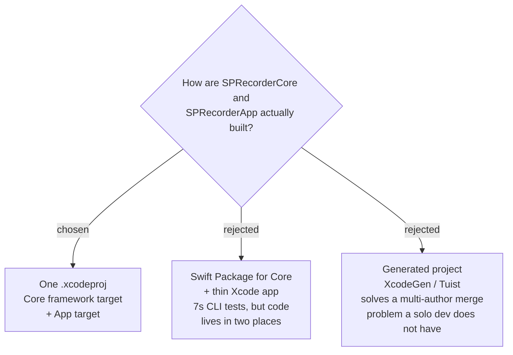

# One Xcode project with two targets



`SPRecorderCore` and `SPRecorderApp` (`sprecorder-mac-0002`) are two **targets in a
single Xcode project**. Both remain real, separate Swift modules, so the module
boundary the earlier ADR describes is unchanged — only its build container is
decided here.

## Structure

| target | kind | holds |
|---|---|---|
| `SPRecorderCore` | framework | domain types, the Recording Session orchestrator, the platform protocols |
| `SPRecorderApp` | application | adapters, SwiftUI/AppKit, entry point |
| `SPRecorderCoreTests` | unit test | the translated tests from `sprecorder-mac-0003` |

`Info.plist` and the entitlements file belong to the **App** target only. The Core
is a framework and has no need of either — it never asks for a permission, because
`sprecorder-mac-0002` puts every platform call in an adapter. This keeps the TCC
usage strings and hardened-runtime settings in exactly one place, which is what
`signing-and-notarization` will need.

## Why this, and what it costs

The user chose one place over two. The trade was made explicitly, against a
measured alternative: a Swift Package Core builds and tests from the command line
in **7.4 seconds** with no Xcode involved. That speed is now given up.

**The costs, recorded so they are not rediscovered as surprises:**

- Testing the Core requires a scheme and `xcodebuild`, not `swift test`. The
  command is expected to be
  `xcodebuild test -scheme SPRecorderCore -destination 'platform=macOS'`.
  **This has not been verified — confirm it when the project is first created.**
- Any machine that builds this project needs a **full Xcode install**, not just the
  command-line tools. That matters if a build machine is ever added.
- The `.xcodeproj` file is awkward to diff. Harmless while one person works on it;
  the reason to revisit this ADR is a second contributor, not a change of taste.

## Enforcing the Core boundary — the compiler does NOT do it

`sprecorder-mac-0002` claimed the compiler makes `import ScreenCaptureKit` inside
the Core a build error. **That claim is false and is corrected in that ADR.**
Measured 2026-09-10: a library target importing `ScreenCaptureKit` and `AppKit`
compiled cleanly in 4.5 seconds. A Swift module boundary stops the Core using the
App's *own* types; it does nothing about system frameworks, which are available to
any macOS target.

The boundary is therefore enforced by a **Run Script build phase on the
`SPRecorderCore` target** that fails the build when a forbidden import appears:

```sh
if grep -rlE '^import (AppKit|SwiftUI|ScreenCaptureKit|AVFoundation|Carbon|CoreAudio)' "$SRCROOT/SPRecorderCore"; then
  echo "error: SPRecorderCore must not import a platform framework (sprecorder-mac-0002)"
  exit 1
fi
```

A Linux compilation would enforce it properly, since `import AppKit` genuinely
fails there — but no container runtime is installed on this machine (`docker` and
`podman` both absent), so that route would add infrastructure to buy a stricter
version of a check the script already performs.

## Consequences

Unblocks `signing-and-notarization`, which needs to know where the entitlements
file lives.
