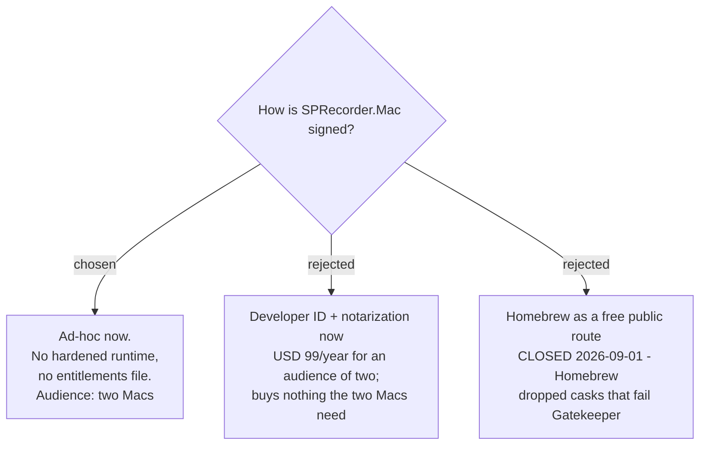

# Ad-hoc signing now; Developer ID deferred with public distribution



The destination changed while this ticket was being resolved: the audience is the
developer and his wife, two Macs, not the public. Public distribution is a possible
later goal, tracked by the `public-release` milestone.

Against that audience, the app is **ad-hoc signed** (`codesign -s -`), with **no**
hardened runtime and **no** entitlements file. `Info.plist` still carries
`NSMicrophoneUsageDescription`, which TCC requires at runtime regardless of signing.

## What ad-hoc costs, measured

Signing identity available on the development Mac today: **none**
(`security find-identity -v -p codesigning` → "0 valid identities found").

The cost is visible in the signature's own designated requirement, read on this
machine 2026-09-10:

```
ad-hoc:        designated => cdhash H"2e164d99cab4147316d02163ba77b331a45de6b2"
Apple-signed:  designated => identifier "com.apple.calculator" and anchor apple
```

An ad-hoc identity is **the exact bytes of one build**. A real certificate is **who
made it**. So every rebuild is a different application as far as macOS is concerned,
and TCC grants are keyed to that identity.

**Consequences accepted:**

- During development, screen and microphone grants are lost on most rebuilds. This
  is friction for the developer, not for a user.
- On the wife's Mac, each new version is a new identity: one Gatekeeper
  "Open Anyway" per version, and permissions granted again per version. At an
  audience of one that is tolerable; at an audience of hundreds it would not be.
- Gatekeeper's Control-click override was removed in macOS Sequoia. The route is now
  System Settings → Privacy & Security → "Open Anyway", and **that button appears
  only for about an hour after a failed launch**. This must be written into whatever
  install note she is given.

## Why Homebrew is not a free route

Homebrew **ended support for casks that fail Gatekeeper checks on 1 September
2026** — nine days before this decision — and is removing the `--no-quarantine`
flag, stating it will "stop making it easier to bypass OS-level security". An
unsigned app therefore cannot be distributed through Homebrew at all. Homebrew is
now the *worst* route for an unsigned build, not a workaround.

## Recorded so the future decision is not re-litigated: the Key caster is notarizable

Should public distribution ever be taken up, the Key caster is **not** an obstacle.
KeyCastr is an established open-source keystroke visualiser distributed by direct
download and Homebrew cask, outside the App Store. The rejection precedents found
are **App Store** rejections under a human-review guideline about keystroke access;
notarization is automated malware scanning and applies a different bar. The App
Store is already out of scope.

## What the deferred path will require

Recorded now so the later ticket starts from facts rather than research:

- Apple Developer Program membership, **USD 99/year**. Enrolment involves an identity
  check that takes days — it is not instant, and that is the scheduling risk.
- Developer ID Application certificate, hardened runtime, and a secure timestamp.
- `com.apple.security.device.audio-input` for microphone access under the hardened
  runtime. Screen Recording and Input Monitoring need no entitlement for a
  non-sandboxed app; they are TCC grants only.
- Switching to Developer ID changes the app's identity once, so any earlier tester
  re-grants every permission at that point. Doing it before there are testers avoids
  that entirely.

## Consequences

`install-and-update-channel` becomes a `public-release` concern rather than a
blocker on shipping to two Macs.

---

## Amendment — 2026-09-10: ad-hoc signing is superseded

`sprecorder-mac-0040` replaces the **ad-hoc** choice above with **one free self-signed
code-signing certificate**, an option this ADR did not consider. An ad-hoc requirement is a
build's cdhash, so every version lost every permission; a certificate's requirement names who
made it, so permissions should carry over. That is proven on the Mac holding the certificate
and must be probed on the second Mac at the first update.

What stands unchanged: no hardened runtime, no entitlements file, Developer ID and
notarization deferred with `public-release`, and the Homebrew finding.
