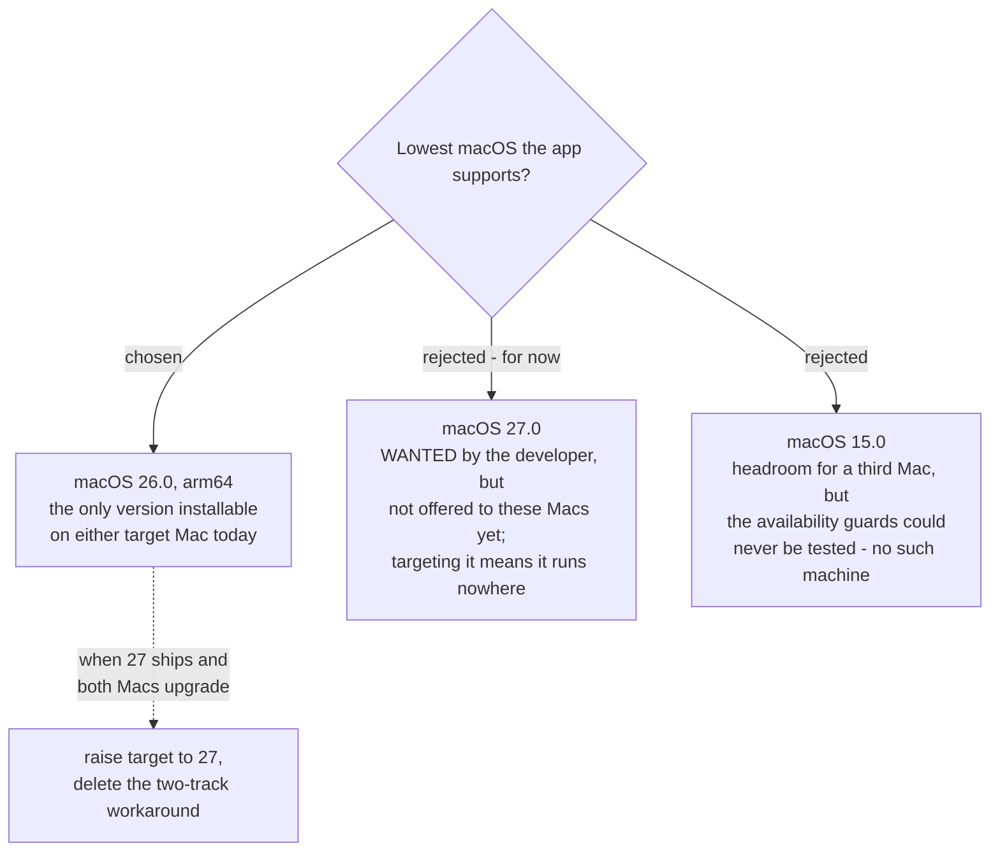

# Deployment target is macOS 26.0 today, macOS 27 as soon as it ships



Deployment target **macOS 26.0**, architecture **arm64 only** — as a **staging
post, not a preference**. The intent is macOS 27, taken up as soon as it can
actually be installed.

## Why the floor is a fact, not a judgement

`sprecorder-mac-0008` changed the audience to two Macs, the developer's and his
wife's. Both were then confirmed identical: **macOS 26.6.2 on Apple Silicon**. So
this is not a reach-versus-API trade against an unknown population.

## macOS 27 is wanted, and is not yet possible

The developer chose macOS 27 outright, which would give
`SCRecordingOutputConfiguration.mixesAudioWithMicrophone` and let the Screen
recording carry its audio in a single pass — deleting the two-track workaround from
`screen-capture-stack` before it is ever written. Owning both target machines makes
that a real option in a way it never is for a public app.

**It is blocked by availability, verified 2026-09-10 on the development Mac:**

```
$ softwareupdate --list-full-installers
* Title: macOS Tahoe, Version: 26.6.2 ...   <- highest offered
* Title: macOS Tahoe, Version: 26.6.1 ...
* Title: macOS Tahoe, Version: 26.6   ...
```

No macOS 27 is offered. A separate check (`softwareupdate -l`) offers **Command Line
Tools for Xcode 27.0** — developer tools, not the operating system. The two are easy
to confuse and the confusion is what made 27 look available.

Targeting 27 today would produce an app that runs on **neither** target Mac.

My own earlier objection — that a `.0` release is where audio and screen-capture
defects concentrate, and a lost meeting recording is unrepeatable — still stands as a
reason to let 27 settle before adopting it. But it is the *secondary* reason. The
primary one is that 27 cannot be installed.

## The follow-through this obliges

Because the move to 27 is intended rather than hypothetical:

1. The two-track audio workaround **is** written now, and **must** sit behind the
   internal seam `screen-capture-stack` called for. Raising the target must then be a
   one-line change plus a deletion, not surgery.
2. When macOS 27 ships and both Macs upgrade, revisit this ADR first.
3. Re-test the ScreenCaptureKit paths on 27 before deleting anything.

## Why not macOS 15

macOS 15 is the genuine floor for `SCStreamConfiguration.captureMicrophone` and
would leave room for a third Mac. Rejected because there is **no macOS 15 machine to
test on**. Availability guards nobody can execute are untested code that rots, and
would first run in front of the very user they were written for.

## arm64 only

Both Macs are Apple Silicon, so "Intel Mac support, or arm64-only" is settled by fact:
**arm64 only**. That fog line moves to out of scope. A universal binary would double
build output to serve zero machines.

## Consequences

`install-and-update-channel` loses one blocker. The `public-release` milestone must
revisit this ADR before anything ships to strangers: a floor of 26.0 — still less a
future floor of 27.0 — excludes a large share of Macs in use, which is acceptable for
two known machines and not for the public.
