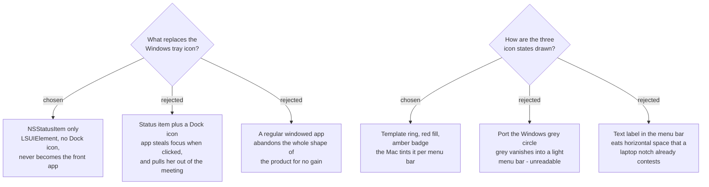

# A menu-bar-only app: no Dock icon, no window at launch, eleven menu rows

## The shape

`NSStatusItem` in the menu bar, `LSUIElement` set, so the app has **no Dock icon
and no window at launch**. It never becomes the front application.

That last part is the load-bearing one and it is not cosmetic. The product's whole
premise is that a Recording Session runs *during* a meeting. Any surface that makes
SPRecorder frontmost takes the meeting out of the user's face. The mockup shows this
deliberately: in both menu states the left of the menu bar reads *Microsoft Teams*,
not SPRecorder.

## The menu

All eleven Windows rows survive. Three change to follow macOS convention:

| row | Windows | macOS | why |
|---|---|---|---|
| Settings | `Settings…` | `Settings…` **⌘,** | every Mac app opens settings with ⌘, — she already knows it |
| About | `About` | `About SPRecorder` | Mac menus name the app |
| Quit | `Quit` | `Quit SPRecorder` **⌘Q** | same, plus the universal shortcut |
| Hotkey warning | `⚠ Hotkey(s) inactive — open Settings` | `⚠ Hotkey taken — open Settings` | *inactive* describes the symptom; *taken* names the cause |

Row visibility is unchanged from the Windows app: the two Marker rows are disabled
rather than hidden while idle (they teach the feature exists), `Open marker review`
appears only once a review page exists, and the hotkey warning is hidden unless
`GlobalHotkey.IsRegistered` is false — the **Inactive hotkey** of the glossary.

## Icon states

Three, matching Windows' three:

| state | drawing |
|---|---|
| Idle | hollow ring, **template image** — the Mac tints it black on a light bar, white on a dark one |
| Recording | solid `#e0362c` fill |
| Inactive hotkey | hollow ring plus an amber badge, lower-right |

The Windows idle icon is a **grey filled circle** and it cannot be carried over.
A macOS menu bar is light or dark depending on the wallpaper behind it, and a grey
dot disappears into one of them. A template image is the platform's own answer and
costs nothing.

`IconFactory.CreateCircle` / `CreateCircleWithBadge` (45 lines) are therefore
**rewritten, not translated** — the badge composition survives as an idea, the
GDI+ drawing does not.

## Consequences

- The app cannot show anything at launch, so a first-run user sees only a new icon
  appear near the clock. Whether that needs a one-time nudge is **not decided here**
  and is left to `logging-and-diagnostics` / first-run work.
- No Dock icon means no ⌘-Tab entry. Quitting is via the menu, or `⌘Q` while the
  menu is open.
- Anything the user *must* see cannot live in a notification (see
  `sprecorder-mac-0012`); it belongs on this icon or in this menu, where no
  permission can suppress it.

## Mockup

`SPRecorder Mac design system` → **Components / The icon by the clock**, and
**Components / What opens when she clicks it**. Foundations card records the
system appearance values every screen is built from.
