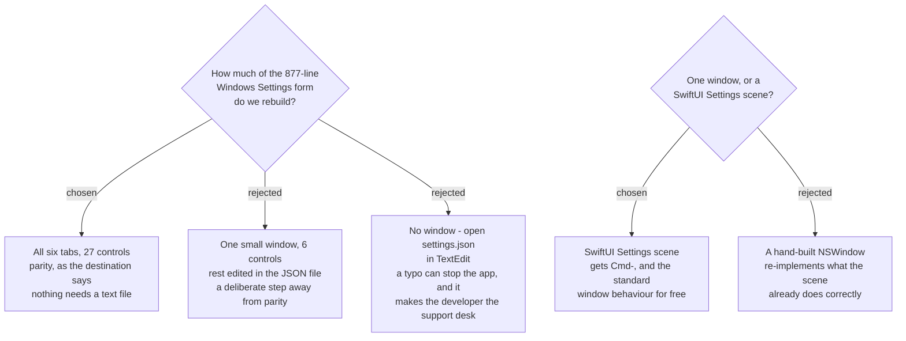

# Settings is a six-tab window, rebuilt in full

## The decision

Rebuild the Windows Settings form **whole**: six panes — General, Audio, Mixed file,
Splitting, Screen, Markers — and all 27 settings from `AppConfig`. Nothing is hidden
behind the JSON file.

The user chose this over a deliberately smaller window. It is the reading most
consistent with this map's own destination, which asks for **full feature parity**
with the Windows app; the small window would have been a scoped-down product, not a
port.

## What it costs, measured

| | Windows today |
|---|---|
| `SettingsForm.cs` | **877 lines** |
| panes | **6** |
| settings in `AppConfig` | **27** |
| `HotkeyCaptureControl.cs` | 223 lines |

This is the largest single build on the remaining map. Recorded here so the estimate
is not rediscovered later as a surprise.

## Shape

A SwiftUI `Settings` scene, not a hand-rolled window. The scene supplies **⌘,**, the
standard settings-window behaviour and the tab chrome without re-implementation —
and `sprecorder-mac-0010` already commits the menu to that shortcut.

Two macOS translations apply throughout:

- **Checkboxes become switches.** Windows draws 18 checkboxes; macOS uses a switch
  for anything that turns a behaviour on or off, keeping the square box only for
  items in a list.
- **Labels sit right-aligned in a left column**, controls to their right — the macOS
  form convention, not the Windows left-aligned stack.

## Live apply

The Windows form has Save / Cancel and `AppConfigStore` writes on Save. That is kept:
macOS convention would prefer immediate application, but three settings — output
folder, the hotkeys, and the audio device — cannot be changed mid-recording, and the
Windows form already carries the *"Stop recording to change devices"* warning for
exactly that reason. Explicit Save keeps one rule instead of two.

## What this does not decide

- **The default file name format** stays open — that is `default-file-name-format`,
  still on the frontier.
- **Which display the Screen pane lists and how it is remembered** stays open — that
  is `recorded-monitor-identity`.
- **Whether the microphone picker is needed at all**, given macOS has a system-wide
  input device, is a build-time question, not a decision this ADR forecloses. If the
  picker turns out redundant the Audio pane shrinks; parity is about reachability,
  not about matching Windows control-for-control where the platform already solves it.

## Mockup

`SPRecorder Mac design system` → **Screens / Settings — six tabs**. The two rejected
shapes are kept as cards (`Settings — small window`, `Settings — text file only`) so
the options are not re-proposed from memory in six months.

---

## Amendment — 2026-09-10. Seven tabs, not six.

`sprecorder-mac-0022` adds a seventh tab, **Permissions**, after Markers. It is the home
`sprecorder-mac-0006` promised for the permissions list and the home of Check my setup
(`sprecorder-mac-0017`). The six tabs above are unchanged and remain the Windows parity
this ADR chose; the seventh is the admitted support exception, not a parity tab.

---

## Amendment — 2026-09-10

The Screen tab's **monitor picker is removed for now**: `sprecorder-mac-0021` records the
built-in screen only, and defers external monitors because none is available to build or
test against. Settings is **26 of 27** controls until that feature returns. The other five
tabs are unchanged.
