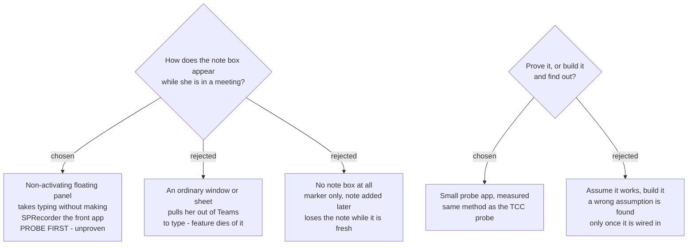

# The marker-note box must not take focus — and that gets probed, not assumed



## The requirement that must not break

`ADR 0010` (Windows) fixes the behaviour: the Marker's timestamp is captured **at the
moment the hotkey is pressed**, not when the note is submitted. `MarkNoteInputForm` is
modeless for exactly this reason, and it exposes `CommitNow()` so a recording that
stops with the box open still commits what was typed.

All of that survives the port unchanged. This ADR is about a macOS-only hazard the
Windows implementation never had to face.

## The hazard

On macOS, a window that accepts keyboard input normally makes its application the
**front** application. `sprecorder-mac-0010` commits the app to never doing that,
because the user is in a meeting when this box appears. If pressing ⌃⌥N takes Teams
out of front, the feature is used twice and then abandoned.

## The intended answer, explicitly unproven

macOS has a non-activating panel — an `NSPanel` with `.nonactivatingPanel` in its
style mask — which can become key and accept typing **without** activating the
application. Spotlight-shaped utilities rely on it.

**This has not been verified for this case.** It is written here as the intended
route and as a claim awaiting measurement, not as a fact. The precedent is
`sprecorder-mac-0006`, whose permission assumptions were replaced by three measured
findings only after a real signed `.app` was built and run — and where one assumption
turned out wrong.

## The probe

Before the feature is built, build a small probe app that:

1. Runs as a menu-bar-only app with no Dock icon, as the real app will.
2. Registers a Carbon hotkey.
3. On the hotkey, shows a non-activating panel with a text field.
4. Logs, on each press: which application was frontmost **before**, whether the panel
   became key, whether typed characters reached the field, and which application was
   frontmost **after**.

Success condition, declared before the run: **the frontmost application is unchanged
before and after, and the typed text arrives in the field.** Anything else is a
failure, including "it mostly works".

Run it with a real meeting window in front, not with Finder frontmost — the failure
mode is about taking focus from a live app.

## The fallback, decided now

If the probe fails: the hotkey still saves the Marker instantly, with no note, and no
window appears at all. The note is added afterwards from the **Marker review page**,
which already lists every Marker. Nothing is lost except the note being written while
it was fresh.

Deciding the fallback now is deliberate — it means a failed probe does not reopen the
whole question.

## Notifications, and why nothing critical may live in one

The Windows app raises **21 balloon messages**. These become macOS notifications, and
that carries a constraint worth recording:

macOS asks the user for notification permission once. **If she declines, all 21 go
silent permanently**, and the app has no way to tell her why. So notifications may
carry helpful news — *Recording saved*, *Your call ended* — but never anything the
user must act on. Anything critical belongs on the status icon or in the menu, per
`sprecorder-mac-0010`.

The Windows `CallEndConfirmation` (115 lines, a borderless always-on-top window with
a 60-second countdown) becomes a notification with **Stop** / **Keep going** actions.
The countdown is dropped: a notification that auto-dismisses is not a deadline, and
the Windows countdown existed to stop the window sitting on screen forever.

## Mockup

`SPRecorder Mac design system` → **Screens / Prompts and messages**. The card marks
the panel claim as *needs building to confirm*, matching this ADR.

---

## Amendment — 2026-09-10, measured. The panel claim is PROVEN.

The route recorded above as **UNPROVEN** was probed and **passed**. Measured on
macOS 26.6.2 / arm64, with an ad-hoc signed `LSUIElement` app bundle — the same
shape the real app will have.

**5 hotkey presses. The frontmost application changed on none of them.**

```
press 4: frontmost BEFORE             = Code [com.microsoft.VSCode]
press 4: panel isKeyWindow            = true
press 4: text field is editing        = true
press 4: frontmost AFTER show         = Code [com.microsoft.VSCode]
press 4: >>> TEXT ARRIVED IN THE FIELD      = true  (content: "probe", 5 chars)
press 4: frontmost AFTER close        = Code [com.microsoft.VSCode]
press 4: >>> FRONTMOST UNCHANGED END TO END = true
press 4: VERDICT = PASS
```

Both halves of the pass condition declared in advance were met, and the human
channel agreed with the machine one: the menu bar read **Code** for the whole time
the panel was open and accepting keystrokes.

**It works over a full-screen space.** Press 5 was run with the frontmost window
full screen, and the operator confirmed by eye that the panel was drawn on top of
it and accepted 17 typed characters. This matters because a meeting is normally
full screen, and `panel.isVisible` alone could not have told the two apart.

### The configuration that works — recorded so it is not rediscovered

```swift
NSApp.setActivationPolicy(.accessory)          // and LSUIElement in Info.plist

let p = NSPanel(contentRect: …,
                styleMask: [.nonactivatingPanel, .titled, .closable, .utilityWindow],
                backing: .buffered, defer: false)
p.isFloatingPanel        = true
p.level                  = .floating
p.hidesOnDeactivate      = false
p.becomesKeyOnlyIfNeeded = false
p.collectionBehavior     = [.canJoinAllSpaces, .fullScreenAuxiliary]   // the full-screen half

p.makeKeyAndOrderFront(nil)      // NOT NSApp.activate(…) — that is what breaks it
p.makeFirstResponder(field)
```

`.fullScreenAuxiliary` is load-bearing, not decoration. Without it the panel has no
route onto a full-screen space.

### A trap worth more than the result

**`NSApp.isActive` becomes `true` while the app is NOT the frontmost application.**
Observed on all 5 presses: `isActive` went `false → true` on showing the panel,
while `NSWorkspace.frontmostApplication` never moved off `com.microsoft.VSCode`.

`isActive` means *this app owns a key window*, not *this app is in front*. **Never
gate behaviour on it.** `sprecorder-mac-0010` commits the app to never being the
front application; a check written against `isActive` would report that commitment
broken on every single marker note.

Corroborated in passing: the Carbon hotkey registered with **no permission prompt**,
which is what `sprecorder-mac-0006` asserts and had not measured.

### What was not tested

Every press was against **VS Code**, not Teams or Google Meet in a live call. The
mechanism under test is a window-server behaviour and is app-independent, so this is
recorded as a limit of the evidence rather than a suspected gap.

The fallback recorded above is not needed, and is left in place as the contingency it was.
