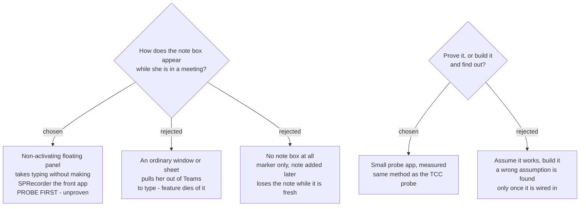

# The marker-note box must not take focus — and that gets probed, not assumed

## The requirement that must not break

`ADR 0010` (Windows) fixes the behaviour: the Marker's timestamp is captured **at the
moment the hotkey is pressed**, not when the note is submitted. `MarkNoteInputForm` is
modeless for exactly this reason, and it exposes `CommitNow()` so a recording that
stops with the box open still commits what was typed.

All of that survives the port unchanged. This ADR is about a macOS-only hazard the
Windows implementation never had to face.

## The hazard

On macOS, a window that accepts keyboard input normally makes its application the
**front** application. `sprecorder-mac-0010` commits the app to never doing that,
because the user is in a meeting when this box appears. If pressing ⌃⌥N takes Teams
out of front, the feature is used twice and then abandoned.

## The intended answer, explicitly unproven

macOS has a non-activating panel — an `NSPanel` with `.nonactivatingPanel` in its
style mask — which can become key and accept typing **without** activating the
application. Spotlight-shaped utilities rely on it.

**This has not been verified for this case.** It is written here as the intended
route and as a claim awaiting measurement, not as a fact. The precedent is
`sprecorder-mac-0006`, whose permission assumptions were replaced by three measured
findings only after a real signed `.app` was built and run — and where one assumption
turned out wrong.

## The probe

Before the feature is built, build a small probe app that:

1. Runs as a menu-bar-only app with no Dock icon, as the real app will.
2. Registers a Carbon hotkey.
3. On the hotkey, shows a non-activating panel with a text field.
4. Logs, on each press: which application was frontmost **before**, whether the panel
   became key, whether typed characters reached the field, and which application was
   frontmost **after**.

Success condition, declared before the run: **the frontmost application is unchanged
before and after, and the typed text arrives in the field.** Anything else is a
failure, including "it mostly works".

Run it with a real meeting window in front, not with Finder frontmost — the failure
mode is about taking focus from a live app.

## The fallback, decided now

If the probe fails: the hotkey still saves the Marker instantly, with no note, and no
window appears at all. The note is added afterwards from the **Marker review page**,
which already lists every Marker. Nothing is lost except the note being written while
it was fresh.

Deciding the fallback now is deliberate — it means a failed probe does not reopen the
whole question.

## Notifications, and why nothing critical may live in one

The Windows app raises **21 balloon messages**. These become macOS notifications, and
that carries a constraint worth recording:

macOS asks the user for notification permission once. **If she declines, all 21 go
silent permanently**, and the app has no way to tell her why. So notifications may
carry helpful news — *Recording saved*, *Your call ended* — but never anything the
user must act on. Anything critical belongs on the status icon or in the menu, per
`sprecorder-mac-0010`.

The Windows `CallEndConfirmation` (115 lines, a borderless always-on-top window with
a 60-second countdown) becomes a notification with **Stop** / **Keep going** actions.
The countdown is dropped: a notification that auto-dismisses is not a deadline, and
the Windows countdown existed to stop the window sitting on screen forever.

## Mockup

`SPRecorder Mac design system` → **Screens / Prompts and messages**. The card marks
the panel claim as *needs building to confirm*, matching this ADR.
