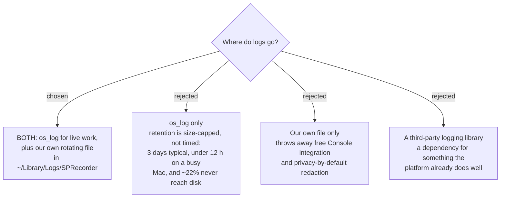

# Two log sinks: os_log for live debugging, our own file as the support record

## The measurement that forced this

The Windows app logs **nothing**. No logging framework, no log file, not one line written
anywhere. There are **32 catch blocks**, and each one either raises a balloon that fades,
swallows the error, or returns empty. Three real examples from the frozen tree:

- `"Screen recording could not start; continuing with audio only."`
- `"Keystroke overlay unavailable; recording screen without it."`
- `"Could not rename to session folder."`

Each of those appears while the user is *in a meeting*, looking at Teams. It fades. Nothing
on the machine records that it ever happened. This ADR exists because the destination for
this map asks for **logs good enough to diagnose a problem she reports**, and there is
currently no floor to build up from.

## Why os_log alone is not enough — researched, not assumed

Apple's unified log is genuinely good, and two of its properties are exactly what this
ticket wanted:

- **Privacy by default.** Interpolated runtime values — a path, a name, a note — are
  redacted to `<private>` when read back. Only literal text in the source stays public.
  You must opt *in* to leaking.
- Free, no dependency, and Console.app reads it live.

But its retention disqualifies it as the artifact a user sends for support. The unified log
is **size-capped, not time-based**: `logd` holds roughly **525 MB** across ~50–55 files and
discards the oldest regardless of age.

| measured | figure |
|---|---|
| complete records | **~3 days** |
| realistic best case | **~5 days** |
| busy machine | **under 12 hours** |
| entries that never reach disk at all | **~22%** |

That last row is decisive on its own. Roughly one entry in five lives only in memory and is
gone within minutes — and not preferentially the old ones. A support story that depends on
the unified log can fail even for a problem reported the same afternoon.

Sources: [Eclectic Light, *How long does the log keep entries?* (2026-03-12)](https://eclecticlight.co/2026/03/12/how-long-does-the-log-keep-entries/);
[*Inside the Unified Log 3: storage and attrition*](https://eclecticlight.co/2025/09/29/inside-the-unified-log-3-log-storage-and-attrition/).

## The decision

**Both sinks, doing different jobs.**

| sink | job | audience |
|---|---|---|
| `os_log`, subsystem `com.sprecorder.mac` | live debugging, Console.app, no retention promise | the developer, at his own Mac, now |
| a rotating file in **`~/Library/Logs/SPRecorder/`** | the support record | the wife's Mac, days later |

`~/Library/Logs/` is the macOS convention for user-visible app logs and is what Console
shows under Log Reports, so the file is findable without instructions.

Categories mirror the glossary rather than the class names — `RecordingSession`,
`SystemTrack`, `MicTrack`, `ScreenRecording`, `Marker`, `Hotkey`, `Permissions` — so a log
line and a conversation with the user use the same words.

## Every one of the 32 catches gets a line

The rule this ADR imposes: **no failure is silent.** Every `catch` writes to both sinks
before it does anything else, including the ones the Windows code deliberately swallows
(`CallDetector`'s transient COM errors, `HdrDisplay`'s best-effort restore). A swallowed
error may be unimportant to the running app and still be the one fact that explains a
complaint.

Warnings that currently vanish as a balloon are logged **and** kept visible: per
`sprecorder-mac-0010`, anything the user must act on belongs on the status icon or in the
menu, because a declined notification permission silences notifications permanently.

## Reading os_log back

`OSLogStore.local()` works for a non-sandboxed app run by an **admin** user, with no
entitlement — Apple DTS has said the documented `com.apple.logging.local-store` requirement
is outdated. Sandboxed apps cannot read it at all. `sprecorder-mac-0005` already chose not
to sandbox, so this door is open.

It is deliberately **not** load-bearing. It depends on the user being an admin, and the
retention numbers above mean it may return nothing. If a future diagnostic bundle includes
unified-log extracts it is a bonus on top of our own file, never a substitute for it.

## Consequences

- A logging seam belongs in `SPRecorderCore`, which per `sprecorder-mac-0002` may not import
  a platform framework. So Core defines the protocol; the app target supplies the `os_log`
  and file implementations. This keeps `RecordingSession` — 382 lines, currently
  untestable because it constructs its own infrastructure — logged without dragging AppKit
  into Core.
- What the file contains, and for how long, is `sprecorder-mac-0014`.
