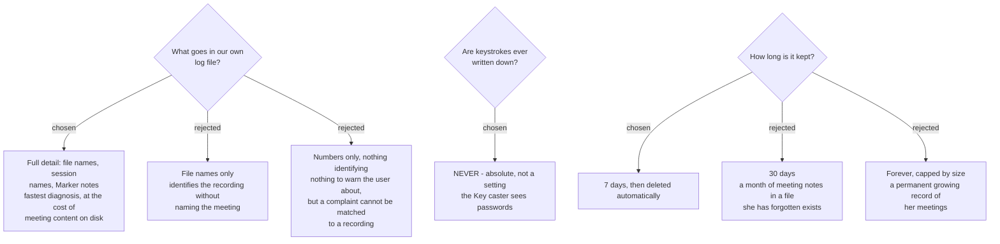

# The diary records everything except keystrokes, and is deleted after 7 days

## What it records

Full detail. Track file names, Recording Session names, Marker notes, paths, device names,
error text, timings.

The user chose this over two narrower options, and the reasoning is worth recording because
the ticket's own framing pushed the other way: for **two people who trust each other**, the
support value of naming the exact recording and the exact marker outweighs the cost of the
detail sitting on disk. That trade would not survive a public release, and this ADR should
be revisited if `public-release` is ever taken up.

## What it never records

**Keystrokes. Ever. Under any setting.**

The Key caster is fed by a global keyboard hook and sees *every key typed while the screen
is recording* — passwords included. The Windows implementation already carries this as a
promise in `InputHighlightOverlay`: *"it never persists keystrokes."*

This ADR promotes that comment to a rule:

> No log sink, no diagnostic bundle, no crash report and no debug build may ever write a
> captured keystroke, in any form — not the key, not a count, not a redacted placeholder
> that confirms one was pressed.

It is not a level, not a toggle and not a redaction policy. It is the one thing in this
system that has no "off". "Everything" in the paragraph above does not reach it, and no
future setting may be added that does.

The reason it is stated this strongly: everything else here is a trade-off between support
and privacy that reasonable people can move. A logged password is not a trade-off.

## How long it is kept

**7 days, then deleted automatically.** One file per day, oldest deleted on launch and at
midnight. No housekeeping by the user, no size prompt, no "clear logs" button to find.

Seven days was chosen against 30 and against keep-everything. It covers the realistic
support case — something noticed during the week and mentioned at the weekend — while
keeping the residue bounded. Since the file holds Marker notes, retention *is* the privacy
control here; it is doing double duty and that is deliberate.

Note this is **longer and more reliable than the unified log**, which per
`sprecorder-mac-0013` manages ~3 days and drops ~22% of entries entirely. The 7-day file is
the record; os_log is the convenience.

## The obligation this places on the send feature

Because the diary contains Marker notes, it contains things people said in her meetings.
That makes one requirement binding on `diagnostic-report-delivery`, which is charted
separately:

> **The send feature may never be one click.** Before anything leaves her Mac it must show
> her the actual contents she is about to send, in a window she can read and cancel, and it
> must be possible to send a redacted version instead.

This is recorded here rather than left to that ticket, because the reason for it is created
by *this* decision. A future session picking up delivery must inherit the constraint, not
rediscover it.

## Levels

| level | what goes in it | example |
|---|---|---|
| `error` | the app could not do what was asked | System track failed to open |
| `warning` | degraded but continuing | screen recording unavailable, audio only |
| `notice` | the spine of a session | started, stopped, marker added, files written |
| `debug` | off by default, on via a hidden switch | device enumeration, buffer timings |

`notice` and above are always on. The default file should stay readable by a person, not
only greppable — she may well be the one reading it first.

## Not decided here

- **Glossary terms** for these concepts are deliberately not added. This repo has no
  `CONTEXT.md`, and whether it copies or references the Windows glossary is still open under
  `adr-and-repo-strategy`. Adding one now would pre-empt that ticket.
- **How the file reaches the developer** — `diagnostic-report-delivery`.
