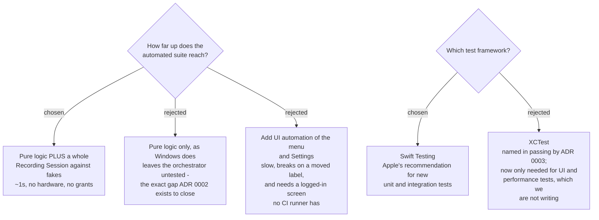

# Swift Testing, and a whole Recording Session run against fakes

## The measured baseline

Counted in the Windows repo on 2026-09-10, not taken from the ticket — **the
ticket's "17 xUnit files" is wrong**:

| | |
|---|---|
| test files | **15** |
| individual `[Fact]` / `[Theory]` tests | **90** |
| lines of test code | 1,337 |
| production classes with **no test at all** | **16** |

The sixteen untested classes are the point of this ADR. They include
`RecordingSession` (382 lines — the class that *is* the app), every capture class,
the overlay, the tray and the whole Settings window. `sprecorder-mac-0002` records
why: `RecordingSession` constructs its own infrastructure, so answering *"does a
session with two Markers produce a Marker review page?"* requires recording a real
meeting.

## The headline test

The Core declares its platform needs as protocols (`sprecorder-mac-0002`), so
every one of them gets a fake in the test target. That makes this possible for
the first time:

> Start a Recording Session against a fake microphone, a fake system-audio source
> and a fake screen recorder. Add two Markers, one with a note. Stop. Assert the
> Mic track, the System track and the Mixed file were all requested, the Marker
> log holds two entries at the right elapsed offsets, and a Marker review page was
> produced that links to both.

It runs in about a second, needs no sound hardware, and needs no TCC grant — so it
also runs on a machine that has none (`sprecorder-mac-0016`).

The **failure paths get the same treatment**, which is what makes
`sprecorder-mac-0013`'s "all 32 catches get a line" rule checkable: a fake screen
recorder that throws must leave the audio tracks intact **and** leave a log line
behind. Asserting the log line is part of the test, not a separate exercise.

## What happens to the 90 tests

`sprecorder-mac-0003` decided the fate of the seven pure classes. Re-reading the
test files against that decision changes the answer for three of them:

| what | tests | verdict |
|---|---|---|
| `CallDetectionStateMachine` | 6 | translate |
| `MarkerLog` | 13 | translate |
| `MarkerReviewPage` | 8 | translate |
| `SessionNameSanitizer` | 2 | translate |
| **`HotkeyStatus`** | **5** | **translate — see the correction below** |
| **`HotkeyValidation`** | **3** | **translate — see the correction below** |
| **`MarkNoteInputForm`** | **4** | **translate — see the correction below** |
| `FileNameBuilder` | 11 | rewrite — ICU date letters, macOS-invalid characters |
| `AppConfigStore` | 12 | rewrite — JSON in Application Support (`sprecorder-mac-0004`) |
| `HotkeyParser` | 2 | drop with its class — Windows virtual-key codes |
| `Mp3FrameSplitter` | 8 | drop with its class — `audio-encoding-format` chose AAC |
| `Mp3Mixer` | 2 | gone — MP3 mixing is AVFoundation's job now |
| `Mp3StreamWriter` | 2 | gone — same reason |
| `HdrDisplay` | 11 | gone — `hdr-display-detection-macos` deletes the feature |
| `IconFactory` | 1 | gone — asserts only "not null, wider than zero pixels" |

**64 of the 90 survive in some form.** 41 translate, 23 are rewritten, 26 go.

### Correction to `sprecorder-mac-0003`

That ADR lists `HotkeyStatus`, `HotkeyValidation` and `MarkNoteInputForm` among
tests that "do not survive: they test Windows infrastructure". **Measured, all
three are pure logic whose behaviour this port keeps:**

- **`HotkeyStatus`** is a 3-field record with `AnyInactive` and `InactiveLabels()`.
  It carries the **Inactive hotkey** concept straight out of the glossary, and
  `sprecorder-mac-0010` renders it as the amber badge and the *"Hotkey taken"* menu
  row. It has no Windows in it at all.
- **`HotkeyValidation`** encodes the rule *two hotkeys must not be the same*. Only
  the parser beneath it is Windows-shaped; the rule is not.
- **`MarkNoteInputFormTests`** does not test a form. All four tests cover
  `PickNoteMonitorDeviceName` — *put the note window on a monitor that is not being
  recorded, so it never appears in the video.* That rule matters more on Mac, not
  less, and it is live input to the open `recorded-monitor-identity` ticket.

The file name misled the earlier reading. The lesson is the general one: a test
file's name describes where the code sits, not what the test asserts.

## Swift Testing, not XCTest

Apple's stated recommendation is Swift Testing for new unit and integration tests;
XCTest remains only for UI tests (`XCUITest`) and performance measurement, neither
of which this suite contains. Both frameworks may sit in one target, so the choice
is not load-bearing — it is simply the default for everything written here.
`sprecorder-mac-0003` named XCTest in passing; this supersedes that.

Verified on this machine, 2026-09-10: **Swift 6.3.3, Xcode 26.6**.

## Why not UI automation

Rejected for a two-Mac audience. UI tests are slow, break when a label moves, and
require a logged-in graphical session — which the CI runner in
`sprecorder-mac-0016` does not have. The surface they would cover is covered
instead by `sprecorder-mac-0017`, which runs on the machine that actually matters.

## Consequences

The test target is `SPRecorderCoreTests` (`sprecorder-mac-0007`), run via
`xcodebuild test -scheme SPRecorderCore -destination 'platform=macOS'` — a command
that ADR still records as **unverified until the project is first created**.

The monitor-picking rule lands in the Core, where `recorded-monitor-identity` can
build on it.
