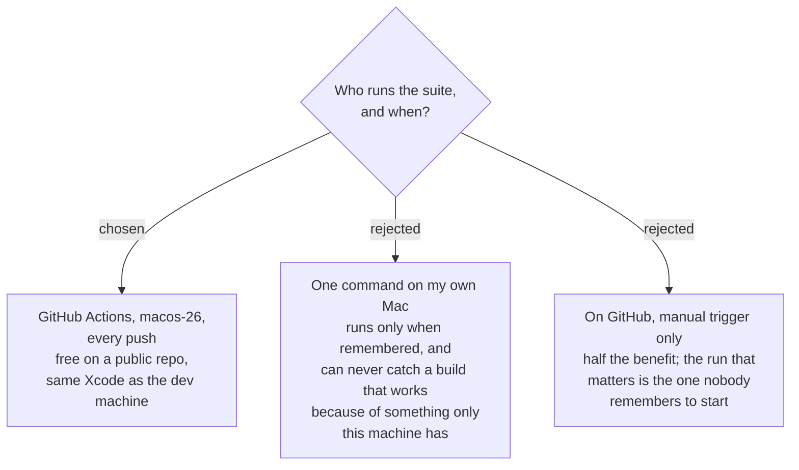

# Tests run on GitHub, on a fresh Mac, for every push

Every push to `ThodsaphonSonthiphin/SPRecorder.Mac` builds both targets and runs
the `SPRecorderCoreTests` suite on a GitHub-hosted Mac.

## Why this is possible at all

Verified 2026-09-10, not assumed:

- **`macos-26` went generally available for GitHub-hosted runners on 26 February
  2026.** It is arm64-only, and its **default Xcode is 26.6** — the same version
  measured on the development machine. So the runner is not an approximation of
  the dev environment; it is the same toolchain.
- The repo is **public**, so Actions minutes cost nothing.

Had either been false this decision would have gone the other way, and the note is
here so a future reader can tell a considered choice from a lucky one.

## What runs there, and what cannot

| runs on the runner | why |
|---|---|
| both targets build | catches a project file that only resolves on one machine |
| the whole Core suite | it is entirely fakes (`sprecorder-mac-0015`) — no hardware, no grants |
| the forbidden-import guard | it is a `grep` (`sprecorder-mac-0007`) |
| the keystroke leak test | it reads files the test itself produced (`sprecorder-mac-0018`) |

| **never** runs there | why |
|---|---|
| real audio capture | the runner has no microphone and no system audio |
| real screen capture | no Screen Recording grant, and nothing to capture |
| the Key caster overlay | no logged-in graphical session |
| anything touching TCC | grants cannot be given to a headless runner |

That second table is not a gap this ADR leaves open — it is the whole reason
`sprecorder-mac-0017` exists.

## The honest caveat

At the time of this decision, **two commits on this repo are unpushed**. A push-
triggered check does nothing for work that never leaves the laptop. The decision
was taken with that stated: the value arrives when pushing becomes the habit, and
the setup cost is a few lines of YAML either way.

## Consequences

A workflow file lands at `.github/workflows/` when the Xcode project is first
created — neither repo has a `.github/` directory today. The green check on a
public repo doubles as the only public evidence the port builds, which
`install-and-update-channel` may want later.
