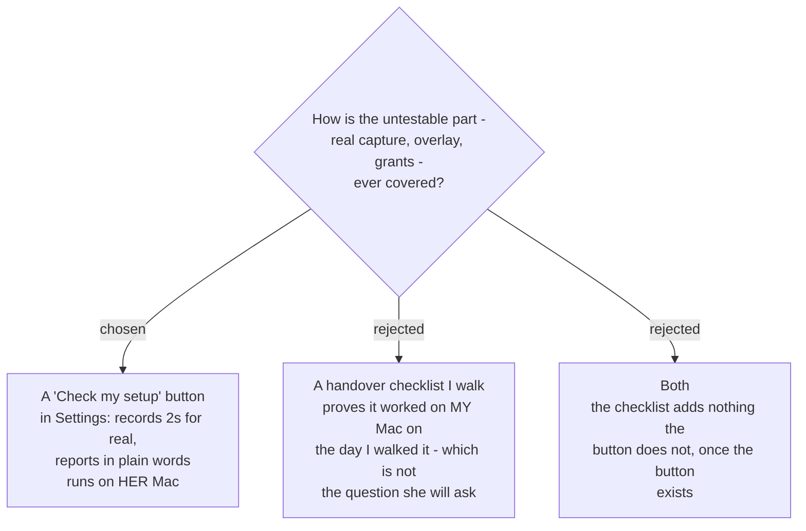

# The app tests its own setup, on the machine that has the problem

Settings gains a **Check my setup** button. Pressing it runs a real two-second
Recording Session and then says, in plain words, what worked and what did not.

## The problem it solves

Nothing decided so far touches real hardware. `sprecorder-mac-0015`'s suite runs
entirely against fakes; `sprecorder-mac-0016`'s runner has no microphone, no
screen grant and nobody logged in. So real capture, the Key caster overlay and all
four TCC grants are untested by every automated thing on this map.

**And the machine where those fail is not the developer's.** The audience is two
Macs; the second one is where a grant gets declined, a microphone gets unplugged,
or the *"Deny click overrides the System Settings switch"* trap recorded in
`sprecorder-mac-0006` bites. A checklist walked before handover cannot reach it. A
button in the app can.

## What it reports

One line per capability, each either working or naming its own fix:

| checked | reported as |
|---|---|
| Mic track | recorded 2 seconds, N kB — or *Microphone permission missing*, with the button that opens the right pane |
| System track | recorded 2 seconds, N kB — or *Screen & System Audio Recording missing* |
| Screen recording | a frame was captured — or the grant is missing, or the feature is switched off |
| Key caster | the overlay drew — or *Input Monitoring missing* |
| the three hotkeys | registered, or **Inactive hotkey** naming which one is taken |
| where files go | the resolved output folder, and whether it is writable |
| the diary | the current log file's path and size (`sprecorder-mac-0013`) |

It writes its findings to the log file as well as the screen, so a support
conversation can start from the diary instead of from a description.

## Two rules it must obey

**It must survive its own failures.** Every check runs independently and reports
its own result — one missing grant may not abort the rest. A self-test that stops
at the first problem hides the second one.

**It deletes what it records.** The two seconds of audio and video exist only to
prove the pipe works. They are removed before the report is shown, and their
existence is never reported as a Recording Session.

## Why not also a handover checklist

Genuinely considered and rejected as duplicated work. Once the button exists, the
handover check *is* pressing the button — on her Mac, which is strictly better
evidence than the same walk on the developer's.

## Consequences

This is a **new feature**, not a test artifact: it needs a place in the Settings
Permissions view (`sprecorder-mac-0006`, `sprecorder-mac-0011`) and it needs its
own design. It is the natural home for the recovery path
`sprecorder-mac-0006` demands — *"Settings shows granted, capture still fails"* —
because it is the only place that can detect that state and explain
`tccutil reset ScreenCapture <bundle-id>` to a person who is not a developer.
