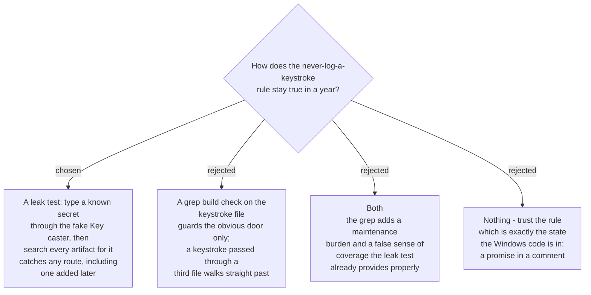

# The keystroke ban is proven by a test that tries to leak one

`sprecorder-mac-0014` states the rule with no exceptions: *no log sink, no
diagnostic bundle, no crash report and no debug build may ever write a captured
keystroke, in any form — not the key, not a count, not a redacted placeholder that
confirms one was pressed.* Today that sentence is enforced by nobody. On Windows
the equivalent promise lives in a code comment in `InputHighlightOverlay.cs`
("it never persists keystrokes"), which is the weakest enforcement there is.

## The test

> During a faked Recording Session (`sprecorder-mac-0015`), feed the fake Key
> caster a distinctive string — a fake password that appears nowhere else in the
> repository. Run the session to completion, including a forced failure so the
> error paths write their lines. Then read **every** artifact the run produced —
> the log file, the `os_log` capture, the Marker log, the Marker review page, the
> settings file and any diagnostic bundle — and fail if that string appears in any
> byte of any of them.

## Why the exit, not the door

The rejected alternative was a `grep` build phase, in the shape
`sprecorder-mac-0007` already uses to stop the Core importing platform frameworks.
It is cheap and it fails fast, and for *imports* it is the right tool — an import
is a single syntactic thing in a single file.

A keystroke is not. It is a value that can travel: through a view model, into an
error message, into a struct that a logger later renders with string
interpolation. A source check would have to know every one of those routes in
advance, which is precisely the knowledge a person adding a new route next year
does not have.

**Testing the exit needs no such knowledge.** It asks the only question that
matters — *did the secret reach the disk?* — and it keeps asking it about code
written after this ADR.

## What it depends on

The test can only search artifacts it can find, so the app must be able to write
its diary somewhere the test controls rather than only to
`~/Library/Logs/SPRecorder`. That is a requirement on the logging seam
`sprecorder-mac-0013` defines: the file sink's directory is injected, not
hardcoded. Without it this test cannot exist, so the requirement is binding.

`os_log` is checked through `OSLogStore` for the process's own entries. Where the
runner denies that read, the test **fails loudly rather than skipping** — a
privacy check that quietly passes because it could not look is worse than none.

## Consequences

`diagnostic-report-delivery` inherits this test: whatever bundle it builds is one
more artifact the leak test must search, and adding a new artifact type without
adding it to that list is the way this rule would be lost.
