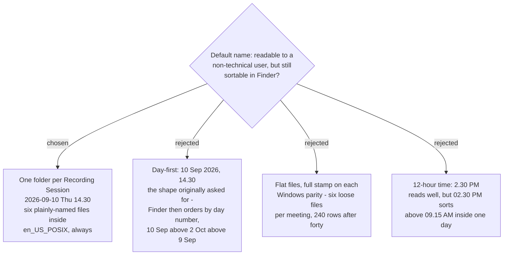

# A Recording Session is a folder named for when it happened



Each Recording Session gets **its own folder**, named
`2026-09-10 Thu 14.30`. The six files inside are named in plain English and
carry no timestamp, because the folder already says when.

## The rule that decides the shape

**A name that sorts must start with the year.** Day-first and correct ordering
in Finder cannot both be true of one string, and no amount of separator choice
changes that. The user asked for day-month-year *and* for something a
non-technical person can read; the first half of that ask is what makes the
second half unreachable, so readability has to be bought somewhere else.

Two places were available, and both are used:

- **The weekday.** `Thu` on the row is what answers *"where is last Tuesday's
  meeting?"* — the question the ticket was written around — without the reader
  doing calendar arithmetic.
- **The folder.** Once the timestamp lives on a folder, the files inside are
  free to be words instead of stamps.

## The shape

```
~/Movies/SPRecorder/
├── 2026-09-08 Tue 09.15/
├── 2026-09-09 Wed 11.00/
├── 2026-09-10 Thu 09.15/
└── 2026-09-10 Thu 14.30 — Team standup/
        Both voices.m4a
        My microphone.m4a
        Computer audio.m4a
        Screen recording.mp4
        Markers.md
        Review page.html
```

The folder pattern is `yyyy-MM-dd EEE HH.mm` — ICU letters per
`sprecorder-mac-0003`. A typed session name is appended after the stamp
(` — Team standup`), never before it: date order survives, the name is still
on the row, and named and unnamed sessions stay in one time-ordered list
instead of scattering.

`:` never appears. It is legal in a POSIX path but Finder renders it as `/`,
so the time separator is `.` throughout.

## The six files, and what they are called

The disk deliberately does **not** speak the glossary. *System track* and
*Mixed file* are the vocabulary of the code, the log lines and every ADR; they
are not words the second Mac's user has been taught. The mapping is recorded
here once, so a support conversation can cross the two:

| glossary term | file on disk |
|---|---|
| Mixed file | `Both voices.m4a` |
| Mic track | `My microphone.m4a` |
| System track | `Computer audio.m4a` |
| Screen recording | `Screen recording.mp4` |
| Marker log | `Markers.md` (or `Markers.csv`, per ADR 0009) |
| Marker review page | `Review page.html` |

Split parts append a zero-padded index — `Computer audio 001.m4a`,
`Computer audio 002.m4a` — keeping the Windows `D3` padding so twenty parts
still sort.

The cost is real and was accepted: a file dragged out of its folder into an
email no longer says which meeting it came from. The folder is what gets
attached or shared, not the loose file.

## Locale is pinned, not inherited

`EEE` and `yyyy` are locale-sensitive, and `DateFormatter` follows the Mac's
region by default. On a Mac set to Thailand that yields the Buddhist calendar:
`2569-09-10 พฤ 14.30` — the year off by 543, and a different spelling on each of
the two machines.

**The formatter is pinned to `en_US_POSIX` with an explicit Gregorian
calendar**, which is Apple's own guidance for fixed-format dates. The folder
name is not only hers to read: she reads it out over the phone, it appears in
the diary (`sprecorder-mac-0013`) and it will appear in the problem report, so
one fixed spelling is what lets those three be matched against each other.

## Collisions, and characters

Two Recording Sessions inside the same minute would otherwise name the same
folder. The second appends ` (2)`, then ` (3)` — Finder's own convention, so it
needs no explaining. Seconds were rejected as the fix: they would pay a
permanent readability cost on every folder to handle a case that arises when
one meeting is stopped and another started inside sixty seconds.

The sanitizer is a rewrite, not a translation — this is precisely the half of
`FileNameBuilder` that `sprecorder-mac-0003` refused to port, because
`Path.GetInvalidFileNameChars()` answers a different question on each platform.
The macOS rule: replace `/` and `:` with `-`, strip leading dots (a leading dot
hides the folder), trim trailing spaces and dots, and cap the result at 255
UTF-8 bytes.

## What this changes in the app

**The folder is created when recording starts, and renamed when it stops.**
Windows writes files flat and then moves six of them into a folder at stop
(`RecordingSession.cs:204`), which can half-fail and leave a session split
across two places. Here the files stream straight into their final home, and
naming the session is one directory rename.

**User-typed text now reaches the folder name only.** Every media file comes
from the fixed vocabulary of six above, so the review page's `src` values are
drawn from a closed set. They are still percent-encoded for the space, and they
stay relative to the folder — which is what makes the rename-at-stop safe.

**The `FileNamePattern` setting now names the folder.** `{track}` is no longer
a token, since the six file names are fixed; `{timestamp:...}` remains, and the
default becomes `{timestamp:yyyy-MM-dd EEE HH.mm}`. The Files tab described in
`sprecorder-mac-0011` keeps its one text field, but its hint text changes from
*"Tokens: {timestamp:format}, {track}"* to name the folder and drop `{track}`.

## Consequences

Completes the `FileNameBuilder` rewrite that `sprecorder-mac-0003` deferred, and
gives `pure-logic-reuse`'s 49-line rewrite its actual specification. The
Windows default `{timestamp:yyyy-MM-dd_HH-mm-ss}_{track}.mp3` is not carried
over, and no migration is written for it — `config-and-file-layout`
(`sprecorder-mac-0005`) already puts Mac recordings under `~/Movies/SPRecorder`,
a location no Windows output ever occupied.

Two things this deliberately does not settle: whether a Named session becomes
the primary way a Recording Session is identified (still fog on the map — this
decision keeps the timestamp primary and the name secondary), and how existing
Windows recordings would be carried across, which remains unspecified.

---

## Correction — 2026-09-10, measured against the Windows source

Two references above are wrong. The decision is unaffected; only where it lands is.

**1. There is no "Files tab."** `sprecorder-mac-0011` keeps the Windows six:
**General, Audio, Mixed file, Splitting, Screen, Markers** — confirmed at
`SettingsForm.cs:89-94`. `FileNamePattern` is built at `SettingsForm.cs:140`,
inside `BuildGeneralTab()`. So the sentence *"the Files tab described in
`sprecorder-mac-0011` keeps its one text field"* should read **the General tab**,
and it is the General tab's hint text that changes.

**2. Dropping `{track}` breaks the validator, which this ADR does not mention.**
`SettingsForm.cs:814` refuses to save unless the pattern **contains `{track}`**:

```csharp
if (string.IsNullOrWhiteSpace(_fileNamePattern.Text) || !_fileNamePattern.Text.Contains("{track}"))
```

This ADR removes `{track}` as a token. Ported unchanged, that rule rejects
**every** valid new pattern, including this ADR's own default
`{timestamp:yyyy-MM-dd EEE HH.mm}` — and it fails at Save, where it reads as the
settings window being broken. The replacement rule is that the pattern must be
non-empty and must contain `{timestamp:...}`, since the folder name is now the
only thing carrying the time.

**Not a defect, but worth naming:** `audio-encoding-format` resolved with
*"Mp3FrameSplitter and Mp3Mixer get rewritten for container-based splitting"*,
while `sprecorder-mac-0003` and `sprecorder-mac-0015` both record
`Mp3FrameSplitter` as **drop**. Both are true — the MP3 frame-header class is
dropped, the splitting capability is rewritten — but no ADR yet specifies how an
`.m4a` is split, and this ADR's `Computer audio 001.m4a` naming assumes it exists.
The Splitting tab and its `SplitMode` / `SplitTimeMinutes` / `SplitSizeMb`
settings (`sprecorder-mac-0004`) assume it too.
