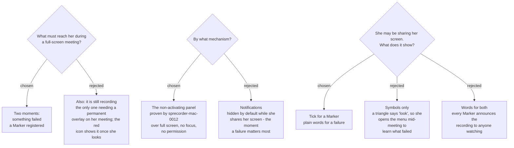

# Over a full-screen meeting: a tick for markers, words for failures

## The problem, measured

`sprecorder-mac-0010`'s amendment records it: the menu-bar status icon is **invisible
while the frontmost window is full screen**, and a meeting normally is. Both
`sprecorder-mac-0010` and `sprecorder-mac-0006` put important state on that icon.

## Narrowing it: only five of 21 messages can fire mid-meeting

Classified from `TrayApp.cs` rather than assumed. Of the Windows app's 21 balloons,
only five can fire while a Recording Session is running:

| `TrayApp.cs` | message |
|---|---|
| 417 | Recording started |
| 364 | Call detected — auto-recording started |
| 313 | Marker #n, with its elapsed time |
| 445 | Recording stopped |
| 59 | `RecordingSession.Warning` — *Screen recording could not start; continuing with audio only*, *Split failed*, *Keystroke overlay unavailable* |

Everything else fires before she starts or after she stops — in a normal window,
with the menu bar in view.

**This dissolved most of the problem.** The missing-grant badge
(`sprecorder-mac-0006`) and the Inactive hotkey badge (`sprecorder-mac-0010`) are met
at launch and in Settings, never mid-meeting. They stay on the icon unchanged.

## What reaches her

Of the moments that can fire mid-meeting, the user chose two:

- **Something failed.** Rare, and the one that costs an unrepeatable meeting. On
  Windows it fades after 3 seconds (`ShowBalloonTip(3000)`, `TrayApp.cs:520`) behind a
  full-screen window, so she learns of it afterwards.
- **A Marker registered.** Frequent. Without it she cannot tell whether a press worked,
  presses again, and ends with two Markers or none.

**"It is still recording" was rejected** as an overlay. It is the only one of the three
that would need to be on her meeting permanently rather than for a moment. The red
icon still shows it whenever the menu bar is visible.

## Why not notifications — verified, not assumed

macOS has a setting, *"Allow notifications when mirroring or sharing the display"*,
and it is **off by default**. When she shares her screen, every notification is
hidden — precisely the meetings where a failure is most costly.

It is also **reported** (Der Flounder, macOS Sequoia) that the same setting governs
**screen recordings**, which would mean SPRecorder's own Screen recording hides
SPRecorder's own notifications. That is reported, not measured on this map; either
half alone rules notifications out for this job. It reinforces
`sprecorder-mac-0012`'s rule that notifications carry nothing that must be acted on.

## The mechanism

The **non-activating panel proven by `marker-note-focus-probe`** — the same
configuration recorded in `sprecorder-mac-0012`, including `.canJoinAllSpaces` and
`.fullScreenAuxiliary`. Measured there: it draws over a full-screen space, takes no
focus, and needs no permission.

## The cost no API removes: her audience can see it

**Since macOS 15, a window cannot hide itself from another app's screen sharing.**
`NSWindow.sharingType = .none` is ignored by ScreenCaptureKit, which Teams and Google
Meet use, and Apple's stated position on its developer forums is that there is no
public API for preventing capture. If she shares her screen, every participant sees
what this ADR puts up.

That is what decided the content:

| event | shows | why |
|---|---|---|
| a Marker registered | a **small tick**, about one second, no words | she knows what she pressed; anyone watching learns nothing |
| something failed | **plain words**: *"Screen recording stopped — audio is still recording"* | she has to know *what* failed to decide whether to act; rare enough to be worth being seen |

The failure wording must say **what still works**, not only what broke. "Screen
recording stopped" alone reads as "the recording stopped", and she ends a meeting
that was still being captured.

## Kept out of her own recording

These notices are **excluded from her own Screen recording**, using the window
exclusion on the capture's content filter — that capture belongs to this app, so
unlike the participants' view, it is ours to filter. A tick burned into the video at
every Marker would duplicate what the Marker review page already does.

**Contrast, deliberately:** the Key caster overlay is kept **in** the capture
(`input-overlay-rendering`), because showing keys in the video is its whole purpose.
The two overlays differ on purpose. Do not "make them consistent".

## A consequence taken, flagged for review

**The failure notice stays until she dismisses it, or until the Recording Session
stops.** This was not asked separately; it follows from the reason the user gave for
words. A notice that fades is the Windows failure verbatim — a 3-second balloon she
never saw. The cost is a strip that sits on a shared screen until she closes it.

Dismissing it by click is **not yet measured**. The probe proved the panel takes
keystrokes without activating the app; it did not test a mouse click. A click that
brought SPRecorder to the front would break `sprecorder-mac-0010` at the worst
moment. Verify at build time, with a full-screen window in front.

## What does not change

The icon states in `sprecorder-mac-0010`, the badge in `sprecorder-mac-0006`, and the
16 messages that fire outside a meeting, which remain notifications under
`sprecorder-mac-0012`.
