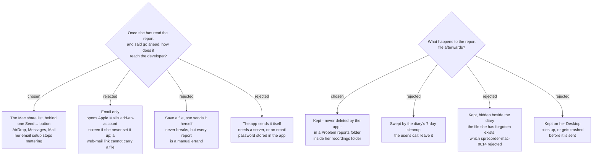

# A problem report goes out through the share list, and stays beside her recordings



When something goes wrong, she starts a report; a window shows her exactly what it
contains, with **Cancel** and a version without her notes (`sprecorder-mac-0014` makes
that window binding, and this ADR does not reopen it). Pressing **Send…** there opens
the standard macOS share list. The report file itself is kept, permanently, in a
**Problem reports** folder inside her recordings folder.

## Why the share list

The audience is two Macs in one household (`sprecorder-mac-0008`). The route has to
work when the developer is in the next room and when he is not, and it has to work
whatever she happens to use for email.

| route | when he is home | when he is away | if Apple Mail was never set up |
|---|---|---|---|
| share list | AirDrop | Messages, or Mail | she picks another row |
| email only | Mail | Mail | **dead end** — Mail opens its account setup |

Email-only was the ticket's starting candidate ("may send to me with email"). It
loses on the last column: a `mailto:` link, which is what a browser-based email
account would need, has no field for an attachment, so there is no fallback inside
that route. The share list contains Mail anyway, so choosing it gives up nothing
email-only offered.

**Measured on the development Mac, macOS 26.6.2:** for a report, the share list
offered AirDrop, Mail, Messages, Notes and Freeform (plus Simulator, because Xcode is
installed). It offered the **same list for a folder as for a zip file**, so this
route does not force the report into a zip. The report's shape is left to the
decision on what it contains.

"The app sends it itself" was never offered: it needs either a server to receive
reports or an SMTP password living inside the app, which is infrastructure an
audience of two does not justify.

## Why the file stays, and why there

The recommendation put to the user was to build the report inside the diary folder
so the 7-day cleanup would delete it too. The user chose otherwise — *"don't clean
data, leave it"* — so the app never deletes a report.

That collides with `sprecorder-mac-0014`, which chose 7 days over 30 and over
keep-forever for one stated reason: *"a month of meeting notes in a file she has
forgotten exists."* A report kept forever in the hidden Library folder would be that
file. So where it stays was put as its own question, and the answer is the place she
already looks:

```
~/Movies/SPRecorder/
├── 2026-09-09 Wed 11.00/
├── 2026-09-10 Thu 14.30 — Team standup/
└── Problem reports/
```

The reasoning that makes this safe: her recordings are **never** auto-deleted either,
and they hold the full audio of every meeting. A report, holding at most a week of
Marker notes, is less sensitive than the folders beside it, and it now falls under
the same rule they do — **she owns it, she deletes it**. It is not forgotten, because
it sits in the one folder she opens to find a meeting.

## Consequences

- **Scopes `sprecorder-mac-0014`'s retention rule to the diary.** The diary is still
  deleted after 7 days, unchanged. A report copied out of it is not, and a report
  that has been sent also lives on in the developer's inbox or chat. That second copy
  comes with *any* route that sends a file; the consent window is the control over
  it, not retention.
- **The "no mail client" case, which the ticket asked about, disappears.** Mail is one
  row of several. And if no row suits her at all, the report is already sitting in
  Problem reports, so she can drag it into anything — the rejected *save a file* route
  arrives for free as the fallback.
- **Cancelling the share list does not delete the report.** Once she has approved the
  contents the file exists; closing the share list without choosing leaves it in
  Problem reports to send later. Cancelling the *contents* window writes nothing.
- **The folder follows the recordings folder.** It lives inside whatever output folder
  the General tab names (`sprecorder-mac-0011`), default `~/Movies/SPRecorder`
  (`sprecorder-mac-0005`), which raises no permission prompt. If she changes the output
  folder, earlier reports stay where they were, as earlier recordings do.
- **Each report is named with the pinned stamp of `sprecorder-mac-0019`**, so a report,
  the Recording Session it concerns and the diary lines about it can be matched by
  eye and read out over the phone.
- **The leak test inherits the folder.** `sprecorder-mac-0018` requires every artifact
  type to be on the list it searches for a planted keystroke. A Problem reports folder
  is a new one, and a permanent one — a leaked keystroke here would outlive every
  other copy.
- **The report window comes to the front**, like Settings. That is acceptable only
  because it is used outside a meeting; where she starts a report from, and whether
  that can happen mid-meeting, is not decided here.

## Not decided here

What goes into a report, what "a version without her notes" removes, where she
starts it from — all still open on `diagnostic-report-delivery`.
