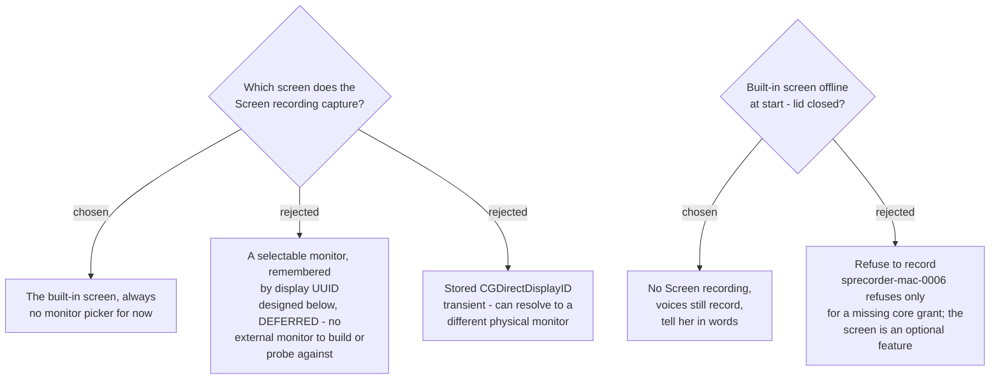

# Record the built-in screen only; external monitors come later

## The decision

**The Screen recording always captures the Mac's built-in screen.** There is no monitor
picker for now. The Key caster overlay is pinned to the same screen.

The user decided this directly: there is no external monitor available now, so the
external-monitor feature is **deferred**, not dropped. Both target Macs are laptops, and
on the development Mac the built-in display is also the main display (measured
2026-09-10: one display online, `Built-in Retina Display`, `builtin=true main=true`).

## Why this is not a quiet cut

`sprecorder-mac-0011` rebuilds Settings at full parity, and the Windows Screen tab has a
monitor picker (`ScreenMonitorDeviceName`). That one control is removed for now — **26 of
27 settings**, not 27. It is recorded here so the gap is visible rather than discovered.

Deferring it removes more than a control. With the recorded screen built into the machine,
it **cannot be unplugged mid-recording**, which makes the most dangerous case found while
designing the full feature (below) impossible in the current scope.

## Built-in screen offline at start

A MacBook docked with its lid closed has no built-in display online. Then there is no
screen this decision allows recording, so:

- no Screen recording is made for that Recording Session,
- the System track and Mic track still record,
- she is told in plain words through the `sprecorder-mac-0020` notice:
  *"Screen recording is off — the laptop lid is closed. Audio is still recording."*

This is `sprecorder-mac-0006`'s rule for an optional feature: degrade, never refuse.

## The note panel with only one screen

The rule carried into the Core by `sprecorder-mac-0015` — *put the note panel on a monitor
that is not being recorded* — has only one screen to choose, and its own fallback returns
that screen. So the note panel is **excluded from her Screen recording** using the capture's
window exclusion, the same treatment `sprecorder-mac-0020` gives its notices.

## The design to resume from — deferred

Answered in this session before the deferral, and kept so the feature does not start from
zero. **None of this is built now.**

**Measured Windows baseline.** Stores `\\.\DISPLAYn`, an adapter output slot that is itself
unstable. Chosen monitor absent: records primary with a 3-second balloon
(`ScreenRecorder.cs:47-57`). The Key caster overlay falls back **silently and separately**
(`RecordingSession.cs:141-148`), so video and overlay can land on different monitors.
Mid-recording unplug is not handled.

**Identity.** Persist the display UUID from `CGDisplayCreateUUIDFromDisplayID` — stable
across reboots and port changes — plus the display's name for messages. Not
`CGDirectDisplayID`, which is transient. Known limit: identical monitors reporting the same
vendor, model and serial can share a UUID.

**Resolve once.** One resolved screen at start, used by the recording, the overlay and the
note-panel rule — never resolved separately as on Windows.

**The user's answers, for when it returns:**

| case | answer given |
|---|---|
| chosen monitor absent at start | record the main screen, overlay follows, tell her; Settings choice unchanged |
| recorded monitor unplugged mid-recording | voices continue; video continues on the remaining screen as `Screen recording 002.mp4`; tell her |
| monitor plugged back in | stay where recording is (decided, not asked) |

**The precondition found on the way — must hold before this returns.**
`system-audio-capture` and `screen-capture-stack` put display video, system audio and
microphone on **one** ScreenCaptureKit stream bound to the recorded display. What that
stream does when its display is physically unplugged is **undocumented** — the
`screen-capture-stack` research itself says it may stop, blank or hang. With a selectable
external monitor, unplugging a cable could stop the System track and Mic track mid-meeting.
So audio capture must not be bound to any display (the CoreAudio process tap that
`system-audio-capture` records as its fallback, plus independent microphone capture), and
removal must be detected from `CGDisplayRegisterReconfigurationCallback`, not only from the
stream's error. **Binding audio to the built-in display is not a fix** — a closed lid takes
it offline.

**Probe, pass condition fixed:** unplug the recorded external monitor mid-recording. PASS
only if both audio tracks run continuously (duration equals wall-clock time within 1 second),
the removal is detected within 5 seconds, and a second video part starts.

**What the video parts would cost:** the Marker review page would seek a Marker's offset
across more than one video — the question `aac-splitting` asks about audio parts.

## Consequences

- `sprecorder-mac-0004`'s settings file drops `ScreenMonitorDeviceName` for now.
- `sprecorder-mac-0011`'s Screen tab loses its monitor picker until the feature returns.
- `setup-self-check` (`sprecorder-mac-0017`) reports the Screen recording as off when the
  built-in screen is offline.
- `aac-splitting` does not need to handle Screen recording parts caused by a monitor change,
  because in this scope none can occur.
