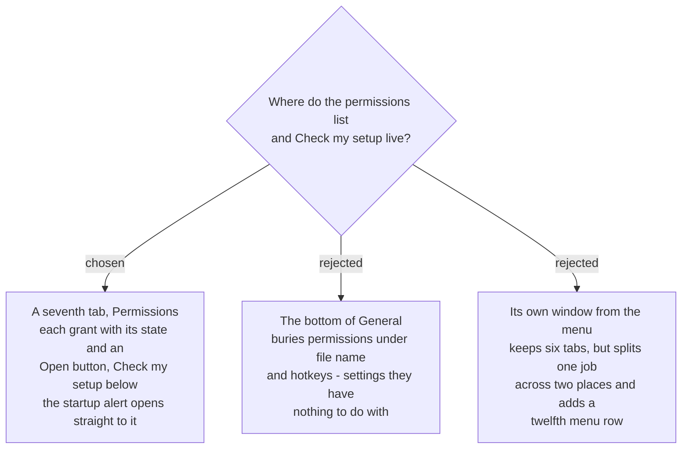

# Permissions get a seventh Settings tab, and Check my setup lives on it

Settings gains a **seventh tab, Permissions**, after Markers. It lists each permission
with its state and a button that opens the matching System Settings page, and the
**Check my setup** button (`sprecorder-mac-0017`) sits below that list.

## The gap this closes

Two earlier decisions did not meet. `sprecorder-mac-0006` promised *"Settings gains a
Permissions view listing each grant, its state, and a button that opens the matching
System Settings pane."* `sprecorder-mac-0011`, written afterwards, rebuilt Settings as
exactly the Windows six — General, Audio, Mixed file, Splitting, Screen, Markers — and
none of those holds a permissions list. The Windows app has no permissions surface at
all (it needs none), so parity could not supply one.

## Why a tab of its own

**The path she actually walks.** Signing is ad-hoc (`sprecorder-mac-0008`), so every
new version is a new identity to macOS and her grants are lost. The next launch raises
the one consolidated *"2 permissions missing"* alert (`sprecorder-mac-0006`). That alert
now has one obvious place to send her: its button opens Settings **on the Permissions
tab**, where the missing grants are listed and Check my setup confirms the fix.

**The six stay parity.** The other tabs keep the shape `sprecorder-mac-0011` chose.
Adding a tab is additive; hiding permissions inside General would have changed a
parity tab to hold something Windows never had there.

The two rejected placements:

- **The bottom of General** keeps the count at six, but puts permissions under the file
  name pattern and the hotkeys, where a person arriving from the alert has to scroll
  past unrelated settings to find them.
- **A separate window opened from the menu** would split one job across two surfaces —
  grants in Settings, the check elsewhere — and add a row to the eleven-row menu
  `sprecorder-mac-0010` kept at parity.

## Consequences

- `sprecorder-mac-0011`'s *six tabs* becomes **seven**; it carries an amendment saying so.
- The tab is **new capability** under the same admitted exception as the check itself
  (the map's out-of-scope list, 2026-09-10): a support requirement, not a feature.
- The startup alert's button targets this tab, not the Settings window's default tab.
- What the check does, what it says, and how it recovers a grant macOS refuses to honour
  are decided separately under `setup-self-check`.
