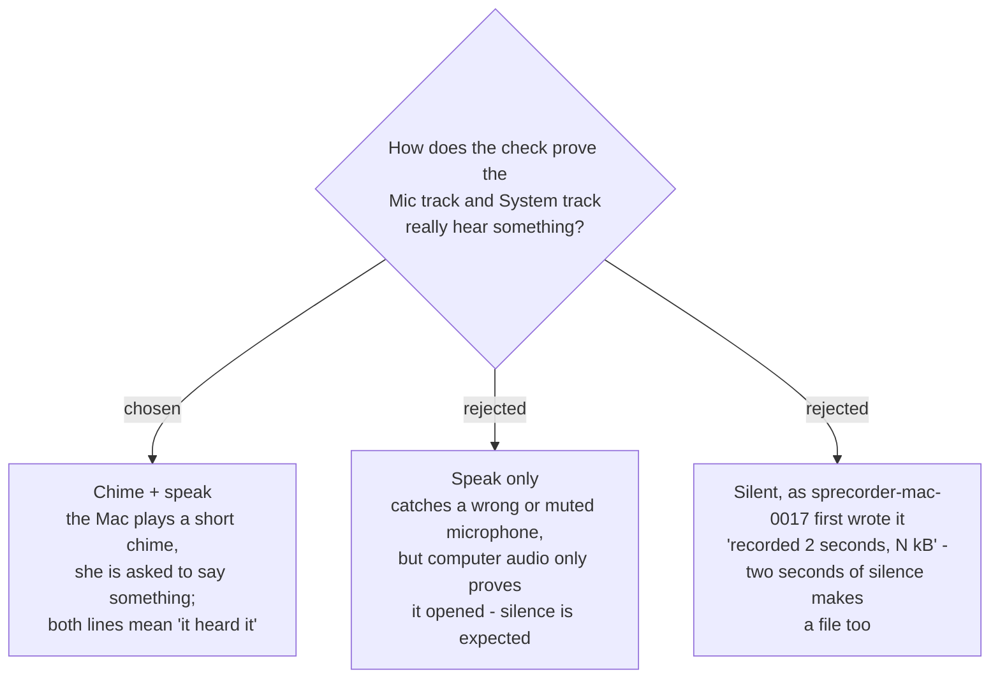

# Check my setup proves sound by hearing it: a chime and her voice

When she presses **Check my setup**, the Mac plays a short chime and the window asks
her to **say something**. The microphone line passes only if it heard her voice; the
computer audio line passes only if it caught the chime.

## Why a file size proves nothing

`sprecorder-mac-0017` wrote the report line as *"recorded 2 seconds, N kB"*. A file of
silence has a size too, so that line passes in exactly the cases most likely to reach
the developer as *"the recording has no sound"*:

- the wrong microphone is chosen — a USB headset left in a drawer, a phone offered as a
  microphone;
- the input volume is at zero;
- computer audio opens without error and hears nothing.

Worked through: she plugs in a headset and leaves it in the drawer. The silent check
reports everything working, and her next meeting's *My microphone* file is silent. This
check instead says the microphone *heard only silence* — before any meeting.

## What each audio line can say

| line | passes when | otherwise |
|---|---|---|
| Microphone | her voice lifts the level clearly above the room during the listening window | *heard only silence* — with a hint to check which microphone is chosen — or *could not record*, naming the fix |
| Computer audio | the chime is found in the captured computer audio | *heard nothing* or *could not record*, naming the fix |

Three outcomes, not two: *heard only silence* is not the same fault as *could not
record*, and the fix differs — one is a permission, the other is a device or a volume.

## The rejected options

- **Speak only** catches the microphone faults but leaves computer audio proving only
  that it opened, because nothing is playing during a check. The chime is what turns
  that line into evidence.
- **Silent** is `sprecorder-mac-0017`'s original wording. It proves the pipe opened and
  writes a file, which the fakes in `sprecorder-mac-0015` already prove without hardware.

## Costs, accepted

- **The check makes a sound and asks her to talk.** She is in Settings on purpose, not
  in a meeting, so the intrusion lands at the one moment it costs nothing.
- **The prompt comes before the listening window, not inside it**, so she is not asked
  to speak into a window that has already half closed. The window itself stays about the
  two seconds `sprecorder-mac-0017` chose.

## To verify at build time

- **SPRecorder must be able to record its own chime.** A real Recording Session never
  needs to hear SPRecorder, and the computer-audio capture may be set to leave the app's
  own sound out. The check needs that sound included. Whether computer audio rides the
  screen's capture stream or a path of its own is not settled — `sprecorder-mac-0021`
  makes a separate audio path a precondition for external monitors, which it defers —
  so measure this on whichever path is actually built.
- **Whether the chime is still caught with the output muted, or with headphones in.** If
  a muted Mac hides the chime from capture, the line must say *turn the volume up and
  check again*, not blame a permission.

## Consequences

- `sprecorder-mac-0017`'s report table no longer decides pass or fail by size. The byte
  count may still appear where the developer reads it; the words she sees are decided
  with the rest of the report under `setup-self-check`.
- The "heard it" judgement is a level threshold on a short buffer and a match against a
  known chime — logic that belongs in the Core behind a protocol
  (`sprecorder-mac-0002`), so the fakes can feed it a voice, a chime and silence.

---

## Amendment — 2026-09-10, measured. The chime is heard, even muted.

Measured by `check-my-setup-probe` (#33) on macOS 26.6.2 with an ad-hoc signed probe
(`tools/setup-check-probe/`). Capture was ScreenCaptureKit with `capturesAudio = true` and
`excludesCurrentProcessAudio = false`; the chime was 880 Hz then 1320 Hz, 0.7 s, played by the app
itself; detection compared both tones against 1.2 s of baseline. Volume and mute were read by the
probe at the start and end of each run.

| run | output | volume / muted | baseline | chime window | verdict |
|---|---|---|---|---|---|
| 1 | WF-1000XM5 (Bluetooth) | 38 / false | digital silence | −20.0 dBFS, 880 Hz 0.209 | **FOUND** |
| 2 | WF-1000XM5 | 38 / false | digital silence | −20.0 dBFS, 880 Hz 0.209 | **FOUND** |
| 3 | WF-1000XM5 | 38 / **true** | digital silence | −20.0 dBFS, 880 Hz 0.209 | **FOUND** |

**Answers to "To verify at build time":**
- **SPRecorder can record its own chime** through ScreenCaptureKit, once `excludesCurrentProcessAudio`
  is `false`. The captured level equals the chime's digital level after the mixer, unaffected by
  the 38 % volume setting.
- **Muted: still found**, at an identical level. The capture sits before the output mute, so a
  muted Mac does not fail the computer-audio line, and the *"turn the volume up and check
  again"* branch is not needed for it — the check passes even when she cannot hear the chime.
- **Headphones: found.**
- **Not measured:** built-in speakers. On a Bluetooth output the volume may be applied inside the
  headphones, so the speaker case is not implied by these runs.

**A finding for the microphone line**, from the same probe: a **refused** microphone does not
error. `AVAudioEngine` starts and delivers full-length buffers of exact zeros. And the
permission-reading call can be stale in a running process, so *heard only silence* cannot be
told apart from *could not record* by reading `authorizationStatus` alone — the line has to
judge by the capture itself.
