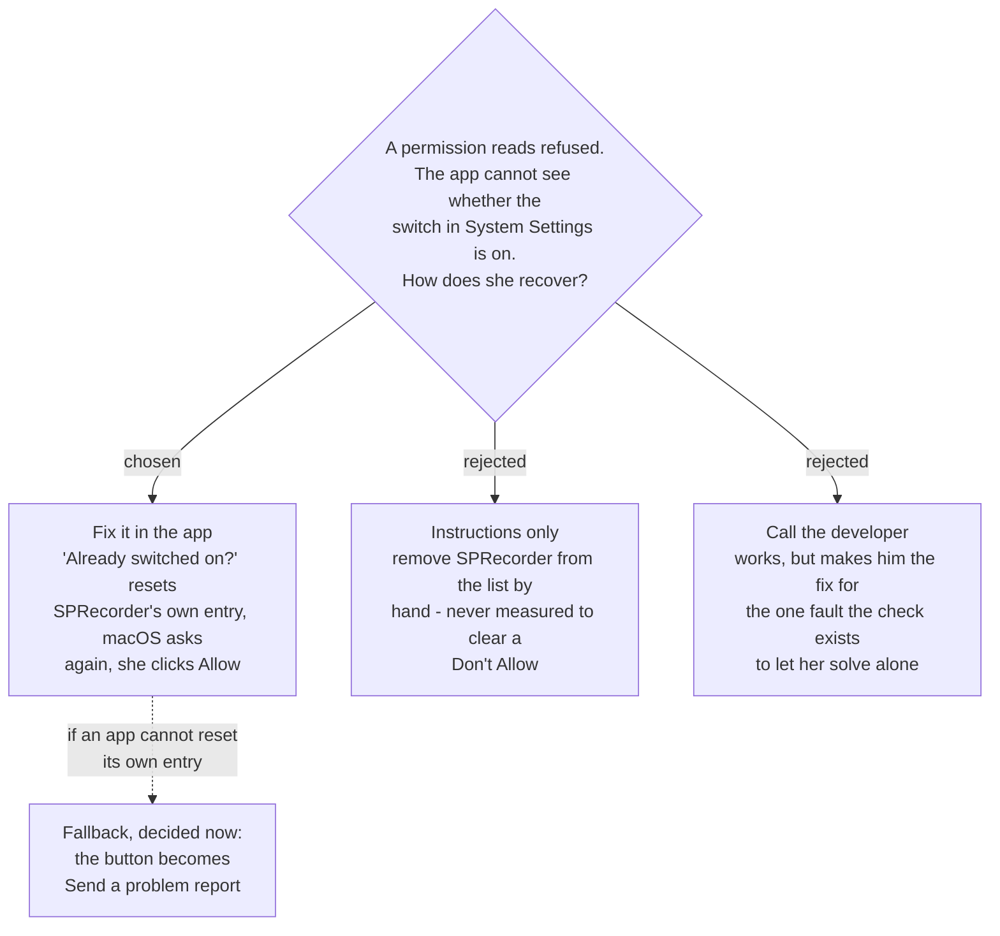

# A permission macOS will not honour is reset from inside the app

On any Check my setup line whose permission reads refused, the report shows two ways
out: **Open System Settings**, and beneath it **Already switched on? — Reset
permission**. Reset clears SPRecorder's own entry for that one permission, so macOS asks
again and she can click **Allow**.

## The trap, measured

`verify-screen-recording-restart` (#24) found it on macOS 26.6.2, and
`sprecorder-mac-0006`'s amendment carries it as a requirement:

1. macOS asks *"SPRecorder would like to record…"*. She clicks **Don't Allow**.
2. Later she turns SPRecorder's switch **on** in System Settings. It visibly shows on.
3. Capture still fails — in the running app and in a freshly launched one. Only
   `tccutil reset ScreenCapture <bundle-id>` cleared it.

**The app cannot see the switch.** It sees only *not allowed*, which is identical whether
the switch is genuinely off or on-but-overridden. So the report cannot tell the two
apart, and has to offer both recoveries on the one line.

## Why fix it in the app

It is the only option she can finish **alone**, which is the reason
`sprecorder-mac-0017` put a self-check on her Mac in the first place.

It is also safe to offer without knowing which case she is in. If the switch was really
off, resetting loses nothing — the entry was already *not allowed*, and macOS simply
asks again.

The rejected options:

- **Instructions only** would send her to remove SPRecorder from the list with the `−`
  button. Nobody has measured whether that clears a *Don't Allow*; the probe cleared it
  only with `tccutil`. Writing instructions that may not work is how the report ends up
  convincing her the app is broken.
- **Call the developer** always works, but it turns the one fault this check can solve on
  the spot into a support call.

## Scope of the reset

- **SPRecorder's own bundle identifier only** — never another app's entry, never `All`.
- **Only the permission on the failing line.** Microphone, the screen/system-audio grant,
  Input Monitoring — each maps to its own TCC service, and the reset names that one.
- The trap was measured for Screen Recording only. The button is offered on **every**
  refused line anyway, because the app cannot tell which grants the trap reaches and the
  reset costs nothing when it does not apply.

## The fallback, decided now

Running the reset **from inside the app** is unmeasured: #24 ran `tccutil` from a
terminal, without admin rights, and it answered *"Successfully reset"*. If an ad-hoc
signed, unsandboxed app (`sprecorder-mac-0008`) cannot do the same for itself, the
button becomes **Send a problem report**, handing the fault to the route
`diagnostic-report-delivery` chooses. Deciding it now means a failed measurement does
not reopen this question — the same move `sprecorder-mac-0012` made for the note panel.

## A second finding the words must cover

The same probe saw an ad-hoc signed app **never add itself** to the permission list; the
operator added it with the `+` button both times. So *Open System Settings* cannot
assume SPRecorder is in the list waiting for its switch. The wording on that line must
cover *"not in the list? press + and choose SPRecorder"* — decided with the report's
words.

## Verify at build time — pass condition fixed now

> On the built, ad-hoc signed app: click **Don't Allow** on the screen/system-audio
> prompt, turn the switch on in System Settings, and run Check my setup. **PASS** only if
> the line reads refused, **Reset permission** succeeds with no admin password and no
> terminal, macOS asks again, and after **Allow** the same line passes — without
> relaunching the app.

Anything else takes the fallback.

## Consequences

- The check never trusts the cached permission hint (`sprecorder-mac-0006` amendment,
  finding 1). A line is judged by attempting the capture and reading the result.
- The reset is logged in the diary (`sprecorder-mac-0013`) by service name, so a later
  support conversation can see it happened.

---

## Amendment — 2026-09-10, measured. The reset works; the stuck state did not appear.

Measured by `check-my-setup-probe` (#33) on macOS 26.6.2 / arm64 with an ad-hoc signed
`LSUIElement` probe (`tools/setup-check-probe/`, full log in `result-2026-09-10.log`). The
independent channel was tccd's unified log; every measurement is on the ticket.

**The reset from inside the app works, for all three permissions.** The app ran
`/usr/bin/tccutil reset <service> <its own bundle id>` as a child process — no admin password,
no terminal — seven times. tccd logged `TCCAccessResetInternal` → a `Delete` for that one entry
→ `REPLY`, every time. Across the session tccd published 27 permission events, **all for the
probe's own identifier**.

**Against the pass condition fixed above, per permission:**

| permission | macOS asks again | grant works without a relaunch | verdict |
|---|---|---|---|
| Screen & System Audio | yes — but tccd logs `does not allow prompting; returning denied`: a notification pointing at System Settings, **never an Allow button**, raised by the next capture attempt | yes | **PASS**, with the wording corrected below |
| Microphone | yes — **only when the app tries to record** (`coreaudiod` asks tccd); `requestAccess` answers from a stale per-process cache and shows nothing | yes, *Allow* in the prompt | **PASS** |
| Input Monitoring | **no, not from the running app** — its requests are answered from the stale cache, the event tap check is `preflight=yes`, and the reset **removes the app from the Input Monitoring list**; only a relaunched process could ask again and restore the row | yes, once the row exists and the switch is on | **FAIL → the fallback applies to this line** |

**So, as this ADR decided in advance:** on a refused **Input Monitoring** line the second button
is **Send a problem report**, not *Reset permission*. Screen and Microphone keep *Reset
permission*.

**Corrections to the text above:**
- *"macOS asks again and she can click Allow"* is true of **Microphone only**. For Screen & System
  Audio the grant is always the System Settings switch, so *Reset permission* must be followed
  by *Open System Settings*. For Microphone the reset must be followed by an **actual recording
  attempt**, not a permission request, or nothing appears.
- **The trap this ADR exists for did not reproduce.** A *Deny* followed by the switch turned on
  was enough to grant, in the same process, for Screen, Microphone and Input Monitoring. #24's
  override was not seen on this build. Whether the button is still worth building is charted as
  its own question on the decision map.

**Two hazards the words must cover, both measured:**
- Turning on any of the three switches raises a box offering to **reopen the app**; an attentive
  operator pressed it 6 times in 8. A check that is running when that happens is quit.
- In a running process the permission-reading calls are **stale hints** —
  `CGPreflightScreenCaptureAccess`, `AVCaptureDevice.authorizationStatus`, `IOHIDCheckAccess` all
  kept an old answer after a reset. "The check never trusts the cached permission hint", in the
  consequences below, now applies to all three.

---

## Superseded in part — 2026-09-10

**The Reset permission button is not built for now** (`sprecorder-mac-0041`): the stuck state
did not reproduce on macOS 26.6.2 for an app that asks for its own permissions, and a failed
result's *Send a problem report* button covers it if it ever does. The measurements above stand
as the record of what an in-app reset does, should the button be built later.
