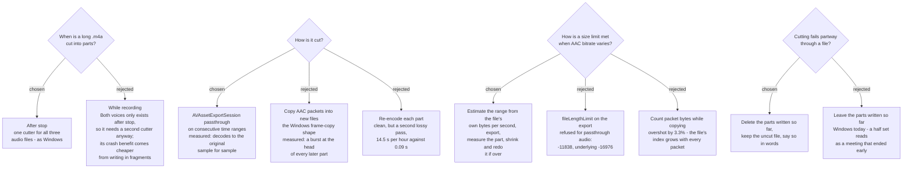

# A long recording is cut after she presses stop, by Apple's own trim

The Splitting tab survives (`sprecorder-mac-0011`), so do `SplitMode`,
`SplitTimeMinutes`, `SplitSizeMb` and the three Apply-to checkboxes
(`sprecorder-mac-0004`), and the part names are already fixed —
`Computer audio 001.m4a` (`sprecorder-mac-0019`). What nothing specified is how an
`.m4a` is cut. Windows cuts after stop by copying MP3 frames into new files
(`Mp3FrameSplitter`, spec `2026-05-28-audio-splitting-design.md`); that works
because an MP3 is a flat run of self-delimiting frames. An `.m4a` is a container
with an index, and AAC frames depend on the frame before them, so the Windows
shape does not carry across.

**Decided:** after the Recording Session stops, each audio file whose Apply-to box
is ticked — Computer audio, My microphone, Both voices — is cut with
`AVAssetExportSession` and `AVAssetExportPresetPassthrough`, one export per part,
on consecutive time ranges. No audio is re-encoded. The user confirmed the timing
on 2026-09-10: *"After stop"*.

## Measured, not assumed

Measured 2026-09-10 on macOS 26.6.2, arm64, Swift 6.3.3, with
`tools/aac-split-probe/probe.swift`. The source is 60 s of mono 48 kHz audio (a
200-2000 Hz chirp, so every position is unique) written to AAC-LC at 64 kbps by
`AVAssetWriter`. Every part is decoded by `AVAssetReader`, the way a player would,
and located in the decoded original sample by sample. "Head error" is the RMS
difference over a part's first 1,024 samples, against a signal whose own RMS is
0.35.

| way of cutting, 20 s parts | where parts join | total length |
|---|---|---|
| copy AAC packets into new files | head error **0.26-0.30** on every later part — a burst; one join 32 samples short; a stray 12 ms fourth part | 64 samples short |
| **export passthrough, time ranges** | head error **0.0000**, every join exact | **2,880,000 of 2,880,000** |
| fresh encoder per part (what cutting live gives) | head error 0.016-0.019, joins exact | exact |
| export passthrough, source written in 5 s fragments | identical to the plain source | exact |

- **Speed.** One hour of mono 64 kbps audio is 23.4 MB; cutting it into two
  30-minute parts took **0.09 s**. Encoding that hour took 14.5 s, which is the
  cost a re-encoding cutter would pay again.
- **How the joins stay exact.** A later part carries a short lead-in of the
  frames before its start — 1,600 and 1,088 samples here (`afinfo`: "priming")
  — and the file tells the player to skip it. The decoder is warmed up, and
  nothing plays twice.

## Why after stop

1. **Both voices is made after stop.** The Mixed file does not exist until the
   two tracks are mixed, so it can only be cut after stop. Cutting the tracks
   live as well would mean building and testing two cutters.
2. **Windows rejected hot rollover** for pipeline churn, and nothing on the Mac
   removes that cost from the capture path — the most fragile code in the app.
3. **Cutting live's one real advantage is available without it.** Finished parts
   would survive a crash, but that is about how a file is written, not about when
   it is cut. Measured: an `.m4a` killed (SIGKILL) after 30 s, before it was
   finished, is **unreadable** — 193,062 bytes on disk, no audio. Written with
   `movieFragmentInterval` at 5 s, it keeps **27.0 of 30 s**. Windows never had
   this problem, because an MP3 has no ending to write. This is its own decision,
   charted as its own ticket, not a reason to cut live.

## Size mode: checked against the file, never predicted

AAC's bitrate varies — the 64 kbps request averaged 47.9-57.5 kbps across parts —
so a byte count cannot be predicted from a duration. Size mode therefore estimates
each part's length from the whole file's own bytes per second with a 3% margin,
exports it, **measures the written part**, and if it is over the limit shrinks the
range in proportion and exports that part again. Measured with a 150,000-byte
limit on the 60 s source: 132,084, 148,713 and 136,950 bytes, one retry, every
join exact.

At the default `SplitSizeMb` of 195 and about 23 MB per hour, one part holds
roughly eight hours of audio, so size mode rarely yields a second part for an
audio file. It stays, as `sprecorder-mac-0011` promised, and so does the
*"NotebookLM accepts ≤ 200 MB"* hint.

## Consequences

- **Where it lives.** The policy — which files, which ranges, the part names, the
  shrink-and-redo loop, what happens on failure — is Core logic behind a
  protocol. Only the export call lives in the App target (`sprecorder-mac-0002`).
  A fake cutter that reports part sizes makes the policy testable against fakes
  (`sprecorder-mac-0015`): *a part over the limit is redone shorter*, *a file that
  fits in one part is left alone*.
- **Order on disk.** A file that fits in one part is not touched (Windows parity).
  Otherwise every part is written first and the original goes last. If any part
  fails, the parts already written are deleted and the original is kept — Windows
  leaves partial chunks behind; here the folder never holds half a set, which is
  easy to upload by mistake. The user chose this on 2026-09-10: *"Clean up"*. The
  failure is reported in words (`sprecorder-mac-0020`). One original is **kept
  whole** alongside its parts: Both voices, when the session has Markers
  (`sprecorder-mac-0027`).
- **Parts line up in time mode only.** Time mode cuts all three files on the same
  boundaries, so `Computer audio 004.m4a` and `My microphone 004.m4a` cover the
  same minutes. Size mode cuts each file on its own, because their bitrates
  differ — as on Windows.
- **Not measured: NotebookLM.** AVFoundation honours the skip-the-lead-in
  instruction. A player that ignores it would replay at most 33 ms at a join,
  harmless for transcription. Whether NotebookLM ingests a cut part was not
  tested here. The Windows spec carried the same manual check (*"Upload one chunk
  to NotebookLM"*), and so does this build.
- **The Screen recording is not cut.** Windows ADR 0005 stands.
- **`sprecorder-mac-0003` and `sprecorder-mac-0015` stay true.** `Mp3FrameSplitter`
  and its 8 tests are dropped. What replaces them is this policy and its new
  tests, not a translation.
