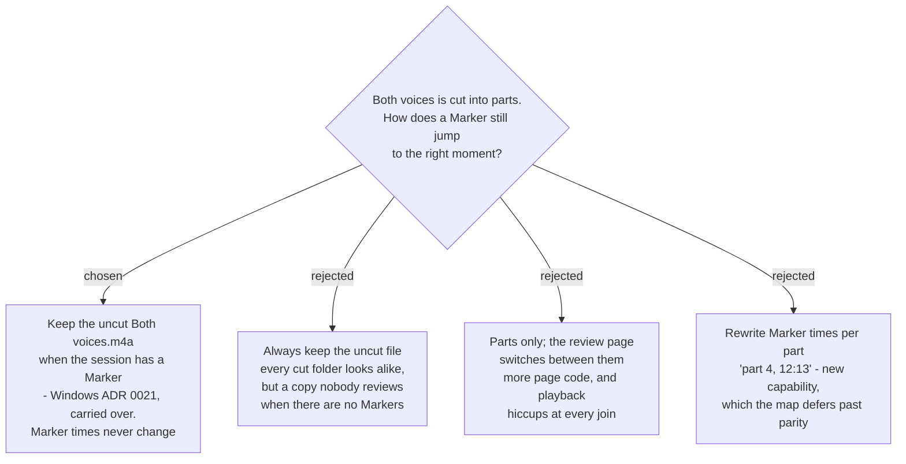

# The uncut Mixed file stays when the session has Markers

A Marker is an elapsed offset from the start of the Recording Session, and the
Marker review page jumps by setting the player's position in **one continuous
file**. Once `sprecorder-mac-0026` cuts Both voices into parts, a Marker at
1:42:13 in a meeting split every 30 minutes sits 12:13 into
`Both voices 004.m4a`, and a single seek no longer reaches it.

**Decided, keeping Windows parity:** when a Recording Session has at least one
Marker, cutting Both voices writes its parts **and keeps the uncut
`Both voices.m4a`**. The review page embeds the uncut file and every Marker time
stays exactly as it was recorded. Computer audio and My microphone lose their
originals as usual, and a session with no Markers keeps parts only. The user
chose it on 2026-09-10: *"Only with Markers"*.

This is Windows ADR 0021 (`RecordingSession.cs:271`, `keepMixedWhole`) carried
across unchanged. Nothing on the Mac argued against it. The one thing that
changed makes it cheaper: at about 23 MB per hour (`sprecorder-mac-0026`), the
extra copy costs a little over half the 41 MB per hour it was accepted at as a
96 kbps MP3 on Windows.

## Rejected

- **Always keep the uncut file.** Its case is real: her folder would look the same
  whether or not she pressed the Marker hotkey. It lost because the copy only
  serves the review page, and a session with no Markers has no review page.
- **Parts only, with the page switching files.** Windows rejected this as needless
  code when one whole file is simpler, and the browser plays across each join with
  a hiccup while it loads the next part.
- **Marker times rewritten per part.** Useful when she uploads one part to
  NotebookLM and asks about one moment, but it is capability the Windows app does
  not have, and the map defers new capability until parity lands.

## Consequences

- With Markers, splitting and a Mixed file all on, her folder holds both
  `Both voices.m4a` and `Both voices 001.m4a` onward. The parts are for uploading,
  and the uncut file is for the review page.
- If the Mixed file is turned off, there is no Both voices to keep, so an
  audio-only session's review page has nothing to play. Windows accepted this edge
  case, and so does the Mac.
- The Marker log (`Markers.md`) and the review page are unaffected by cutting.
  Neither ever names a part.
