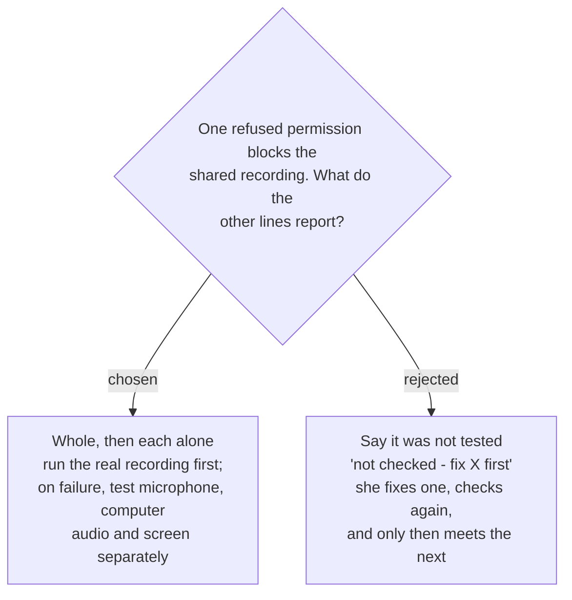

# Check my setup runs the real recording first, and tests each part alone only when it fails

Check my setup first runs **the real recording route** — the same capture a Recording
Session uses. If every part of it works, that is the report. **Only if it fails** does
the check test the microphone, computer audio and screen **each on its own**, so that
every line gets an answer on the first press.

## Why the question exists

`system-audio-capture` and `screen-capture-stack` put the microphone, computer audio and
display video on **one shared capture**. If the grant that capture needs is refused, the
microphone is never reached through it — even when the Microphone permission itself is
allowed and the microphone works.

`sprecorder-mac-0021` makes a separate audio path a precondition for external monitors,
which it defers, so the capture may yet be split. **This decision holds either way**: with
separate captures, the whole run already tests each part independently and the split step
simply finds nothing more to do.

## Why whole first, then split

`sprecorder-mac-0017` set the rule: *"a self-test that stops at the first problem hides the
second one."* Worked through: she refused computer audio, **and** her microphone is set to
a headset left in a drawer.

| | first press | after she fixes computer audio |
|---|---|---|
| **whole, then each alone** | both problems shown | all lines pass |
| **say it was not tested** | computer audio refused; microphone *not checked* | microphone *heard only silence* — a second round, and perhaps a phone call between |

Running the whole route **first** keeps the green lines honest. When nothing fails, a
passing line means the route a real meeting uses works — not merely that a
microphone-only test path works. The separate tests exist to **name** faults, never to
pass a line the real route failed.

## What a split line says

A line tested on its own after the whole run failed reports what it found **and** that
the real recording still depends on something else:

> *Microphone works — it will record once Computer audio is fixed.*

It never reads as plain green, because a Recording Session would still refuse to start
while a core grant is missing (`sprecorder-mac-0006`).

## Consequences

- The check needs a microphone-only and a computer-audio-only capture that a Recording
  Session never uses. They are check-only code, and the fakes (`sprecorder-mac-0015`) must
  cover the branch where the whole run fails and the split runs.
- Lines that record nothing — the hotkeys, where files go, the diary — run regardless of
  what the recording lines found.
- The report takes longer only when something is wrong; the common case stays one run.
