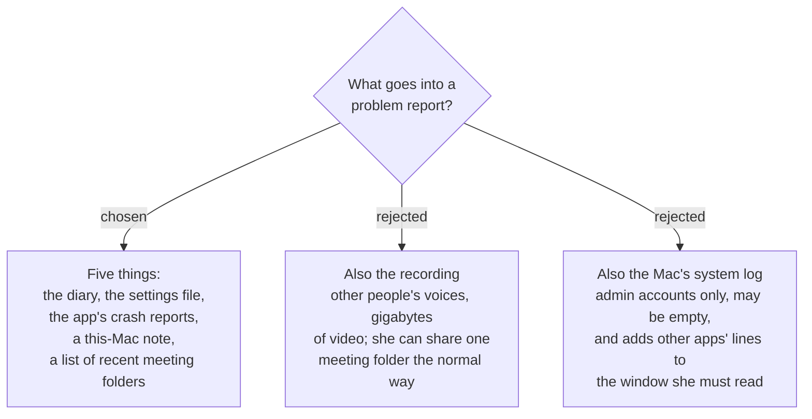

# A problem report carries facts about the meeting, never the meeting itself

A problem report holds five things and deliberately leaves out two. Everything in it
is **about** her meetings; nothing in it **is** one.

## What goes in

| item | what it is | why it earns a place |
|---|---|---|
| **The diary** | every daily file still in `~/Library/Logs/SPRecorder` — at most 7 (`sprecorder-mac-0014`) | the support record `sprecorder-mac-0013` exists to produce |
| **The settings file** | `settings.json` as it is now | `sprecorder-mac-0004` made it readable JSON precisely so it could be sent |
| **The app's crash reports** | SPRecorder's own files from `~/Library/Logs/DiagnosticReports`, last 7 days | a crash is the one failure the diary cannot write down |
| **A this-Mac note** | app version and build, macOS version, Mac model, permission status as macOS reports it, microphones, screens | every ad-hoc build is a different app to macOS (`sprecorder-mac-0008`), so the first question is always *which build she has* |
| **A list of recent meeting folders** | the last 7 days of Recording Session folders: folder name, and each file's name, size and length — **not the files** | a missing or empty file answers most complaints without sending anything said in the meeting |

The seven-day window is the diary's, applied throughout, so every part of the report
describes the same stretch of time.

### Measured, not assumed: crash reports are there to collect

On the development Mac, 2026-09-10: `~/Library/Logs/DiagnosticReports` is owned by the
user and readable without any permission, and the ad-hoc signed probe app from
`marker-note-focus-probe` had left **5** crash files there named
`probe-2026-09-10-….ips`. So macOS writes crash reports for an ad-hoc app, under its
process name, where the app itself can read them.

### The walk-through that justified the folder list

She says *"the video from Tuesday is missing."* The list shows
`2026-09-08 Tue 09.15 / Screen recording.mp4 — 0 KB`, and the diary shows
*Screen recording could not start* at 09.15.02 with its reason. The complaint is
diagnosed and no recording was ever sent.

## What stays out

**The recordings — audio and video — never.** Not by default, not as an option in the
report window. Three reasons, any one sufficient:

- They are the meeting itself, and they contain **other people's** voices and screens,
  who agreed to none of this. The diary's Marker notes are hers; a recording is not.
- An hour of screen video is gigabytes, far past what an email attachment normally
  allows. Not measured here, but the direction is not in doubt: the share list route
  (`sprecorder-mac-0024`) would become unreliable for exactly the reports that
  included one.
- When a recording really is needed, she can already share that one meeting folder the
  way she shares any folder. The report does not need to duplicate a thing Finder does.

**The Mac's system log — no.** `sprecorder-mac-0013` found `OSLogStore` readable only
for an admin account and liable to return nothing, and every line the app writes is
already in the diary. What the system log would add is other processes' lines, which
she would have to read in the contents window before agreeing to send them.

## Consequences

- **The report is five things for the contents window to show.** `sprecorder-mac-0014`
  requires her to see *the actual contents* before anything leaves the Mac; this list
  is what that window is built around.
- **Permission status is labelled as macOS's claim, not a fact.** `sprecorder-mac-0006`
  measured `CGPreflightScreenCaptureAccess()` returning `false` while capture worked.
  The this-Mac note must say *"macOS reports"* and must never be read as proof a grant
  is missing — the diary's own error lines are the evidence.
- **Sizes and lengths catch a missing or empty file, not a silent one.**
  `sprecorder-mac-0023` found a two-second silent recording has a perfectly normal byte
  size. A silent *My microphone.m4a* will look healthy in this list; the diary and the
  self-check are what can tell.
- **The folder list names her meetings.** A typed session name is part of the folder
  name (`sprecorder-mac-0019`), so the list reveals what the meetings were called. That
  is already true of the diary at full detail (`sprecorder-mac-0014`), so this adds no
  new kind of exposure.
- **Crash reports are the one item the app does not write, so the leak test cannot
  plant a keystroke in one.** `sprecorder-mac-0018` searches artifacts the app
  produces; a crash report is produced by macOS, and it can carry a developer-written
  crash message. The keystroke ban therefore adds a rule the test cannot enforce: **no
  crash, precondition or fatal-error message may include a runtime value from the Key
  caster's path.** The contents window is the last line of defence, since it shows her
  the crash report's text too.
- **Every item is on the leak test's list.** The diary and settings already were; the
  this-Mac note and the folder list are new artifacts the app writes, and
  `sprecorder-mac-0018` fails the build if they are left off.

## Not decided here

What "a version without her notes" removes from these five, and where she starts a
report — both still open on `diagnostic-report-delivery`.
