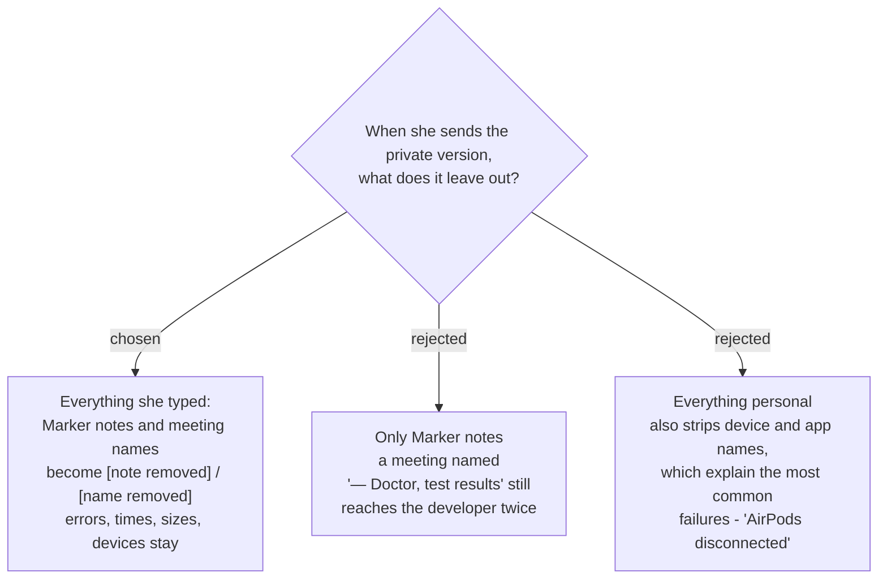

# The private copy of a report leaves out everything she typed

`sprecorder-mac-0014` requires that a report can be sent **redacted**. The report
window therefore offers two ways to send: everything, or **without anything she
typed**. Whichever she picks is the one file written to *Problem reports*
(`sprecorder-mac-0024`) — the other version is never written anywhere.

## What "typed" means here

The two free-text fields that carry what a meeting was *about*:

| typed by her | appears in the report as | private version |
|---|---|---|
| a **Marker note** | diary lines | `[note removed]` |
| a **Recording Session name** | diary lines, file paths inside diary lines, the folder list | `2026-09-10 Thu 14.30 — [name removed]` |

The stamp half of a folder name is not typed, so it stays; an unnamed session is
unchanged. The placeholders are fixed text and carry **no length** — a count of
characters says something about a note, and nothing diagnosed so far needs it.

**Settings values are not in scope.** The file-name pattern, the output folder and
the hotkeys are configuration, not meeting content, and the settings file goes out
unchanged in both versions. This boundary follows the wording the user chose
between (*"Marker notes and the names she gave meetings"*) rather than a separate
question; it is flagged here so that a later reader who disagrees knows it was drawn
deliberately and where.

## Why this and not the other two

**Only Marker notes** was the literal reading of `sprecorder-mac-0014`'s *"a version
without her notes."* It fails on meeting names, which can be as private as any note
and appear in more places — every diary line that writes a path carries the folder
name, and the folder list repeats it.

**Everything personal** removes device names, her account name inside paths and the
name of the app in the call. Those are the facts that explain the ordinary failures —
headphones disconnected mid-meeting, a call in Google Meet rather than Teams — and
`sprecorder-mac-0014` already rejected a *"numbers only, nothing identifying"* diary
because a complaint then cannot be matched to anything. Between two people who trust
each other, her account name is not a secret.

**Everything she typed** is also the only one of the three she can check by eye: the
button says what it removes, and the window shows the result.

## Consequences

- **The window shows the private contents, not the originals.** When she switches to
  the private version, the contents she reads are the redacted ones, with the
  placeholders in place. `sprecorder-mac-0014` requires her to see *what she is about
  to send*; showing the originals under a promise that they will be removed would not
  meet that.
- **Typed text is marked where the app writes it, so removal is a cut, not a search.**
  *Flagged — this follows from the decision rather than being asked.* Finding a note
  afterwards by searching the diary would need to know every note ever typed,
  including one whose meeting folder has since been renamed. Instead the logging seam
  (`sprecorder-mac-0013`) carries typed text as its own kind of value, and the file
  sink writes it inside markers the report builder can cut out. A Recording Session
  name inside a path is marked the same way.
- **Crash reports get a search, because macOS writes them without markers.** Every
  meeting name and note the app can still find from the last 7 days is replaced
  wherever it occurs in a crash report. This is weaker than the cut, and acceptable
  only because a crash report carries typed text solely through a crash message or a
  path.
- **It is proven by a planted-text test, in the shape of `sprecorder-mac-0018`.** In a
  faked Recording Session, type a distinctive note and give the session a distinctive
  name; build the private report; fail if either string appears in any byte of it. The
  same argument applies as there: test the exit, not the door, so a route for typed
  text added next year is caught without anyone having to know about it.
- **This is not the keystroke ban.** Captured keystrokes are in **neither** version,
  ever (`sprecorder-mac-0014`). The private copy is about text she chose to type into
  SPRecorder; the ban is about text the Key caster saw her type anywhere.
