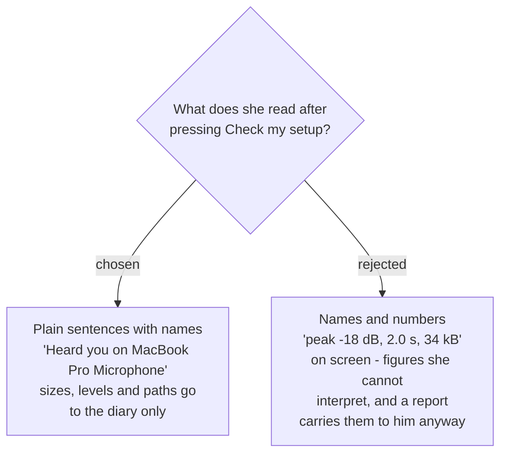

# The Check my setup report speaks in names, not numbers



The report shows one line per capability, in plain sentences that **name** what was
used — the microphone by its name, the folder by where it is. Sizes, sound levels and
file paths are written to the diary (`sprecorder-mac-0013`), not shown.

## The report

After a check with Screen recording switched on, where everything records but one hotkey
is taken, on the Permissions tab (`sprecorder-mac-0022`):

```
✓ Microphone      Heard you on MacBook Pro Microphone
✓ Computer audio  Heard the chime
✓ Screen          Captured the built-in screen
✓ Key caster      Allowed and ready
✗ Hotkeys         Add marker ⌃⌥M is taken by another app
                  [Choose another in General]
✓ Recordings      Saving to Movies › SPRecorder
✓ Diary           Kept for the last 7 days
```

When a permission is refused, and another line was tested on its own
(`sprecorder-mac-0025`, `sprecorder-mac-0028`):

```
✗ Computer audio  Not allowed
                  [Open System Settings]
                  Not in the list? Press + and choose SPRecorder.
                  Already switched on?  [Reset permission]
! Microphone      Works — will record once Computer audio is fixed
```

Four marks: **✓** works, **✗** broken with its fix on the line, **!** works on its own but
waits on another fix, **–** switched off and deliberately not checked.

## Why names and no numbers

**The name is the diagnosis.** The fault a check most needs to surface is the wrong
device — a headset left in a drawer (`sprecorder-mac-0023`). *"Heard only silence on
USB Headset"* tells her what to change; *"peak −60 dB, 34 kB"* does not.

**The numbers still reach the developer.** Every line is written to the diary with its
figures — duration, size, measured level, device identifier, resolved path — and a
problem report carries the diary (`diagnostic-report-delivery`). Putting them on screen
too would give her figures she cannot interpret, to read aloud over the phone to someone
who will receive them in the report anyway.

## Two vocabularies, kept apart

The line labels use **her words** — *Microphone*, *Computer audio*, *Screen* — the words on
the files in each Recording Session folder (`sprecorder-mac-0019`). The diary lines for the
same results use the **glossary** — *Mic track*, *System track*, *Screen recording* — as
every log category already does (`sprecorder-mac-0013`).

This settles the map's open question about which vocabulary the app's own surfaces speak
**for this one surface only**. Settings labels, the menu and the Marker review page are not
decided here.

## Wording rules that follow

- **A failure says what to do, on the line.** Every ✗ carries its fix as a button or an
  instruction; no line sends her elsewhere to find out why.
- **The permission line covers an app missing from the list.** An ad-hoc signed app was
  observed never to add itself (`verify-screen-recording-restart`), so the instruction
  includes *"Not in the list? Press + and choose SPRecorder."*
- **The Key caster line cannot claim it drew a key.** Proving that needs her to type, and
  `sprecorder-mac-0014` forbids the diary from recording even *that* a key was pressed. So
  the line reports only that Input Monitoring is allowed and the keyboard listener started.
  This replaces `sprecorder-mac-0017`'s *"the overlay drew"*.
- **A hotkey line names the hotkey by what it does and its keys** — *Add marker ⌃⌥M* — so it
  matches the Inactive hotkey wording in the menu (`sprecorder-mac-0010`).

## Consequences

- `sprecorder-mac-0017`'s report table is superseded by the lines above; its list of what
  is checked is unchanged.
- Every line has a diary twin, and the leak test (`sprecorder-mac-0018`) searches it like
  any other artifact.
