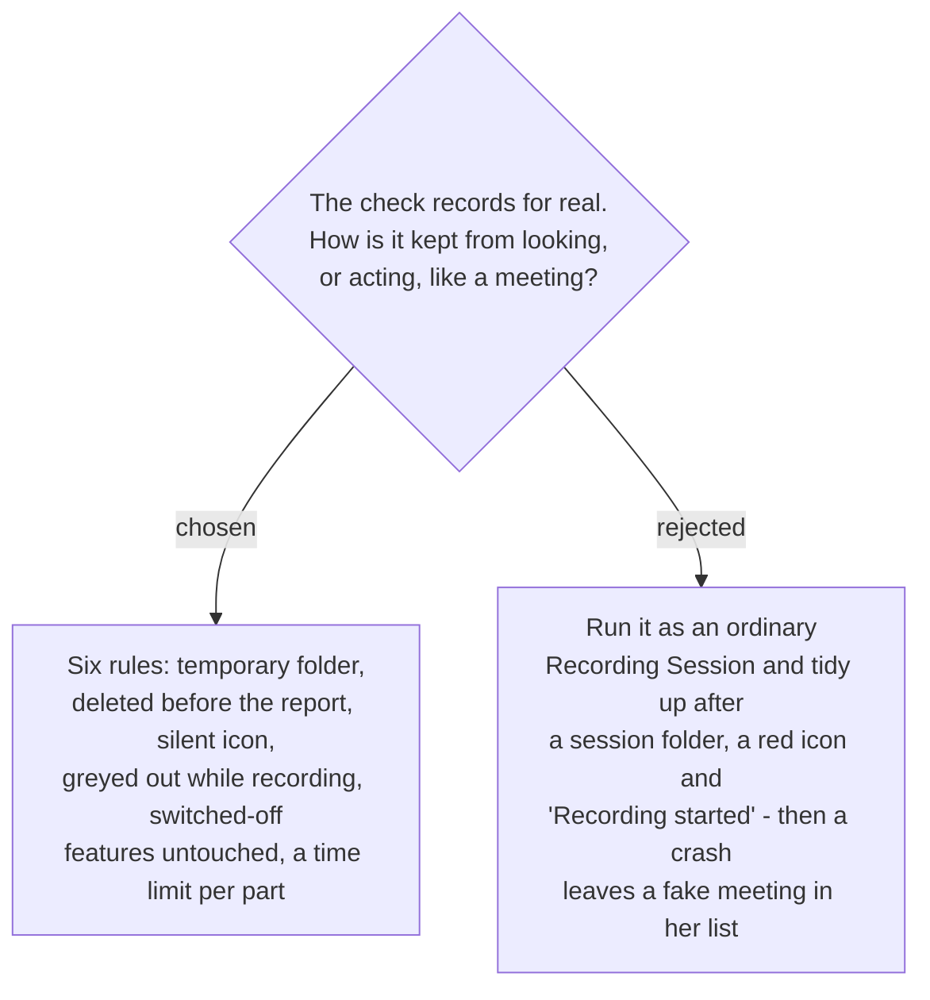

# Check my setup is never a Recording Session: six rules

`sprecorder-mac-0017` set two obligations — the check *"deletes what it records"* and
*"its existence is never reported as a Recording Session"* — and a third, that it
*"must survive its own failures"*. These six rules are how. Each was put to the user as
written and accepted.

## The rules

| # | rule | what she notices |
|---|---|---|
| 1 | The test recording is written to the **app's own temporary folder**, never the recordings folder (`sprecorder-mac-0005`). No session folder, no Markers file, no Marker review page. | nothing appears among her recordings |
| 2 | It is **deleted before the report is shown**. Anything a crash leaves behind is swept from that temporary folder at the next launch. | nothing to tidy up |
| 3 | The status icon **does not turn red**, no *Recording started / stopped* message is raised, and the failure notice of `sprecorder-mac-0020` is not used. Failures appear on the report only. | only macOS's own orange and purple privacy indicators, for about two seconds |
| 4 | The button is **greyed out while a Recording Session runs**, reading *"Stop recording to check your setup"*. | a live meeting cannot be disturbed by it |
| 5 | If Screen recording is **switched off**, the Screen and Key caster lines read *"Switched off, not checked"*, and **no permission prompt is raised** for either. | enabling nothing, she never meets the Input Monitoring prompt |
| 6 | Every part runs under a **time limit**. A capture that never answers reads *"did not answer"*; the check always finishes. | the report always arrives |

## Why each one

**1 and 2 — a crash must not leave a fake meeting.** The recordings folder is what she
browses for last Tuesday's meeting (`sprecorder-mac-0019`). If the check wrote there and
crashed before deleting, a two-second "meeting" would sit in that list with nothing to say
it is not real. Written to the temporary folder, the worst a crash leaves is a file she
never sees, removed at the next launch.

**3 — the icon and messages mean a meeting is being recorded.** Showing them for a check
teaches her that red can mean "nothing important". The privacy indicators are macOS's and
cannot be suppressed; they are expected.

**4 — two captures at once is the one way a check can cost a meeting.** A Recording Session
is unrepeatable (`sprecorder-mac-0006`); a check can always be run later. The wording
follows the Windows form's existing *"Stop recording to change devices"*.

**5 — the check must not undo lazy permissions.** `sprecorder-mac-0006` asks for Screen
Recording and Input Monitoring only when she turns on the feature that needs them, so the
keylogger-shaped Input Monitoring prompt never reaches someone who does not use the Key
caster. A check that probed them anyway would raise that prompt from a button labelled
*Check my setup*. The Key caster is part of the Screen recording (`sprecorder-mac-0006`), so
it is off whenever Screen recording is.

**6 — a capture can hang without an error.** The `screen-capture-stack` research records a
capture that may stop, blank or hang with no callback, and `sprecorder-mac-0021` repeats it.
Without a limit, one silent capture holds the whole report back — the failure
`sprecorder-mac-0017`'s *"survive its own failures"* rule forbids.

## The rejected shape

**Run it as an ordinary Recording Session and clean up afterwards.** It is the least code —
the orchestrator already exists — but every cleanup step becomes something that can fail
halfway, and each half-failure is visible: a session folder, a red icon, a *Recording
stopped* message. The six rules make the check invisible by construction, not by tidying.

## Consequences

- The Core orchestrator needs an output location and a presentation that a check can supply
  **without** the Recording Session's side effects. That is a seam in `SPRecorderCore`
  (`sprecorder-mac-0002`), and the fakes (`sprecorder-mac-0015`) assert it: a check leaves no
  folder, no Marker log, no icon change and no message.
- The launch sweep of the temporary folder is one more job at startup, beside the diary's
  7-day cleanup (`sprecorder-mac-0014`).
- The check's diary lines use their own category, so a support reader never mistakes a check
  for a Recording Session.
