# A problem report starts from the menu or a failed check, and names the failure she picks

```mermaid
flowchart TD
    Q{"Where can she always<br/>start a problem report?"} -->|chosen| A["A menu row: Report a problem…<br/>just above About SPRecorder<br/>the one surface she already opens"]
    Q -->|rejected| B["A button in Settings<br/>a window and a tab to hunt<br/>through while already annoyed"]
    Q -->|rejected| C["Both<br/>two doors into one window<br/>for an audience of two"]
    N{"Does the failure notice over<br/>a full-screen meeting offer<br/>a report?"} -->|chosen| D["No button<br/>it says what failed and what<br/>still works; she reports after"]
    N -->|rejected| E["Report now<br/>the report window jumps in front<br/>of her meeting - and of everyone<br/>watching her shared screen"]
    N -->|rejected| F["Remind me later<br/>whether a click on the panel<br/>activates the app is unmeasured"]
    C2{"Does a Check my setup<br/>result offer a report?"} -->|chosen| G["Yes, whenever any line failed<br/>one Send a problem report button<br/>under the result; none when all pass"]
    C2 -->|rejected| H["Only when a stuck permission<br/>cannot be reset<br/>every other failure is a dead end"]
    C2 -->|rejected| I["Never - use the menu<br/>she must know to leave the<br/>window that just showed the fault"]
    M{"How does the report name<br/>the moment she means?"} -->|chosen| J["She picks: What went wrong?<br/>last 7 days of failures in the<br/>words she saw, newest selected,<br/>plus Something else"]
    M -->|rejected| K["Always the latest failure<br/>silently points at the wrong one<br/>when she reports an older fault"]
    M -->|rejected| L["Nothing<br/>he searches a week of diary<br/>for the moment she describes"]
    M -->|rejected| P["A box to type in<br/>Messages and Mail already take<br/>her words; a typed field falls<br/>under the private-copy rules"]
```

`sprecorder-mac-0024`, `sprecorder-mac-0029` and `sprecorder-mac-0030` decided how a
problem report leaves the Mac, what it holds and what its private copy removes, but
not where she starts one. The Windows app has no problem report, so there is no
parity to keep.

**Decided:** the always-available way in is a **menu row, `Report a problem…`**,
placed just above `About SPRecorder`. It opens the contents window
`sprecorder-mac-0014` makes binding. The user chose it on 2026-09-10: *"Menu row"*.

## Why the menu

The app has no Dock icon and no window at launch (`sprecorder-mac-0010`), so the
menu by the clock is the only surface that is always there. A Settings button would
send her through a window and a tab to hunt for, at the moment something has
already gone wrong.

## Not from a full-screen meeting

The failure notice of `sprecorder-mac-0020` carries **no report button**. It says
what failed and what still works, and nothing more. The user chose it on 2026-09-10:
*"No button"*.

- **Report now** would open the contents window, which comes to the front
  (`sprecorder-mac-0024`), in front of a meeting. That is the one thing
  `sprecorder-mac-0010` exists to prevent. It would also ask her to read a week of
  diary mid-call, on a screen her audience may be watching (`sprecorder-mac-0020`).
- **Remind me later** opens nothing. But `sprecorder-mac-0020` records that a mouse
  click on the non-activating panel has never been measured, and a click that brought
  the app forward would break 0010 at the worst moment. A reminder after stop is also
  something the report itself can do better, because it can remember the failure
  without her pressing anything.

So the notice's only interaction stays the one `sprecorder-mac-0020` already names:
dismissing it. That click is still unmeasured and still a build-time check, and this
ADR adds no second one.

## From a Check my setup result that failed

When any line of a Check my setup result did not pass (`sprecorder-mac-0031`), **one
`Send a problem report` button** appears under the result. When every line passed,
there is none. The user chose it on 2026-09-10: *"When any line failed"*.

The result is shown in Settings, on the Permissions tab (`sprecorder-mac-0022`),
outside any meeting, so the report window coming to the front costs nothing there. It
is the moment she is already looking at the fault, and the report can name that
exact check run instead of leaving it to be found in the diary.

- **Only when a stuck permission cannot be reset** was the rule until now
  (`sprecorder-mac-0025`'s fallback). It left every other failure, such as a silent
  microphone or an overlay that would not start, with nothing to press.
- **Never, use the menu** would ask her to leave the window that just showed her the
  fault and know to look elsewhere.

## The report names the failure she picks

At the top of the contents window, above the five things `sprecorder-mac-0029` lists,
is one choice: **What went wrong?** It lists the failures from the last 7 days,
newest first, each in the words she saw — *"Screen recording stopped — audio is still
recording"* (`sprecorder-mac-0020`) — with the time and the Recording Session it
happened in. The newest is selected. The last entry is **Something else**. The user
chose it on 2026-09-10: *"Pick a recent failure"*.

- **What counts as a failure:** every diary line at `error` or `warning`
  (`sprecorder-mac-0014`), which covers the failure notices of `sprecorder-mac-0020`
  and the ones that fire outside a meeting, plus any Check my setup run with a line
  that did not pass. Seven days is the diary's
  window (`sprecorder-mac-0014`), so every entry has its diary lines in the same
  report.
- **Started from a failed Check my setup result,** that check run is selected instead
  of the newest failure.
- **With no failure in the last 7 days,** the choice is not shown, and the report is
  simply about something else.
- **What she picks becomes the report's first line**: the failure's words, its time
  and its Recording Session folder. The developer starts there, not at the top of a
  week of diary.

The walk-through that decided it: the screen recording failed on Tuesday at 09.15,
her AirPods disconnected on Thursday at 14.32, and on Thursday evening she reports
Tuesday's missing video.

- **Always the latest failure** would point the report at Thursday: confidently,
  and at the wrong moment.
- **Nothing** leaves the developer searching seven days of diary for what she
  describes in her message.
- **A box to type in** duplicates what she can already do: the share list
  (`sprecorder-mac-0024`) opens Messages or Mail, where she writes to him anyway.
  And every typed field is one more thing `sprecorder-mac-0030`'s private copy must
  remove.

## Consequences

- **The menu grows from eleven rows to twelve.** `sprecorder-mac-0010`'s *"all eleven
  Windows rows survive"* still holds. This row is added, not substituted. It sits in
  the bottom group with `About` and `Quit`, the rows about the app rather than about a
  recording. It is always enabled, idle or recording.
- **It is reached after a full-screen meeting, not during one.** The menu bar is
  hidden while a full-screen window is in front (`sprecorder-mac-0010`, amendment). So
  the report window, which comes to the front (`sprecorder-mac-0024`), is normally
  opened outside a meeting, which is the condition 0024 accepted it under.
- **`sprecorder-mac-0025`'s fallback no longer has to turn the reset button into a
  report button.** A failed result already carries `Send a problem report`, so if
  `check-my-setup-probe` finds that an app cannot reset its own permission, the reset
  button is simply not offered and the report button beside it covers the case.
  Recorded here rather than edited into 0025 while that probe is still running.
- **The private copy keeps the failure and hides the meeting's name.** The failure
  words and the time are written by the app, so they stay. The Recording Session
  folder carries any name she typed (`sprecorder-mac-0019`), so in the private copy it
  becomes `[name removed]`, exactly as elsewhere in the report (`sprecorder-mac-0030`).
- **No new artifact for the leak test.** The first line lives inside the report file,
  which `sprecorder-mac-0018` already searches (`sprecorder-mac-0029`).
- **The list is read from the diary's levels.** A failure is a diary line at `error`
  or `warning` (`sprecorder-mac-0014`), and a check run is recognised by its own
  category (`sprecorder-mac-0032`). One build-time requirement follows: a line behind a
  notice she saw must carry **the same words** the notice showed, so the list speaks
  them back to her instead of the diary's technical wording.
