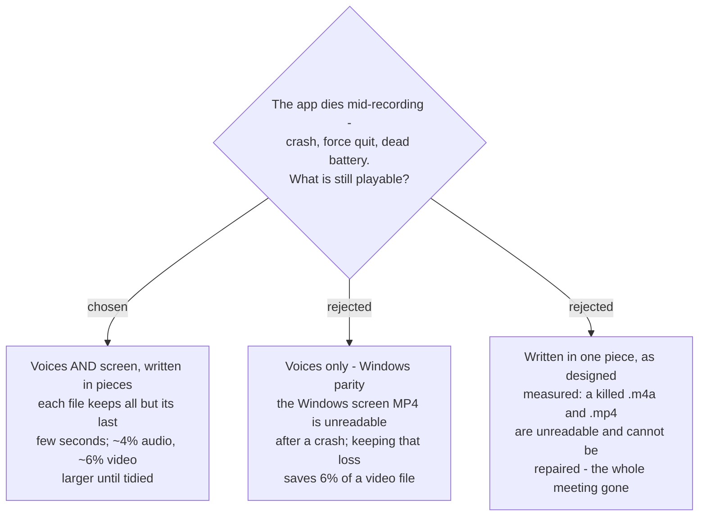

# Recordings are written in pieces, so a crash keeps the voices and the screen

The Mic track, the System track and the Screen recording are all written by
`AVAssetWriter` with **`movieFragmentInterval`** set, so a Recording Session that dies before
stop still leaves every file playable up to its last few seconds.

## Measured

`tools/crash-safety-probe/probe.swift`, 2026-09-10, macOS 26.6.2, arm64, Swift 6.3.3. A child
process writes 30 s — AAC 64 kbps mono `.m4a`, or 1280×720 30 fps H.264 plus AAC in `.mp4` —
and is killed with `SIGKILL` before finishing. Survival is what `AVAssetReader` can decode.

| written as | audio left | video left | repair by passthrough export |
|---|---|---|---|
| **one piece** (the design until now) | **none** | **none** | **fails**, `-11800` / `-16979` |
| pieces every 1 s | 28.97 s | 810 frames, 27.0 s | — |
| pieces every 2 s | 27.99 s | 780 frames, 26.0 s | — |
| pieces every 5 s | 26.99 s | 750 frames, 25.0 s | **works**, 0.01-0.02 s, clean file |

Audio keeps everything but roughly one piece; video trails audio by about a second more.

**After a normal stop the pieces do not show.** `finishWriting` leaves a finished file whose
top level is `ftyp mdat moov`, the same as a file written in one piece, and it decodes in full
(600.00 s of 600; 1,800 of 1,800 frames). The cost is dead bytes inside it:

| finished normally | size against one piece |
|---|---|
| 10 min audio, pieces every 1 s / 2 s / 5 s | +4.53% / +3.83% / +3.30% |
| 60 s video + audio, pieces every 2 s | +6.1% |

A passthrough export of a finished file removes them in 0.02 s — back to the exact one-piece
size (4,237,730 bytes) — with every sample and frame intact.

## What Windows does — measured from its source

- **Audio survives.** `Mp3StreamWriter` writes MP3 frames as they come; an MP3 has no ending
  to write, so a crash leaves every frame already on disk playable.
- **The Marker log survives.** Each Marker is appended and flushed the moment it is pressed
  (Windows ADR 0014, `MarkerLog.cs:44`).
- **The Screen recording does not.** `ScreenRecorder.cs:71` never sets
  `IsFragmentedMp4Enabled`, which ScreenRecorderLib defaults to `false`
  (`CommonTypes.h:668`); the library then uses `MFCreateMPEG4MediaSink` with the index written
  at finalize (`OutputManager.cpp:417-428`). A crash leaves an MP4 with no index.

So **voices-only would have been parity**, and one piece — the Mac design until now — was
**worse** than Windows for audio.

## Why the screen too

The user chose it over parity. The worked case: a battery dies 50 minutes into a meeting with
Screen recording on. Voices-only leaves 50 minutes of voices and no video of a meeting that
cannot be repeated; protecting both leaves both, less the last few seconds. The price is file
size, and it is removable.

## Limits

- **`SIGKILL` is not a power cut.** A killed process leaves what it wrote in the file system's
  cache, which the OS still writes out; a sudden power loss may also lose what had not yet
  reached the disk. Not measured — no way to cut power safely on this Mac.
- **A crashed file is readable, not tidy.** It carries a placeholder header and no final
  duration; the next launch finishes it (`sprecorder-mac-0035`).

## Consequences

- Every `AVAssetWriter` in a Recording Session sets `movieFragmentInterval` to **2 s**
  (`sprecorder-mac-0038`). The Mixed file,
  made after stop from finished tracks, is not written live and does not need it.
- `sprecorder-mac-0026`'s cutter is unaffected: its probe measured a passthrough export of a
  fragmented source identical to a one-piece source.
