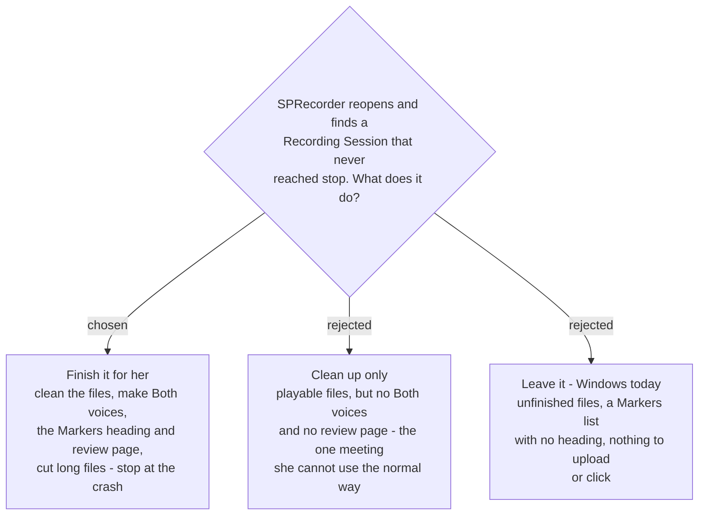

# An interrupted Recording Session is finished at the next launch, as if stop had been pressed

When SPRecorder launches and finds a Recording Session that was interrupted before stop, it
**runs everything stop would have run**, treating the moment of the crash as the moment she
pressed stop. Her folder ends up like any other meeting's, only shorter.

## What a crash leaves

With recordings written in pieces (`sprecorder-mac-0034`), a folder interrupted at 15:12
holds:

- `My microphone.m4a`, `Computer audio.m4a`, `Screen recording.mp4` — decodable to within a
  few seconds of the crash, but unfinished: a placeholder header and no final duration;
- `Markers.md` — every Marker, because each is written the moment it is pressed, but not the
  heading stop writes;
- **no** `Both voices.m4a`, **no** `Review page.html` — both are made by stop.

Windows leaves the same shape and does nothing with it; its markers spec lists *"no
crash-recovery reconciliation of an orphaned log"* as a non-goal.

## What finishing does, in order

1. **Clean each file** with a passthrough export — measured to turn a crashed 5 s-piece file
   into an ordinary one in 0.01-0.02 s with nothing lost (`sprecorder-mac-0034`). Written to a
   temporary name, checked by decoding, and only then put in place of the original.
2. **Write the Markers heading** stop would have written.
3. **Make Both voices** from the cleaned tracks, as stop does.
4. **Make the review page.**
5. **Cut long files** by the Splitting rules (`sprecorder-mac-0026`), keeping the uncut Both
   voices when there are Markers (`sprecorder-mac-0027`).

## Why finish it

The user chose it. The file she uploads to NotebookLM is Both voices, and a Marker is only
something to click on the review page. Cleaning up without finishing, or leaving the folder
alone, makes the interrupted meeting the one meeting she cannot use the normal way — and a
meeting interrupted by a crash is not one she cares about less.

## Rules that come with it

- **A failed step keeps her originals.** Nothing is replaced until its replacement decodes;
  if any step fails, what the crash left stays exactly as it was and she is told in words —
  the same rule `sprecorder-mac-0026` applies to a failed cut.
- **It runs quietly in the background.** She may reopen SPRecorder in the middle of the same
  meeting to carry on recording, so finishing opens no window and never delays a new
  Recording Session.
- **It never touches the folder of a Recording Session that is running.**

How she learns it happened is `sprecorder-mac-0036`; how an interrupted session is
recognised, and the smaller rules around it, are `sprecorder-mac-0038`.

## Consequences

- Stop's post-processing becomes callable on a folder rather than only at the end of a live
  session. In the Core (`sprecorder-mac-0002`) that is one orchestration with two entry
  points, and the fakes (`sprecorder-mac-0015`) can run it on a folder shaped like a crash.
- The leak test (`sprecorder-mac-0018`) must include a recovered session among the runs it
  searches.
