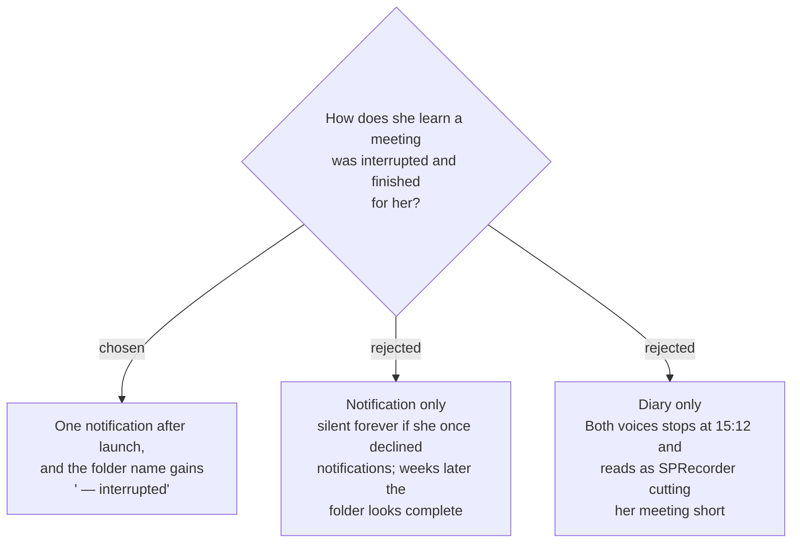

# An interrupted Recording Session is announced once, and its folder says "interrupted"



When `sprecorder-mac-0035` finishes an interrupted Recording Session, she gets **one
notification** — *"Your 14.30 meeting was interrupted at 15:12. SPRecorder saved it up to
then."* — and the session's folder is named with **` — interrupted`** after its stamp:

```
~/Movies/SPRecorder/
├── 2026-09-10 Thu 09.15/
└── 2026-09-10 Thu 14.30 — interrupted/
```

## The confusion it prevents

Nothing needs her action: the meeting is already finished. The risk is later. Weeks on she
opens that meeting, Both voices stops abruptly at 15:12, and she concludes SPRecorder cut her
meeting short — a support call about a recording that is in fact as complete as it could be.

## Why both

- **The notification** says it at the moment it happened. It is the right channel for news
  that asks nothing of her (`sprecorder-mac-0012`).
- **The folder name** says it forever. `sprecorder-mac-0012` records that one declined
  notification prompt silences every notification permanently; the name is the one signal
  that no setting can switch off, and it is where she looks when she opens the meeting.

## How the mark fits the folder rules

`sprecorder-mac-0019` appends a typed session name after the stamp with ` — `. An interrupted
session has no typed name — the name prompt runs at stop (`RecordingSession.cs:206` on
Windows), and stop never ran — so the mark takes that place and date order is untouched. A
clash with an existing folder takes ` (2)` as that ADR already specifies. The rename is part of
finishing, so it follows the same rule: done only once every other step has succeeded.

## When finishing fails

That is not news, it is a failure: she is told through the plain-words failure notice of
`sprecorder-mac-0020`, not a notification, and the folder keeps its stamp-only name with what
the crash left inside it untouched (`sprecorder-mac-0035`).

## Consequences

- The folder mark is fixed English text, like the rest of the folder name
  (`sprecorder-mac-0019` pins the stamp to `en_US_POSIX`), so it reads the same on both Macs
  and in the diary.
- The notification and the rename are both written to the diary, so a problem report shows
  which session was recovered and when.
