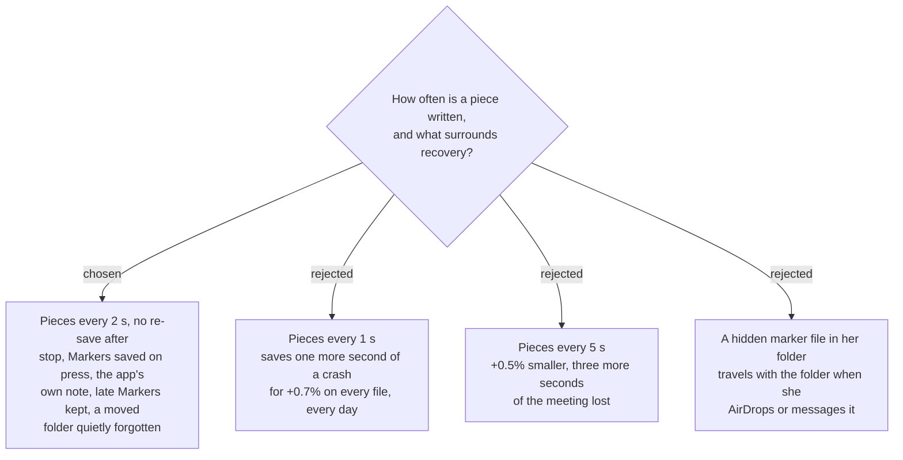

# Crash safety: 2-second pieces and five smaller rules

`sprecorder-mac-0034` writes recordings in pieces and `sprecorder-mac-0035` finishes an
interrupted session. These six rules complete them. Each was put to the user as written and
accepted on 2026-09-10: *"Yes, all six"*.

| # | rule | what it means for her |
|---|---|---|
| 1 | `movieFragmentInterval` is **2 seconds** for every live writer | a crash loses about the last 2 s of voices and 3 s of video; files are ~4% (audio) and ~6% (video) larger |
| 2 | **No tidy re-save** after a normal stop. A file that is cut is re-saved by the cut anyway (`sprecorder-mac-0026`) | slightly larger uncut files; one less step that can fail or briefly need double the disk space |
| 3 | Each Marker is **written and flushed the moment it is pressed** — Windows ADR 0014, carried over | no Marker is lost to a crash |
| 4 | An interrupted session is recognised from **the app's own note** in `~/Library/Application Support/SPRecorder/`, written at start and removed at stop — never a hidden file inside her folder | nothing hidden travels when she shares the folder |
| 5 | A Marker pressed in the seconds the crash lost is **kept**; the review page seeks to the end of the audio for it | the list never quietly drops something she pressed |
| 6 | If the noted folder has been **moved or deleted**, the note is dropped and one diary line is written | no error about a folder she removed on purpose |

## Why each one

**1 — the interval.** Measured (`sprecorder-mac-0034`): pieces every 1 s / 2 s / 5 s keep 29.0 /
28.0 / 27.0 s of a 30 s audio file killed mid-write, and cost +4.5% / +3.8% / +3.3% on a finished
one. The step from 2 s to 1 s buys one second of a rare crash with a size cost paid on every
file; the step to 5 s saves half a percent and loses three more seconds. 2 s is also the only
interval measured for video as well as audio.

**2 — no tidy.** A passthrough export removes the dead bytes in 0.02 s for a 10-minute audio file,
but it rewrites the whole file: for an hour of Screen recording that is a second full copy on
disk, and one more step after stop that can fail. The bytes are harmless — the finished file's
top level is already ordinary (`ftyp mdat moov`).

**3 — Markers on press.** Recovery can only finish what reached the disk. Windows already
guarantees this (`MarkerLog.cs:44`), and without it the review page of an interrupted meeting
would be empty.

**4 — the app's own note.** The folder is what she shares: `sprecorder-mac-0019` makes the folder
the unit that is attached, and `sprecorder-mac-0024` sends things through the share list. A
leading-dot sentinel inside it would be invisible in Finder and still travel in an AirDrop or a
zip. The note lives beside `settings.json` (`sprecorder-mac-0004`), holds the folder's path and
start time, and is the only thing recovery trusts.

**5 — late Markers.** Rule 3 makes a Marker survive seconds the audio does not (rule 1). Dropping it
would silently lose the one thing she deliberately pressed; keeping it with a seek clamped to the
end costs nothing.

**6 — a moved folder.** She may have tidied the folder away before relaunching. Searching for it,
or raising an error, would treat a deliberate act as a fault.

## Not measured, accepted

A sudden **power cut** differs from the `SIGKILL` measured: data not yet written from the file
system's cache may also be lost. It could not be tested safely on this Mac and is recorded as a
limit, not as a finding.
