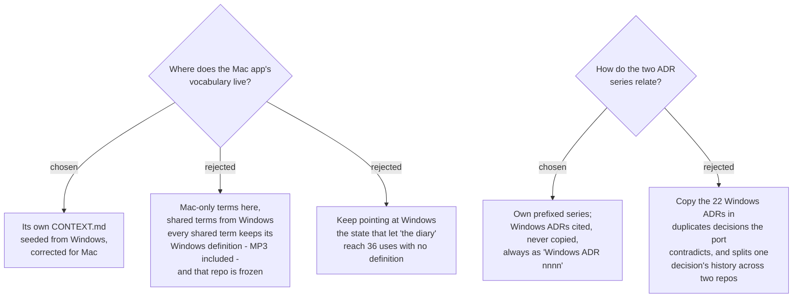

# This repo owns its own glossary, and cites Windows ADRs without copying them

## The glossary

The user chose that SPRecorder.Mac has **its own `CONTEXT.md`**, started from the
Windows glossary, corrected wherever the Mac app differs, and extended with the terms
the Mac decisions coined. It is the vocabulary for this repo; the Windows glossary no
longer is. `CLAUDE.md` said the opposite and is corrected to match.

### Why pointing at the Windows file failed — measured

The Windows repo is **frozen**, so its definitions can never be corrected there. Read
against this map's decisions on 2026-09-10, at least seven are wrong for the Mac:

| Windows `CONTEXT.md` | Mac reality |
|---|---|
| System track, Mic track, Mixed file — *"The MP3 of…"*, and Self-contained MP4's *"separate MP3 tracks"* | AAC `.m4a` (`audio-encoding-format`) |
| Recorded monitor — *"picked in Settings (default primary)"* | always the built-in screen (`sprecorder-mac-0021`) |
| Session folder — *"created when the user opts into naming a recording"* | every Recording Session gets one (`sprecorder-mac-0019`) |
| Inactive hotkey — *"`RegisterHotKey` call failed… `GlobalHotkey.IsRegistered`"* | a different mechanism (`global-hotkey-mechanism`), and code names do not belong in a glossary |
| *Drive delivery* — Upload, Connected account, Pending upload | never built on Windows, so not parity |

And the Mac decisions used words **no glossary defined**, counted across
`docs/adr/` that day: *the diary* 36 uses, *Check my setup* 18, *problem report* 13,
*private copy* 3.

### What changed from the Windows glossary

- **Removed:** the Drive delivery section (Upload, Connected account, Pending upload).
- **Corrected:** System track, Mic track, Mixed file, Self-contained MP4 (no MP3);
  Recorded monitor (built-in screen); Session folder (always); Named session (the label
  goes on the folder); Inactive hotkey and Mouse highlight (implementation names removed);
  Record-screen toggle (menu bar, not tray).
- **Added:** Part, Failure notice, Marker note, Diary, Check my setup, Problem report,
  Private copy.
- **Disk names** — *Computer audio*, *My microphone*, *Both voices*, *Screen recording* —
  appear under their terms, because `sprecorder-mac-0019` deliberately names files in plain
  words rather than in the glossary's vocabulary, and a support conversation has to cross
  the two.

### Terms now to avoid

Where the ADRs already used a competing word, the glossary picks one and lists the other
under *Avoid*, so later ADRs converge: *diagnostic bundle* (4 uses) → **Problem report**;
*self-check* (6) and *self-test* (2) → **Check my setup**; *redacted version* (1) →
**Private copy**. Existing ADRs are **not rewritten** to match — they are records of what was
said when — but new ADRs use the glossary terms.

### Keeping it current

A term is added or corrected **when the decision that settles it lands**, in the same commit
as that ADR — the rule `sp-grill-with-doc` already sets. The glossary holds definitions only:
no implementation, no rationale; those live in the ADRs.

## The ADR series — ratified, plus one rule

This half was already settled in practice before the ticket was worked. `CLAUDE.md` fixed the
prefix, and 36 ADRs followed it. Recorded here so it is a decision rather than a habit:

- SPRecorder.Mac keeps **its own series**, `sprecorder-mac-NNNN`, four-digit zero-padded.
- The Windows ADRs are **cited, never copied**. A Mac ADR that keeps, changes or reverses a
  Windows decision says so and names it. The Windows repo is never edited.
- The 7 Windows design specs are treated the same way: cited by file name where relevant.

**The one new rule: a Windows ADR is always cited as `Windows ADR NNNN`.** Measured across
`docs/adr/` on 2026-09-10, 15 citations used the bare form `ADR NNNN`; **8 of them did not name
Windows on the same line**. Since both series have an `0017`, a bare number is ambiguous to a
reader who does not already know which repo is meant. Existing ADRs are not rewritten; the rule
applies from here on.

## Consequences

- `CONTEXT.md` created at the repo root; `CLAUDE.md`'s *Ubiquitous language* section rewritten
  to point at it and to drop the note that this question was open.
- `sprecorder-mac-0014`'s remark that it adds no glossary terms *"because `adr-and-repo-strategy`
  is still open"* no longer holds; its terms are now in `CONTEXT.md`.
- Sessions working this map in parallel should add terms to `CONTEXT.md` as their decisions
  land, which makes it a shared file — edit it with care, and stage it deliberately.
