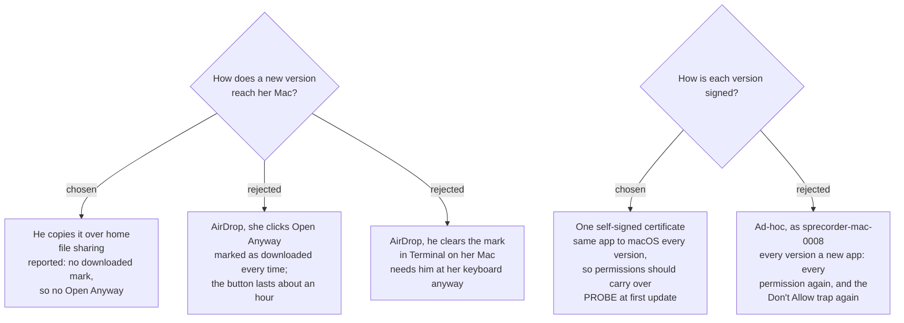

# New versions reach her Mac over home file sharing, signed with one self-signed certificate

`install-and-update-channel` is written for a public audience, and nothing on the map said
how a build reaches the second of the two Macs. This ticket was graduated from that fog line
on 2026-09-10 to answer the two-Macs half only. The public ticket is untouched.

## The route: he copies it, she does nothing

A new version goes from the developer's Mac to hers **over home file sharing**, while both
Macs are on the home network. **File Sharing is switched on once, on her Mac**, so that his
Finder can connect to it with an account on her Mac and copy the new `SPRecorder.app` in.

Why this route: an app that arrives by **AirDrop** carries macOS's downloaded mark
(`com.apple.quarantine`, agent `sharingd`), so every version is blocked on first launch and
she must press **Open Anyway** in System Settings — a button `sprecorder-mac-0008` measured
as appearing only for about an hour after the failed launch. **Copying from a network share
is reported not to set that mark** (Eclectic Light Company), so she never sees the block.

**Reported, not measured here.** It is checked at the first update (below).

Updates wait until both Macs are at home. A new version of a meeting recorder is never
urgent, and the Problem report route (`sprecorder-mac-0024`) already covers the case where
he is away.

**Which folder on her Mac** his Finder can write to is not assumed. Connecting as a user
normally reaches that user's home folder, not the system `Applications` folder, so the
likely target is the `Applications` folder inside her home folder, which runs an app just
the same. Confirm at the first update, and write the answer into this ADR.

**SPRecorder must be quit on her Mac before the copy**, from its menu. Replacing a running
app mid-recording would end a Recording Session.

## Signing: one self-signed certificate

**This supersedes `sprecorder-mac-0008`'s choice of ad-hoc signing.** Developer ID and
notarization stay deferred, exactly as that ADR recorded, and it still carries no hardened
runtime and no entitlements file.

### The option that ADR did not consider

`sprecorder-mac-0008` compared ad-hoc signing with a USD 99/year Developer ID. It did not
consider a **free self-signed code-signing certificate**, created once in Keychain Access.

That ADR measured why ad-hoc costs so much: an ad-hoc signature's designated requirement is
the **cdhash of one build** — *these exact bytes* — so every rebuild is a different app to
macOS, and the permissions macOS keys to that identity are lost. A certificate-signed build's
requirement names **the identifier and the certificate** — *who made it* — which stays the
same across builds. Signing every version with the one certificate should therefore keep her
Microphone, Screen & System Audio Recording and Input Monitoring grants across updates.

**Proven for the Mac that holds the certificate** (widely reported as the standard fix for
losing permissions on rebuild). **Unproven on a second Mac that has never seen the
certificate and does not trust it.** A trust requirement should not be part of that
designated requirement, but that is inference, which is why the first update is a probe.

### Why it matters more than `sprecorder-mac-0008` estimated

That ADR judged "permissions granted again per version" tolerable for an audience of one.
Two decisions since then raised the price of every re-grant:

- `sprecorder-mac-0022`: each new version raises the *"2 permissions missing"* alert and
  sends her to the Permissions tab.
- `sprecorder-mac-0025`: a **Don't Allow** click can override the System Settings switch, and
  only a reset from inside the app clears it. Every re-grant is a fresh chance to fall into
  that trap.

### Looking after the certificate

- Create it in **Keychain Access → Certificate Assistant → Create a Certificate**, type
  **Code Signing**, overriding the defaults to set a **long validity period** — the assistant's
  default is short (reported as 365 days), and a certificate that expires forces a new identity.
  Verify the default when creating it.
- **Export a backup** (a password-protected `.p12`) and keep it somewhere that is not the
  development Mac. Losing the certificate costs her **one full re-grant**, once — no worse than
  a single ad-hoc update.
- Switching from ad-hoc to the certificate is itself one identity change, so do it **before
  the first build reaches her Mac**, and she re-grants nothing extra.
- Moving to Developer ID later, if `public-release` is ever taken up, is one more identity
  change and one more full re-grant — the same cost `sprecorder-mac-0008` already recorded.

## What he does per update

1. Build the new version, signed with the certificate.
2. On her Mac: quit SPRecorder from its menu.
3. From his Finder, connect to her Mac and copy the new `SPRecorder.app` over the old one.
4. On her Mac: open SPRecorder, then press **Check my setup** (`sprecorder-mac-0017`). A clean
   report is the proof that the update landed with nothing lost.

Step 4 is the self-check an update needs anyway, and it runs on the machine that matters.

## The first update is a probe — pass condition fixed now

Run it on **her Mac**, with a version already installed and its permissions granted.
Deliver a second version whose code differs, by the route above.

**PASS only if all of these hold:**

1. Opening the new version shows **no** *"Apple could not verify"* block and needs no Open Anyway.
2. **No** permission prompt and **no** *"permissions missing"* alert appears.
3. **Check my setup** passes the Microphone and Computer audio lines.

Also record, for the ADR: whether `xattr -p com.apple.quarantine` finds the mark on the copied
app, whether `codesign -d -r-` prints the same designated requirement for both versions, and
which folder the copy landed in.

**If 1 fails**, the route was marked after all: she presses Open Anyway once per update — the
AirDrop cost, no worse. **If 2 or 3 fails**, the certificate did not carry permissions across
Macs: she re-grants per update — the ad-hoc cost, no worse. Either way nothing is lost by
having tried, and this ADR is amended with what was measured.

## Consequences

- `sprecorder-mac-0008` is amended: its signing choice is superseded; its Developer ID
  research, Homebrew finding and deferral stand.
- The build signs with a named certificate rather than `codesign -s -`. Where that is set
  in the Xcode project is decided when the project is created (`sprecorder-mac-0007`).
- `install-and-update-channel` keeps the public questions: a disk image, an updater, and
  signing for strangers.
