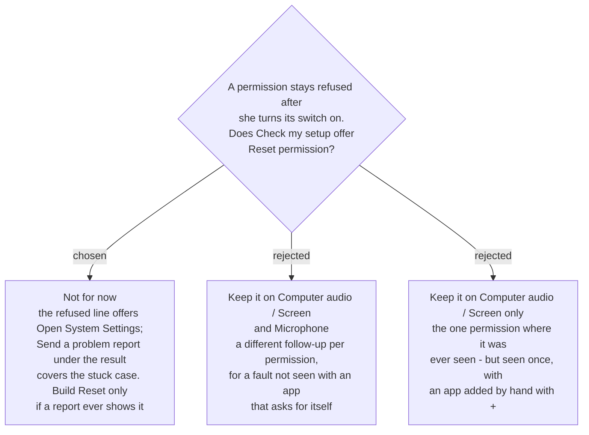

# Check my setup has no Reset permission button, for now



`sprecorder-mac-0025` put a **Reset permission** button on every refused Check my setup
line, to rescue one fault: she clicks *Don't Allow*, later turns the switch on in System
Settings, and capture still fails. **That button is not built.** A refused line offers
*Open System Settings* and the *"Not in the list?"* hint, and the **Send a problem report**
button that `sprecorder-mac-0033` already puts under any failed result covers the case if it
ever happens. Reset is built only if a problem report shows the fault on her Mac.

## The evidence that decided it

| probe | how the app got into the permission list | *Don't Allow*, then the switch turned on |
|---|---|---|
| `verify-screen-recording-restart` (#24), macOS 26.6.2 | never added itself; added by hand with **+** | **stuck** — only `tccutil reset` cleared it |
| `check-my-setup-probe` (#33), macOS 26.6.2 | added itself when it asked | **not stuck** — for Screen & System Audio, Microphone **and** Input Monitoring; the switch was always enough, in the same process |

So the fault has been seen **once**, in a setup SPRecorder will not normally be in: an app
that asks for its own permissions, as SPRecorder does (`sprecorder-mac-0006`), is listed by
macOS at the moment it asks.

## Why not keep it anyway

The in-app reset is proven safe (#33), so the question was only whether it earns its place.

**It is rarely reachable.** The fault needs a fresh grant. `sprecorder-mac-0040` signs every
version with one certificate so her permissions carry across updates, which leaves roughly
**one grant per permission, at first install** — when the developer is normally setting the
app up with her. (If 0040's first-update probe fails, she re-grants per update and this ADR
should be re-read.)

**It is not one button but three flows.** #33 measured a different follow-up per permission:

| permission | after an in-app reset |
|---|---|
| Computer audio / Screen | macOS only notifies; she still has to turn the switch on |
| Microphone | macOS asks only when the app *records* — a permission request shows nothing |
| Input Monitoring | the app is **removed from the list** and cannot ask again until it is relaunched |

Each flow also passes through the box that offers to quit and reopen the app, which an
attentive operator pressed 6 times in 8 (#33).

**The rare case already has a route.** A failed result carries *Send a problem report*
(`sprecorder-mac-0033`); the report carries the check result and the diary
(`sprecorder-mac-0029`). Between two Macs in one household, a support step for a fault that
may never occur is cheaper than a third button on every refused line.

## What she sees instead

```
✗ Computer audio  Not allowed
                  [Open System Settings]
                  Not in the list? Press + and choose SPRecorder.
                                                    [Send a problem report]
```

The *"Already switched on? [Reset permission]"* row of `sprecorder-mac-0031` is removed.
*Flagged — not asked separately:* whether that row should instead read *"Already switched on?
Send a problem report"* is a wording question left to the build.

## When to build it after all

When a problem report shows a permission line **refused** while she says the switch is **on**.
The app cannot see the switch (`sprecorder-mac-0025`), so the evidence is her words plus the
diary's refused-capture error for that line.

Until then, the fix is the developer's, on her Mac, scoped to SPRecorder's own entry and to
the one permission:

```sh
tccutil reset ScreenCapture <SPRecorder's bundle id>   # or Microphone, or ListenEvent
```

Never unscoped — an unscoped reset wipes that permission for every app on the Mac.

## Consequences

- **Supersedes the Reset permission button of `sprecorder-mac-0025`** and its 2026-09-10
  amendment's per-permission follow-ups. 0025's measured findings stand as the record of what
  a reset does, should the button be built later.
- **`sprecorder-mac-0031`'s refused-line example loses one row.** Its other wording rules are
  unchanged.
- **Not decided here — flagged for the map:** the only stuck permission ever seen followed a
  **+** add, and `sprecorder-mac-0031` tells her *"Not in the list? Press + and choose
  SPRecorder."* Whether that hint could lead her into the fault is unmeasured.
- The build needs no `tccutil` call, no per-permission reset flow, and no test for one.
