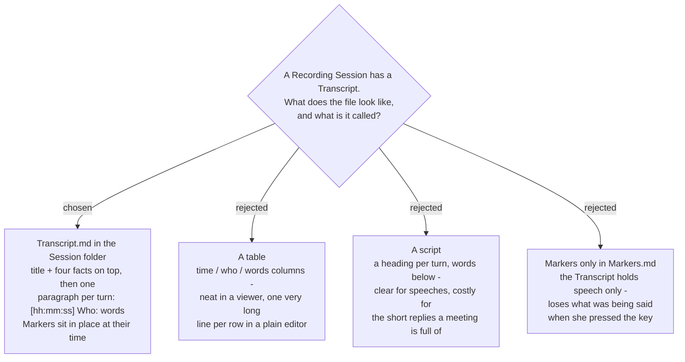

# The Transcript is chat lines in Transcript.md, with Markers in place



Decided on ticket `words-file-look` (#44) of the decision map
`meeting-words-file` (#36), by the user reacting to rendered samples on 2026-09-11. It fixes
the **shape** of the file; which engine or service fills it, and when, are other tickets.

## The file

```markdown
# 2026-09-10 Thu 14.30 Budget review

- Made by: Google, online (free tier)
- Language: as spoken
- Length: 42 min
- Voices found: Me, Speaker 1, Speaker 2, Speaker 3

---

**[00:00:00] Me:** สวัสดีครับทุกคน วันนี้เราจะคุยเรื่องงบประมาณของโครงการใหม่

**[00:00:07] Speaker 1:** Hi everyone. Can I share my screen first?

**[00:00:12] Me:** ได้ครับ เชิญเลย

**[00:00:15] Speaker 1:** Thanks. So this is the timeline. I think we should move the deadline to the end of October, because the design review is not finished yet.

> 📍 **[00:00:29] Marker #1:** deadline moves to October

**[00:00:31] Speaker 2:** เห็นด้วยค่ะ ถ้าอย่างนั้นเรานัดประชุมอีกครั้งวันศุกร์นี้ตอนบ่ายสองโมง

> 📍 **[00:00:38] Marker #2**

**[00:00:40] Speaker 3:** Friday works for me.
```

## The rules

| part | rule |
|---|---|
| **Name** | `Transcript.md`, in the Session folder, beside `Both voices.m4a` and `Markers.md`. One per Recording Session. |
| **Title** | `# ` plus the Session folder's name, so a Named session's label and an interrupted session's mark come along for free (`sprecorder-mac-0019`, `sprecorder-mac-0036`). |
| **Facts** | four bullets, in this order: *Made by* (the service and tier, or this Mac), *Language* (`as spoken`, or the language it was translated into), *Length* (whole minutes), *Voices found* (Me first, then Speaker 1, 2, 3 …). Then a `---` rule. |
| **A turn** | one paragraph: `**[hh:mm:ss] Who:** words`. Consecutive speech by the same voice joins into one paragraph; a new voice, or a Marker, starts a new one. |
| **Time** | time elapsed since the Recording Session started, as `hh:mm:ss` — the **same form as `Markers.md`** (Windows `MarkerLog.FormatElapsed`), so one moment reads the same in the Transcript, the Marker log and the Marker review page. The samples first showed `mm:ss`; it was changed to match before the user confirmed. |
| **Who** | `Me` for speech from the Mic track. `Speaker 1`, `Speaker 2` … for voices told apart inside the System track, numbered in the order they **first speak**. She renames them by hand — find and replace in the file. |
| **Order** | turns from both tracks are merged by start time. |
| **Markers** | a quoted line at its time: `> 📍 **[hh:mm:ss] Marker #n:** note`, or without the colon and note when she typed none. A Marker goes before the first turn that starts after it. `Markers.md` is unchanged and still written. |

## Why chat lines

The file is read in three places: a plain text editor, a Markdown viewer, and an AI summarizer
such as NotebookLM. Chat lines read the same in all three, and every paragraph carries its own
time and voice, so a pasted excerpt still says who said it and when. A table renders neatly
only in a viewer — in an editor each row is one very long line, worst for Thai, which has no
spaces to wrap on. A script heading per turn doubles the length of the short replies
(*ได้ครับ*, *yes*) a meeting is mostly made of.

## Why Transcript.md

The user chose it over *What was said.md* and *Words.md*. It is the ordinary word for the
thing, and it is the same word in the glossary and on disk — unlike the Track names, where
the code says *Mixed file* and the disk says *Both voices* (`sprecorder-mac-0019`).

## Consequences

- **CONTEXT.md gains the term *Transcript*** in the same commit. *Words file*, the planning
  name the decision map uses, goes under *Avoid*.
- **The `sprecorder-mac-0019` file table gains a row:** Transcript → `Transcript.md`.
- **A Problem report never carries `Transcript.md`**, nor any line of it: it is the meeting
  (`sprecorder-mac-0029`). Its file name may appear in the folder list, as other file names do.
  What the Diary may record about it is ticket `privacy-boundaries` (#48).
- **The Marker log and the Transcript share one time form.** If `Markers.md` ever changes its
  time format, the Transcript changes with it.
- **Speaker numbers are per Transcript.** Speaker 2 in one meeting is not Speaker 2 in the next.
  Whether numbering holds across a long meeting cut into pieces for an online service is still
  fog on the map.
- **Not decided here:**
  - how a translated Transcript shows the original words, if at all — `settings-shape` (#46);
  - what happens when a Session folder already has a `Transcript.md` and one is made again —
    `manual-start` (#49);
  - what the file says when a service fails part-way — `when-made` (#45).

## Amendment 2026-09-11 — a Transcript can come from any file

`sprecorder-mac-0043` moves Transcript-making into a separate app that opens **any audio or
video file**, and keeps SPRecorder handing each Recording Session to it after stop. This ADR's
format holds for every Transcript. Its **Name** and **Title** rules, and its **Markers**, describe
a Recording Session only. For a file from anywhere else: every voice is Speaker 1, 2, 3 (there
is no Mic track to give `Me`), times count from the start of the file, and where the
Transcript is written and what its title says are not yet decided (a ticket on map #36).
