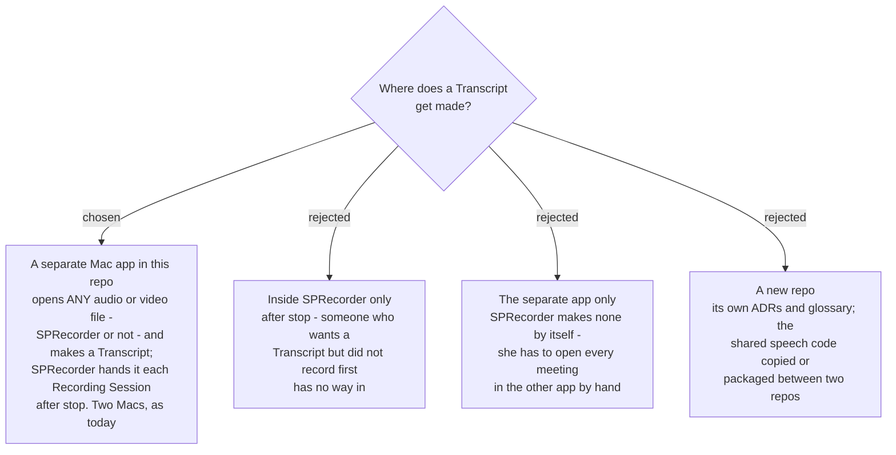

# Transcripts come from a separate app in this repo, for any audio or video file

Decided by the user on 2026-09-11, while working the decision map `meeting-words-file`
(#36), after `sprecorder-mac-0042` had settled what a Transcript looks like. It changes the
map's destination; it resolves no ticket on its own.

## The decision

1. **A separate Mac app makes Transcripts.** In the user's words: *"some people want to use
   this function but don't want to record first."* It opens **any audio or video file** —
   *"video file or audio file that don't come from sprecorder too"*: a Zoom recording, a
   phone clip, a downloaded video, or a SPRecorder Recording Session.
2. **SPRecorder still makes a Transcript by itself after stop.** It hands the finished
   Recording Session to the separate app, so `Transcript.md` lands in the Session folder with
   nobody pressing anything. Both routes use the same speech-to-text and speaker code.
3. **The audience does not change:** the developer's Mac and his wife's Mac
   (`sprecorder-mac-0009`, and the map #1 scope change of 2026-09-10). No public distribution.
4. **The code lives in this repo**, as a second app in the one Xcode project
   (`sprecorder-mac-0007`), sharing the glossary and the `sprecorder-mac` ADR sequence.

The app's name is not decided; this ADR calls it *the separate app*.

## What a file from elsewhere loses

`Me` comes only from a Mic track recorded apart from the System track — which only a
SPRecorder Recording Session has. **In a file from anywhere else every voice, the user's
included, is Speaker 1, 2, 3.** The `sprecorder-mac-0042` format is otherwise unchanged:
chat lines, time since the start of the file, title and four facts. Markers exist only in a
Recording Session.

## Consequences

- **The map's destination is rewritten by hand** to name the separate app, any audio or
  video file, and SPRecorder's hand-off after stop. Its out-of-scope line *"Words files for
  meetings recorded before this feature exists"* is removed: the separate app opens an old
  recording like any other file.
- **`sprecorder-mac-0042` is scoped, not replaced.** Its format holds for every Transcript;
  its *Name* and *Title* rules describe a Recording Session. Where a Transcript goes, and what
  its title is, when there is no Session folder is a new ticket.
- **`sprecorder-mac-0007` gains a fourth target.** Which module holds the shared speech code
  is a new ticket: `SPRecorderCore` must not import AVFoundation (`sprecorder-mac-0002`), and
  reading an audio or video file needs it.
- **Settings for the service, tier and language belong to the separate app**, not to
  SPRecorder's seven tabs (`sprecorder-mac-0022`) — ticket `settings-shape` (#46) is
  re-scoped accordingly.
- **Asking for a Transcript by hand is opening a file in the separate app.** Ticket
  `manual-start` (#49) is re-scoped to what is left: making one again when one exists.
- **The real-meeting test (#41) no longer waits for SPRecorder to record** for the online
  and speaker checks; any meeting file will do. Checking `Me` still needs a Recording Session.
- **New tickets on map #36:** how SPRecorder hands a Recording Session over (and what happens
  when the separate app is missing or closed); which files it opens and where their Transcript
  goes; what the separate app is called and looks like; where the shared code lives.

## Amendment 2026-09-11 — the name

The separate app is **SPTranscriber**, a normal window app you drop a file into
(`sprecorder-mac-0044`).
