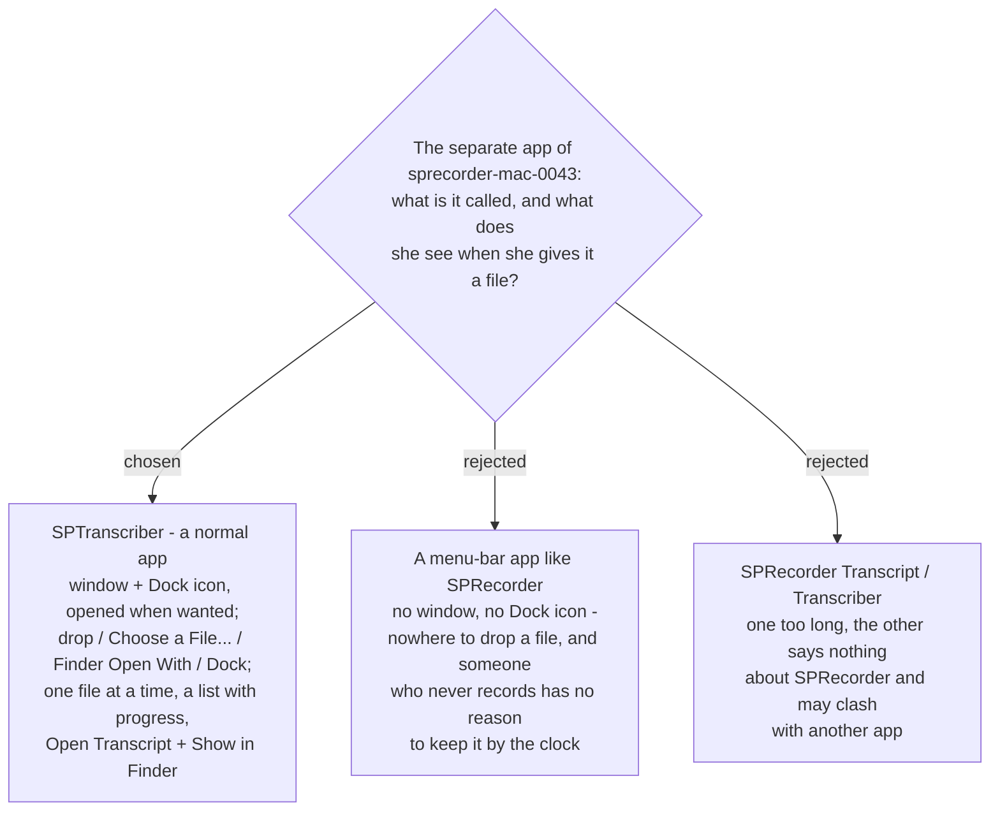

# SPTranscriber is a normal window you drop a file into

Decided on ticket `app-shape` (#52) of the decision map `meeting-words-file` (#36), by the
user reacting to a mockup on 2026-09-11. It names the separate app of `sprecorder-mac-0043`
and fixes its shape; what goes inside its Settings, and where a Transcript is written, are
other tickets.

The mockup: Claude Design → **SPRecorder Mac design system** → **Screens / SPTranscriber — the
window**.

## The decision

| part | what she gets |
|---|---|
| **Name** | **SPTranscriber** — one family with SPRecorder, and it says what it does. |
| **Kind of app** | A **normal app**: a window and a Dock icon. She opens it when she wants it and quits it when she is done. This is the opposite of SPRecorder, which is menu-bar only and never frontmost (`sprecorder-mac-0010`); SPTranscriber is opened on purpose, so taking the front is correct. |
| **Ways in** | Four, all landing in the same list: **drop a file on the window**, **Choose a File…**, **Finder → right-click → Open With → SPTranscriber**, and **drop a file on its Dock icon**. The drop area says *"Drop an audio or video file here — a meeting recording, a phone clip, a video — or a SPRecorder folder"*. |
| **The list** | **One file is made at a time; the others wait in order.** Each row shows the file, a plain-words line saying what is happening now (*"Sending to Google · piece 1 of 2"*, *"Listening for voices · 18%"*, *"Waiting — starts after interview.m4a"*) and a progress bar. **✕** stops that file. |
| **Done** | The row turns to *"Transcript ready · 41 min · 2 voices"* with **Open Transcript** (opens the .md) and **Show in Finder**. Finished files stay under **Recent**. |
| **Closing the window** | Work carries on; the list is still there when the window is opened again. |
| **Settings** | Where every Mac app keeps them: **SPTranscriber → Settings… (⌘,)**. |
| **Look** | The project's design language — the Mac's own appearance, following light and dark mode (`foundations/tokens.html` in the design project). |

## Why a window

The people this app exists for (`sprecorder-mac-0043`) *"don't want to record first"*: they
arrive holding a file. A file needs somewhere to be dropped, and a list of files being worked
on needs somewhere to be shown — both are a window. A menu-bar app would reduce the four ways
in to one menu row and put progress in a menu that closes when she looks away.

## Consequences

- **CONTEXT.md gains the term *SPTranscriber***, and *Transcript* names it instead of "the
  separate Transcript-making app". `sprecorder-mac-0043`'s *"the app's name is not decided"* is
  answered here.
- **The build needs a document-style app target**, registered as a viewer for audio and video
  types so it appears under Finder's *Open With*, and accepting drops on its window and Dock
  icon. Which target holds the shared speech code is still `shared-code-layout` (#53).
- **Quitting while a file is being made** is not decided here — `when-made` (#45) covers what
  happens when the app quits part-way.
- **Not decided here, and left visible on the mockup as open:**
  - where a Transcript for a file from elsewhere is written, and its name — `any-file-output` (#51);
  - whether a Recording Session handed over by SPRecorder after stop appears in this list, and
    whether this window opens for it — `recording-handoff` (#50);
  - what happens when a file already has a Transcript — `manual-start` (#49);
  - what a row says when a service fails or the internet drops — `when-made` (#45);
  - what Settings contains — `settings-shape` (#46).
