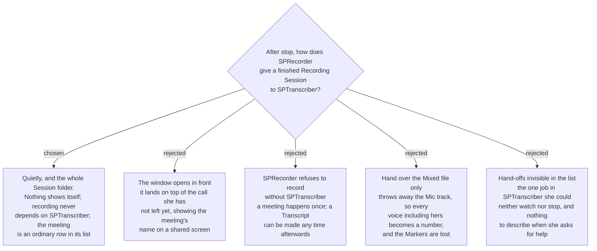

# The hand-off is quiet, and recording never waits for it

Decided by the user on ticket `recording-handoff`
([#50](https://github.com/ThodsaphonSonthiphin/SPRecorder.Mac/issues/50)) of the decision map
`meeting-words-file` ([#36](https://github.com/ThodsaphonSonthiphin/SPRecorder.Mac/issues/36))
on 2026-09-11. It settles the hand-off that `sprecorder-mac-0043` promised and that
`sprecorder-mac-0044` left open.

## The decision

| # | rule | what was rejected |
|---|---|---|
| 1 | **The hand-off is quiet.** No window opens, nothing comes to the front. A Dock icon appears while SPTranscriber works and goes when it quits. | The window opening in front of her. |
| 2 | **Recording never depends on SPTranscriber.** If it is missing, the Recording Session runs and saves exactly as it does today; only the Transcript is skipped. | SPRecorder refusing to start. |
| 3 | **A missing SPTranscriber is said once.** One notification the first time a hand-off finds it gone — *"Recording saved. No Transcript — SPTranscriber is not installed."* — and not again until it is back. **Check my setup** gains a line for it, and that line is the channel no setting can switch off. | Silence, which loses every Transcript unnoticed; and a notification after every meeting, which teaches her to dismiss them. |
| 4 | **The whole Session folder is handed over**, not one file. SPTranscriber finds the Mic track, the System track and the Marker log inside. | The Mixed file alone. |
| 5 | **The handed-over meeting is an ordinary row** in SPTranscriber's list: watchable, stoppable with **✕**, and kept under **Recent** when done. The only thing that makes it different from a dropped file is that nobody was looking when it arrived. | Hand-offs never appearing. |
| 6 | **Each app keeps its own Diary, and one Problem report gathers both.** She never has to know which of the two apps failed in order to report it. | A second Problem report from SPTranscriber; and one Diary shared by both apps. |

## What she sees, case by case

The ticket asked for all four. Only one of them is a failure.

| SPTranscriber is… | what happens | what she sees after Stop |
|---|---|---|
| installed, not running | SPRecorder starts it. This is the normal case. | Nothing. A Dock icon, while it works. |
| installed, already working on a file | The meeting joins the end of the list. One file at a time was already the rule (`sprecorder-mac-0044`). | Nothing. |
| installed, window closed | Work carries on; the row is there when she opens the window (`sprecorder-mac-0044`). | Nothing. |
| **not installed** | The Recording Session is complete and untouched. No Transcript. | The rule 3 notification, the first time. |

## Why recording never waits

A meeting happens once. If SPRecorder will not start, that meeting is gone and no later fix
brings it back. A Transcript is the opposite: the Session folder keeps every track, so she
can drop it on SPTranscriber next week and get exactly the same Transcript. The two failures
are not the same size, and the design must not treat them as if they were.

This is the same reasoning as `sprecorder-mac-0028`: the parts of a Recording Session fail
one at a time, and what still works keeps working.

## Why the whole folder

`Me` exists only because the Mic track was recorded apart from the System track. That
separation is already sitting on disk in the Session folder. Handing over the Mixed file
would throw it away and hand back a Transcript in which she cannot tell which lines were
hers — which `sprecorder-mac-0043` names as the thing a file from anywhere else *loses*.
There is no reason to lose it for a recording that did not have to.

The Marker log travels for the same reason: `sprecorder-mac-0042` puts Markers in the
Transcript at their time, and only the folder has them.

SPTranscriber's drop area already invites *"…or a SPRecorder folder"* (`sprecorder-mac-0044`).
The hand-off is therefore not a private back door — it is the same thing she could do by hand,
done for her.

## The Diary and the Problem report

In the user's words: *"Log is should good too it must help support user."* (In this repo's
words: the **Diary**.)

- **Two Diaries.** SPRecorder and SPTranscriber are two apps that start, stop and crash
  separately, and SPTranscriber often runs when SPRecorder does not. One file written by both
  at once would be a Diary that lies about who was running.
- **One Problem report.** It starts from SPRecorder's menu (`sprecorder-mac-0033`) and gathers
  **both** Diaries. Sending the SPRecorder half alone would report only that the hand-off
  worked, which is the one fact already known.
- **What each side records about the hand-off:** which Session folder, the time, that it was
  handed over, and whether SPTranscriber took it or was missing. Facts, never the meeting
  (`sprecorder-mac-0029`).
- **The Private copy** (`sprecorder-mac-0030`) strips what she typed from both halves, not
  just SPRecorder's.

## When the hand-off happens

**After finishing is completely done** — after a long recording is cut into Parts
(`sprecorder-mac-0026`) and after any folder rename (`sprecorder-mac-0036`). A folder handed
over while it is still being written or about to be renamed is a folder SPTranscriber reads
wrong. This follows from the earlier ADRs rather than being chosen here, but it is the one
ordering rule the implementation must not get wrong.

## Consequences

- **`CONTEXT.md` gains *Hand-off***, and corrects **Diary** (each app keeps one) and
  **Problem report** (it gathers both).
- **Check my setup gains a line** for SPTranscriber, alongside the microphone, computer audio,
  screen, Key caster, hotkeys and recordings folder (`sprecorder-mac-0031`). It is never a
  Recording Session (`sprecorder-mac-0032`), so the line reports presence, not a test Transcript.
- **SPTranscriber must accept a folder**, not only a file, on every way in — it already says so
  on its drop area (`sprecorder-mac-0044`).
- **A Problem report now spans two apps.** How SPRecorder reads a Diary belonging to a
  separate sandboxed app, and what the report says when SPTranscriber is not installed, is a
  new ticket on map #36.
- **`sprecorder-mac-0044` is answered** on two of the five questions it left visible: a
  handed-over Recording Session *does* appear in the list, and the window does *not* open for it.

## Not decided here

- **What she sees while it is made, and when it fails part-way** — `when-made`
  ([#45](https://github.com/ThodsaphonSonthiphin/SPRecorder.Mac/issues/45)), including the Mac
  sleeping, the app quitting, and the internet being down.
- **Whether any Transcript text reaches the Diary, and what the Diary says about an upload** —
  `privacy-boundaries`
  ([#48](https://github.com/ThodsaphonSonthiphin/SPRecorder.Mac/issues/48)). This ADR records
  only what the *hand-off* writes.
- **Which target holds the shared speech code** — `shared-code-layout`
  ([#53](https://github.com/ThodsaphonSonthiphin/SPRecorder.Mac/issues/53)).
- **Whether the uncut track or its Parts is transcribed** for a long meeting — still fog on
  map #36.
